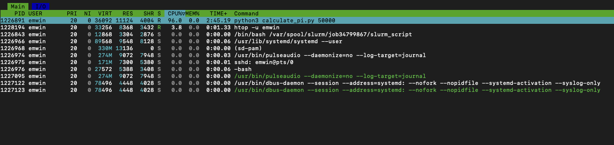

# Advanced Slurm
This lesson expands on the principles of Slurm job configuration and parallelization from the first Slurm lesson. It introduces Slurm job dependencies, pipeline management techniques, and 
environment management and sharing with Conda.

## Lesson Setup
For this lesson, you will need to connect to a Talapas login node through a shell application of your choice.

For convenience, we recommend the [Talapas OnDemand shell](https://ondemand.talapas.uoregon.edu/pun/sys/shell/ssh/login1.talapas.uoregon.edu).

Make sure you are in your home directory.

```bash
cd ~
```

Copy the `slurm_day2` folder to your home directory. As
always, make sure to use the `-r` flag to recursively copy the
folder's contents.

```bash
cp -r /projects/racs_training/intro-hpc-f25/slurm_day2/  .
```

Navigate inside the `slurm_day2` directory you copied over.

```bash
cd slurm_day2
```

## Evaluating Resource Usage on Running Jobs with `htop`
Remember the `seff` command? That's a great way to evaluate resource usage of a *finished* job. 
But what about resource usage for running jobs?

Navigate to the `python_pi_example` directory and inspect the contents.

```bash
cd python_pi_example
ls
```

```output
calculate_pi.py  calculate_pi.sbatch
```

Inspect `calculate_pi.sbatch`.

```bash
cat calculate_pi.sbatch
```

```bash
#!/bin/bash

#SBATCH --partition=preempt              ### Partition (like a queue in PBS)
#SBATCH --account=racs_training          ### Account used for job submission

### NOTE: %u=userID, %x=jobName, %N=nodeID, %j=jobID, %A=arrayMain, %a=arraySub
#SBATCH --job-name=digits_of_pi          ### Job Name
#SBATCH --output=%x.log                  ### File in which to store job output

#SBATCH --time=0-00:60:00                ### Wall clock time limit in Days-HH:MM:SS
#SBATCH --nodes=1                        ### Number of nodes needed for the job
#SBATCH --mem=100M                       ### Total Memory for job in MB -- can do K/M/G/T for KB/MB/GB/TB
#SBATCH --cpus-per-task=1                ### Number of cpus/cores to be launched per Task

### Load needed modules
module purge
module load python3/3.11.4

### Run your actual program
srun -u python3 -u calculate_pi.py 30000
```

This is a serial job that loads the **python3** module and executes a Python script that computes the first 30000 digits of pi. 
Observe that this job runs on the `preempt` partition.
Both error and output logs are written to a single `digits_of_pi.txt`, which
(if there are no errors) will contain pi approximated to the first 30000 digits.

Use `cat` to inspect `calculate_pi.py`. 

This script takes in an integer argument `num_digits`
from the command line, then calculates that many of pi.

```bash
cat calculate_pi.py
```

```python
 #!/usr/bin/env python3

import sys

def calcPi(limit):  # Generator function
    """
    Prints out the digits of PI
    until it reaches the given limit
    """

    q, r, t, k, n, l = 1, 0, 1, 1, 3, 3

    decimal = limit
    counter = 0

    while counter != decimal + 1:
            if 4 * q + r - t < n * t:
                    # yield digit
                    yield n
                    # insert period after first digit
                    if counter == 0:
                            yield '.'
                    # end
                    if decimal == counter:
                            break
                    counter += 1
                    nr = 10 * (r - n * t)
                    n = ((10 * (3 * q + r)) // t) - 10 * n
                    q *= 10
                    r = nr
            else:
                    nr = (2 * q + r) * l
                    nn = (q * (7 * k) + 2 + (r * l)) // (t * l)
                    q *= k
                    t *= l
                    l += 2
                    k += 1
                    n = nn
                    r = nr


def main():  # Wrapper function

    num_digits = sys.argv[1]

    for d in calcPi(int(num_digits)):
        print(d, end='')

if __name__ == '__main__':
    main()
```

For those of you unfamiliar with Python, this is a *single-threaded* algorithm that
uses a loop to return successive digits from a generator function, `calc_pi`.

Launch the Slurm job with `sbatch`.

```bash
sbatch calculate_pi.sbatch
```

```output
Submitted batch job 39549813
```

Check your queue. Note the node number (hostname) of the compute node where the job is currently running.

```bash
squeue --me
```

```output
             JOBID PARTITION     NAME     USER ST       TIME  NODES NODELIST(REASON)
          39549813   preempt digits_o    emwin  R       0:06      1 n0105
```

As we can see, we are currently running on node n0105.

Because we have an active Slurm task on node n0105, we can *remote into that compute node* from the login node with `ssh`.

```bash
ssh n0105
```

Enter the password to your DuckID when prompted. Confirm that you are connected with the `hostname` command.
```bash
hostname
```

```output
n0105.talapas.uoregon.edu
```

While you are on the compute node, the [**htop command**](https://linux.die.net/man/1/htop) can be used to evaluate the resources usage of your running processes. 

```bash
htop -u $USER
```


* The `USER` column is the DuckID of the user who launched the process.
* The `RES` column measures RAM per process in KB.
* The `CPU%` column measures the percentage of CPU time used by the process.
A 100% indicates full usage of a CPU core. 
* The `MEM%` column indicates the percentage of memory the process is using.
* The `TIME` column indicates how long the process has been running in seconds.

From this, we can see that the `calculate_pi` script
uses the single core it has been allocated very
effeciently (97.5%) but uses almost no RAM.
This is by design, as [Python generators](https://docs.python.org/3/howto/functional.html#generators)
are more memory effecient than
lists or sequences.

Your connection to the compute node will terminate when your job terminates.
After the job has finished, you can use `seff` to get more granular information about your job.

Let's use `sacct` to get more information about the finished job.

```bash
sacct --units=M --format=JobId,JobName,ReqMem,MaxRss,ReqCPUs,AllocCPUs,Elapsed,State
```

```output
JobID           JobName     ReqMem     MaxRSS  ReqCPUS  AllocCPUS    Elapsed      State 
------------ ---------- ---------- ---------- -------- ---------- ---------- ---------- 
39549813     digits_of+       100M                   1          1   00:01:03  COMPLETED 
39549813.ba+      batch                 4.64M        1          1   00:01:03  COMPLETED 
39549813.ex+     extern                 0.12M        1          1   00:01:04  COMPLETED 
39549813.0      python3                 5.68M        1          1   00:01:01  COMPLETED 
```

If you've run several  jobs recently, you can pass in a special
flag to `sacct` to indicate that you only want to results from jobs
started in  the last hour.

```bash
sacct --units=M --format=JobId,JobName,ReqMem,MaxRss,ReqCPUs,AllocCPUs,Elapsed,State -S now-1hour
```

Finally, let's confirm the job ran correctly by checking the output
log. As the output is quite long, use `cut` to peek at the first
six characters of the output log.

```bash
cat digits_of_pi.log | cut -c1-6
```

```output
3.1415
```

Now, let's confirm that there are 30000 digits
using the `wc -c` command to count the characters in the output file.

```bash
cat digits_of_pi.log | wc -c
```

```output
30002
```

Because the 30000 digits are prefixed with `3.`, 30002
is the number of characters of output we would expect.

### Evaluating Finished Job Resource Usage with `seff`

Examine this job's effeciency with `seff`. Remember to pass in your job id
in place of the example.

```bash
seff 39549813
```

```output
Job ID: 39549813
Cluster: talapas
User/Group: emwin/uoregon
State: COMPLETED (exit code 0)
Cores: 1
CPU Utilized: 00:01:01
CPU Efficiency: 96.83% of 00:01:03 core-walltime
Job Wall-clock time: 00:01:03
Memory Utilized: 5.68 MB
Memory Efficiency: 5.68% of 100.00 MB
```

What does `seff` tell us here? Our toy job uses the CPU very effeciently,
but it uses only 5.68% of the 100MB of RAM requested.


While 100MB is a trivial amount of memory, if you 
observe your own Slurm job has such low memory effeciency,
it will *schedule faster and finish just as quickly* if you
request less memory in future. 

For example, requesting 100GB
of RAM when your job only requires 8GB is poor Talapas etiquette.

### Slurm Job Constraints: Additional CPU Cores

Remember those `#SBATCH` arugments at the top of each Slurm
batch script? 

You can override those arguments manually
when launching a batch script by passing in the argument followed by
the replacement value.

We will use this technique to manipulate
certain parameters to see how they affect the performance
of the `calculate_pi.sbatch`. This is faster than
manually adjusting parameters in a command line text editor
like `nano` or `vim`.

When writing and executing
Slurm jobs in the context of scientific computing, especially
for code used to generate results, it is essential
that your batch scripts reflect *exactly* how your Slurm
jobs were executed. We do not recommend overriding batch script arguments
through the command line outside the context of development or
testing.

First, let's see if requesting more CPU cores will make 
the `calculate_pi` script finish faster.

```bash
sbatch --job-name=digits_of_pi_4cpus --cpus-per-task=4 calculate_pi.sbatch 
```

```output
Submitted batch job 39560052
```

Because these arguments *overwrite* what you have in your script, this
will launch a job that is identical to our previous iteration except that...
1) it will be named `digits_of_pi_4cpus`
2) it will request 4 CPU cores rather than 1

How much faster than will this job run? Wait for the job
to finish, then use `sacct` to check the time that job took
in the `Elapsed` column.

```bash
sacct --units=M --format=JobId,JobName,ReqMem,MaxRss,ReqCPUs,AllocCPUs,Elapsed,State
```

```output
JobID           JobName     ReqMem     MaxRSS  ReqCPUS  AllocCPUS    Elapsed      State 
------------ ---------- ---------- ---------- -------- ---------- ---------- ---------- 
39549813     digits_of+       100M                   1          1   00:01:03  COMPLETED 
39549813.ba+      batch                 4.64M        1          1   00:01:03  COMPLETED 
39549813.ex+     extern                 0.12M        1          1   00:01:04  COMPLETED 
39549813.0      python3                 5.68M        1          1   00:01:01  COMPLETED 
39560052     digits_of+       100M                   4          4   00:01:01  COMPLETED 
39560052.ba+      batch                 4.64M        4          4   00:01:01  COMPLETED 
39560052.ex+     extern                 0.05M        4          4   00:01:01  COMPLETED 
39560052.0      python3                 5.91M        4          4   00:00:59  COMPLETED 
```

While your time may vary, my first job completed in 1:03 and this
job completed in 1:01. As you can see, the job that was allocated 4 CPUs
rather than 1, did not run 4 times as fast. What happened?

Let's look more closely at the `digits_of_pi_4cpus` job with `seff`.

```bash
seff 39560052
```

```output
Job ID: 39560052
Cluster: talapas
User/Group: emwin/uoregon
State: COMPLETED (exit code 0)
Nodes: 1
Cores per node: 4
CPU Utilized: 00:01:03
CPU Efficiency: 25.82% of 00:04:04 core-walltime
Job Wall-clock time: 00:01:01
Memory Utilized: 5.91 MB
Memory Efficiency: 5.91% of 100.00 MB
```

While we requested 4 times as many CPU cores, the Python code called
by the Slurm job is not parallelized.
As a single-threaded, serial job, it cannot exploit
any additional CPU resources. Therefore, the job's CPU-effeciency
goes from 97.5% to 23.85%, and it completes no faster.

This isn't to dismiss the power of parallel computing. 
Additional CPU cores make jobs that *leverage* them complete
much faster! You will get to see examples of parallelized Python code
later in this lesson.

## Node Features: Helper Scripts From RACS
Need to decide which nodes (and which partitions) are appropriate for your jobs? RACS has a script that shows available CPU and RAM on each node.

```bash
/packages/racs/bin/slurm-show-cpu-mem
```

This script shows the name of the node, the number of CPU cores on the node, and the amount of RAM (in MB) in that order for each node on Talapas.

```output
...
n0187 128 515048
n0188 128 515048
n0189 128 515048
n0190 128 515048
n0191 128 515048
n0192 128 515048
n0193 128 515048
...
```

Nodes on the compute partition typically have 128 CPU cores and 500GB of RAM.

To check which partition a node belongs to, find its name in the output of the `sinfo` command. Let's look at `n0191`, a compute node.

```bash
sinfo
```

As you can see, `n0191` is one of the nodes in the **compute** partition.
```output
compute              up 1-00:00:00      1   plnd n0195
compute              up 1-00:00:00      6  drain n[0112-0117]
compute              up 1-00:00:00     35    mix n[0111,0118-0135,0180-0194,0196]
```

You may also want to know what hardware is associated with each node.

```bash
/packages/racs/bin/slurm-show-features
```

This script shows the node name, processor type, processor architecture, and GPU parameters for each node.

```output
...
n0191 amd,milan,7713
n0192 amd,milan,7713
n0193 amd,milan,7713
n0194 amd,milan,7713
n0195 amd,milan,7713
n0196 amd,milan,7713
n0197 intel,sapphirerapids,6448y,mem-1tb,l40s,gpu-48gb
...
```

Let's inspect `n0191` again. As you can see, it has an AMD processor 
and no GPU.

Nodes with extra RAM are indicated with `mem-[amount]` tags.
```output
n0372 intel,broadwell,e7-4830,mem-1t
n0373 intel,broadwell,e7-4830,mem-1tb
n0374 intel,broadwell,e7-4830,mem-4tb
```

Nodes with GPUs are also indicated in this list.
```output
n0149 amd,milan,7413,a100,gpu-10gb
n0150 amd,milan,7413,a100,gpu-40gb
n0151 amd,milan,7413,a100,gpu-10gb
n0152 amd,milan,7413,a100,3xgpu-80gb,no-mig
```
These comma-separated traits are called features.

We can use **constraints** to 
direct Slurm to schedule jobs on nodes with specific features (extra RAM, GPU, CPU architecture) based on code hardware requirements.

### Using Slurm Job Constraints: Requesting Specific Hardware
Does running a job on different hardware affect performance?
For example, do processors with newer architecture perform better than
older ones?

Broadwell processors, launched in 2014, are the oldest Intel CPUs available on Talapas.
Intel launched its Sapphire Rapids processors in 2023. Processors
with this architecture are the newest Intel processors on Talapas.

Let's return to our `calculate_pi` job. We know its performance is
heavily CPU-dependent from our previous experimentation.

We can use the `--constraint` parameter to restrict our job to nodes
with specific features. In this cause, we want this job to run on a
node with a Sapphire Rapids processor.

```bash
sbatch --job-name=sapphirerapids_pi --constraint=sapphirerapids calculate_pi.sbatch
```

```output
Submitted batch job 39570110
```

Alright, now let's try running on a Broadwell CPU.

```bash
sbatch --job-name=broadwell_pi --constraint=broadwell calculate_pi.sbatch
```

```output
Submitted batch job 39570110
```

Compare the time elapsed for these two jobs with `sacct`.

```bash
 sacct --units=M --format=JobId,JobName,ReqMem,MaxRss,ReqCPUs,AllocCPUs,Elapsed,State
```

```output
JobID           JobName     ReqMem     MaxRSS  ReqCPUS  AllocCPUS    Elapsed      State 
39570110     sapphirer+       100M                   1          1   00:00:48  COMPLETED 
39570110.ba+      batch                 4.64M        1          1   00:00:48  COMPLETED 
39570110.ex+     extern                 0.11M        1          1   00:00:48  COMPLETED 
39570110.0      python3                 7.38M        1          1   00:00:46  COMPLETED 
39570196     broadwell+       100M                   1          1   00:01:17  COMPLETED 
39570196.ba+      batch                 4.64M        1          1   00:01:17  COMPLETED 
39570196.ex+     extern                 0.10M        1          1   00:01:17  COMPLETED 
39570196.0      python3                 6.73M        1          1   00:01:16  COMPLETED
```

While the performance differential (46 seconds to 77 seconds) observed here is
significant, parallelization will improve your performance more than
simply running the same single-threaded code on a processor with a
faster clock speed.

We recommend using constraints when your job *must* run on specific
hardware. 

## Slurm Pipelines
Navigate to the `pipeline_example` directory of today's examples,
then peek at the files inside.

```bash
cd ../pipeline_example
ls -F
```

```output
create_random.sbatch*  scripts/           submit_pipeline.sh*
find_eigh.sbatch*      sort_eigh.sbatch*  sum_eigh.sbatch*
```

Inside the scripts directory, you will find the following 
Python files.

```bash
ls scripts
```

```output
create_random.py  find_eigh.py  sort_eigh.py  sum_eigh.py
```

An detailed explanation of how the Python code works is outside the scope
of this workshop. You can assume that they work effeciently and as
described. 

Instead, we will focus on how sbatch scripts that rely on this Python
code can be used to construct a multi-stage pipeline that runs
in parallel and uses job dependencies to ensure that no job
starts before its intended input is ready.

### Summary of the Pipeline's Python Scripts
* `create_random.py` - creates a single 1000x1000 matrix of random numbers, writes
the matrix to a filepath specified as an argument

```python
import numpy as np
import sys

size = 1000

random_data = np.random.random((size,size))
savename = sys.argv[1]
np.save(savename, random_data)
```
* `find_eigh.py` - reads in a single matrix, compute its
[eigenvalues](https://en.wikipedia.org/wiki/Eigenvalues_and_eigenvectors)
and writes those eigenvalues to a file specified as an argument

```python
import numpy as np
import sys

filename = sys.argv[1] 

random_data = np.load(filename)
eigh_values, _ = np.linalg.eigh(random_data)

savename = sys.argv[2]
np.save(savename, eigh_values)
```
* `sum_eigh.py` - given a list of files as arguments,
reads the matrices and sums them, then writes a summed matrix to an output file
specified as the last argument
```python
import numpy as np
import sys

filenames = sys.argv[1:-1] 
output_filename = sys.argv[-1]
sum_all = np.zeros(len(filenames))

for i,filename in enumerate(filenames):
    sum_all[i] =  np.load(filename)
    sum_sort = np.sort(sum_all)

with open(output_filename, "w") as tf:
    tf.write(str(sum_sort))
```
* `sort_eigh.py` - given a list of files as arguments, sums and sorts
the input matrices, then writes that sum out to a file

```python
import numpy as np
import sys

filenames = sys.argv[1:-1] 
output_filename = sys.argv[-1]
sum_all = np.zeros(len(filenames))

for i,filename in enumerate(filenames):
    sum_all[i] =  np.load(filename)
    sum_sort = np.sort(sum_all)

with open(output_filename, "w") as tf:
    tf.write(str(sum_sort))
```

Observe that `create_random.py` and `find_eigh.py` scripts operate indepedently,
one matrix at a time. This means they can be easily parallelized by
[array jobs](https://slurm.schedmd.com/job_array.html) in which each
concurrent subjob gets its own CPU core and enough RAM to store the matrix.

However, we need to ensure that *all* the matrices we want to sum or sort 
are generated before they are called, 
otherwise our totals will be incorrect.

### Building the Pipeline: `sbatch` Scripts

The goal of our pipeline is to make 8 1000x1000 matrices,
compute their eigenvalues, sum those eigenvalues, then sort and sum
those eigenvalues. 

This can be accomplished by running the following
`sbatch` scripts in order, waiting for each stage to finish before 
starting the next one.

* `create_random.sbatch`
* `find_eigh.sbatch`
* `sum_eigh.sbatch`
* `sort_eigh.sbatch`

First, examine `create_random.sbatch`.

```bash
cat create_random.sbatch 
```

```bash
#!/bin/bash

#SBATCH --partition=compute              ### Partition (like a queue in PBS)
#SBATCH --account=racs_training          ### Account used for job submission

### NOTE: %u=userID, %x=jobName, %N=nodeID, %j=jobID, %A=arrayMain, %a=arraySub
#SBATCH --job-name=create_random         ### Job Name
#SBATCH --output=logs/%x-%a.out          ### File in which to store job output
#SBATCH --error=logs/%x-%a.err           ### File in which to store job error messages

#SBATCH --time=0-00:45:00                ### Wall clock time limit in Days-HH:MM:SS
#SBATCH --nodes=1                        ### Number of nodes needed for the job
#SBATCH --mem=4G                         ### Total Memory for job in MB -- can do K/M/G/T for KB/MB/GB/TB
#SBATCH --ntasks-per-node=1              ### Number of tasks to be launched per Node
#SBATCH --cpus-per-task=1                ### Number of cpus/cores to be launched per Task

#SBATCH --array=0-7

srun python3 scripts/create_random.py data/random-data-${SLURM_ARRAY_TASK_ID}.npy 
sleep 10
```

This array job creates eight sub-jobs that each create a single
matrix, generating eight matrices simultaneously. 
The matrices are written to files `random-data-0.npy`, `random-data-1.npy`...
based on their Slurm array ids.

Next, inspect `find_eigh.sbatch`.

```bash
#!/bin/bash

#SBATCH --partition=compute              ### Partition (like a queue in PBS)
#SBATCH --account=racs_training          ### Account used for job submission

### NOTE: %u=userID, %x=jobName, %N=nodeID, %j=jobID, %A=arrayMain, %a=arraySub
#SBATCH --job-name=find_eigh             ### Job Name
#SBATCH --output=logs/%x-%a.out          ### File in which to store job output
#SBATCH --error=logs/%x-%a.err           ### File in which to store job error messages

#SBATCH --time=0-00:45:00                ### Wall clock time limit in Days-HH:MM:SS
#SBATCH --nodes=1                        ### Number of nodes needed for the job
#SBATCH --mem=4G                         ### Total Memory for job in MB -- can do K/M/G/T for KB/MB/GB/TB
#SBATCH --ntasks-per-node=1              ### Number of tasks to be launched per Node
#SBATCH --cpus-per-task=1                ### Number of cpus/cores to be launched per Task

#SBATCH --array=0-7

srun python3 scripts/find_eigh.py data/random-data-${SLURM_ARRAY_TASK_ID}.npy data/eigh-output-${SLURM_ARRAY_TASK_ID}.npy
sleep 10
```

This array job computes the eigenvectors of each of the matrices in the
`/data/` folder, using the same indexing scheme as the previous step.


After that, inspect `sum_eigh.sbatch`.

```bash
#!/bin/bash

#SBATCH --partition=compute              ### Partition (like a queue in PBS)
#SBATCH --account=racs_training          ### Account used for job submission

### NOTE: %u=userID, %x=jobName, %N=nodeID, %j=jobID, %A=arrayMain, %a=arraySub
#SBATCH --job-name=sum_eigh              ### Job Name
#SBATCH --output=logs/%x-%a.out          ### File in which to store job output
#SBATCH --error=logs/%x-%a.err           ### File in which to store job error messages

#SBATCH --time=0-00:45:00                ### Wall clock time limit in Days-HH:MM:SS
#SBATCH --nodes=1                        ### Number of nodes needed for the job
#SBATCH --mem=4G                         ### Total Memory for job in MB -- can do K/M/G/T for KB/MB/GB/TB
#SBATCH --ntasks-per-node=1              ### Number of tasks to be launched per Node
#SBATCH --cpus-per-task=1                ### Number of cpus/cores to be launched per Task

#SBATCH --array=0-7

srun python3 scripts/sum_eigh.py data/eigh-output-${SLURM_ARRAY_TASK_ID}.npy data/sum-eigh-${SLURM_ARRAY_TASK_ID}.npy
sleep 10
```

This array job launches 8 subjobs, with each job summing up
the eigenvalues at `sum-eigh-0.npy`, `sum-eigh-1.npy`...


Finally, inspect `sort_eigh.sbatch`.

```bash
#!/bin/bash

#SBATCH --partition=compute              ### Partition (like a queue in PBS)
#SBATCH --account=racs_training          ### Account used for job submission

### NOTE: %u=userID, %x=jobName, %N=nodeID, %j=jobID, %A=arrayMain, %a=arraySub
#SBATCH --job-name=sort_eigh              ### Job Name
#SBATCH --output=logs/%x-%a.out          ### File in which to store job output
#SBATCH --error=logs/%x-%a.err           ### File in which to store job error messages

#SBATCH --time=0-00:45:00                ### Wall clock time limit in Days-HH:MM:SS
#SBATCH --nodes=1                        ### Number of nodes needed for the job
#SBATCH --mem=8G                         ### Total Memory for job in MB -- can do K/M/G/T for KB/MB/GB/TB
#SBATCH --ntasks-per-node=1              ### Number of tasks to be launched per Node
#SBATCH --cpus-per-task=2                ### Number of cpus/cores to be launched per Task


INPUT_FILES=(data/sum-eigh-*)
srun python3 scripts/sort_eigh.py ${INPUT_FILES[@]} output/sort-output.txt
sleep 10
```

Unlike the previous jobs, this is *not* an array job. 
Instead it uses Bash arguments to pass in a list of 
files to the job. It launches a single job step that takes
in *all* the files produced by `sum-eigh-` as input.

### Building Slurm Pipelines with Bash Scripts
How do you go about running all these jobs? You could run
these `sbatch` scripts one at a time, but that involves a lot of waiting
on the part of the programmer.

As you read `submit_pipeline.sh`, you will notice that it
is not a Slurm batch script. Instead, it manipulates job ids
returned by the successive jobs within the pipeline.

```bash
#!/bin/bash

# Setup the needed directories
mkdir -p logs
mkdir -p data
mkdir -p output


# submit First step of pipeline
jobid_create_random=$(sbatch --parsable create_random.sbatch)

# submit additional steps dependent on previous step completion
jobid_find_eigh=$(sbatch --parsable --depend=afterok:$jobid_create_random find_eigh.sbatch)
jobid_sum_eigh=$(sbatch --parsable --depend=afterok:$jobid_find_eigh sum_eigh.sbatch)

# submit final job step
sbatch --depend=afterok:$jobid_sum_eigh sort_eigh.sbatch
```
Let's unpack the terminology and syntax used:

* The `--parsable` flag makes the output of the command
return the job id so it can be used by
other stages of the pipeline. 

* The Bash variables `jobid_create_random`, `jobid_find_eigh`,
and `jobid_sum_eigh` store the job ids returned by `sbatch`.

* The `--depend=afterok:` is a flag to `sbatch` to that tells
Slurm to defer starting the job until *after* the job id following
`afterok:` succeeds.

For example, `jobid_find_eigh` *depends* on the `jobid_create_random` 
finishing. It will not start finding eigenvalues until all 8 arrays
have been generated. 

Likewise, `jobid_sum_eigh` will not start until after `jobid_find_eigh`
finishes.

### Slurm Job Dependency Syntax
Slurm pipelines express job depdencies in terms of relationships between
jobids.

**Single Job Dependencies**
* after:jobid -- after job start or cancellation
* afterany:jobid -- after job was terminated
* afternotok:jobid -- after job terminated in failed state
* afterok:jobid -- after job completes successfully

**Multiple Job Dependencies**
* afterok:jobid1:jobid2 -- after both jobs succeed
* afterok:jobid1:jobid2,afterany:jobid3 -- after both job1/job2 succeed AND after job3 terminated 
* afterok:jobid1?afternotok:jobid2 -- after job1 succeeds OR job2 terminated 

Confirm that you have permission to execute the pipeline
script using `ls -lh` to inspect your permissions as owner.

```bash
ls -lh submit_pipeline.sh
```

```output
-rwxr-x---. 1 emwin uoregon 977 Oct 28 13:05 submit_pipeline.sh
```

See that `x` bit in the owner group? This script is executable.

Launch the pipeline as a **Bash script** using `./` syntax.

```bash
./submit_pipeline.sh
```

```output
Submitted batch job 39571789
```

Check the Slurm queue to see how the dependencies within the pipeline
are represented. 

Depending on when you check, your pipeline may be at a different
stage of completion.

```bash
squeue --me
```

```output
             JOBID PARTITION     NAME     USER ST       TIME  NODES NODELIST(REASON)
          39571789   compute sort_eig    emwin PD       0:00      1 (Dependency)
    39571788_[0-7]   compute sum_eigh    emwin PD       0:00      1 (Dependency)
        39571787_0   compute find_eig    emwin  R       0:07      1 n0185
        39571787_1   compute find_eig    emwin  R       0:07      1 n0185
        39571787_2   compute find_eig    emwin  R       0:07      1 n0185
        39571787_3   compute find_eig    emwin  R       0:07      1 n0185
        39571787_4   compute find_eig    emwin  R       0:07      1 n0185
        39571787_5   compute find_eig    emwin  R       0:07      1 n0185
        39571787_6   compute find_eig    emwin  R       0:07      1 n0185
        39571787_7   compute find_eig    emwin  R       0:07      1 n0185
```

In this case, the `sum_eigh` and `sort_eigh` jobs must wait in the queue  
with the `(Dependency)` status because the `find_eigh` subjobs haven't finished
yet.

Confirm that all the pipeline jobs have finished with
`sacct`.

When the jobs have finished, you will find the output
logs in the logs folder.

```bash
ls logs
```

```output
create_random-0.err  create_random-4.err  find_eigh-0.err  find_eigh-4.err  sort_eigh-4294967294.err  sum_eigh-3.err  sum_eigh-7.err
create_random-0.out  create_random-4.out  find_eigh-0.out  find_eigh-4.out  sort_eigh-4294967294.out  sum_eigh-3.out  sum_eigh-7.out
create_random-1.err  create_random-5.err  find_eigh-1.err  find_eigh-5.err  sum_eigh-0.err            sum_eigh-4.err
create_random-1.out  create_random-5.out  find_eigh-1.out  find_eigh-5.out  sum_eigh-0.out            sum_eigh-4.out
create_random-2.err  create_random-6.err  find_eigh-2.err  find_eigh-6.err  sum_eigh-1.err            sum_eigh-5.err
create_random-2.out  create_random-6.out  find_eigh-2.out  find_eigh-6.out  sum_eigh-1.out            sum_eigh-5.out
create_random-3.err  create_random-7.err  find_eigh-3.err  find_eigh-7.err  sum_eigh-2.err            sum_eigh-6.err
create_random-3.out  create_random-7.out  find_eigh-3.out  find_eigh-7.out  sum_eigh-2.out            sum_eigh-6.out
```

Intermediate inputs are stored in the `data` folder.

```bash
ls data
```

```output
eigh-output-0.npy  eigh-output-5.npy  random-data-2.npy  random-data-7.npy  sum-eigh-4.npy
eigh-output-1.npy  eigh-output-6.npy  random-data-3.npy  sum-eigh-0.npy     sum-eigh-5.npy
eigh-output-2.npy  eigh-output-7.npy  random-data-4.npy  sum-eigh-1.npy     sum-eigh-6.npy
eigh-output-3.npy  random-data-0.npy  random-data-5.npy  sum-eigh-2.npy     sum-eigh-7.npy
eigh-output-4.npy  random-data-1.npy  random-data-6.npy  sum-eigh-3.npy
```

The output of the pipeline is a single text file in the output
folder. Use `cat` to inspect its contents.

```bash
cat output/sort-output.txt
```

```output
[496.07321731 496.98384752 501.67605794 503.14482935 503.95403912
 507.40342565 507.42449073 513.25354422]
```

Because this array is computed over randomized
inputs, your results may not match mine, but it should
be of the same length.

### Don't Overwhelm the Scheduler!
Do not make 50,000 individual jobs with `srun` and a for-loop.
The maximum number of concurrent array jobs per user on Talapas is 12,000.

To get around these restrictions, you can tell Slurm to limit the nubmer of jobs submitted to the queue at a time.
Using `#SBATCH --array=0-50000%100` parameter submits only 100 subjobs to Slurm at a time.

### The Slurm `nodes` Parameter
Unless you're using an MPI or message passing interface, you should use the default
sbatch param of  `--nodes=1`.
Your jobs can't communicate between computers (nodes) without
code compatible  with MPI. Fall into this case? RACS has a [guide for configuring jobs that use MPI on Talapas](https://hpcrcf.atlassian.net/wiki/spaces/TW/pages/2755756676/How-to+Submit+a+MPI+Job).

## Slurm Defaults on Talapas
 I have selected a few common parameters. These constraints are subject to change and do not necessarily apply on condo nodes.

| Parameter    | Default| Description | Notes
| -------- | ------- | ---------- | ----------------|
| ntasks | 1 | tasks per job | |
| cpus-per-task | 1 | number of  cpu threads per task | |
| mem-per-cpu | 4G  | memory per cpu thread        | |
| mem | 4G* | memory per node | cannot be used with mem-per-cpu |
| nodes |   1  | nodes allocated for the job | [requires mpi](https://hpcrcf.atlassian.net/wiki/spaces/TW/pages/2755756676/How-to+Submit+a+MPI+Job) |
| gpus   | 0   | gpus per job | must be >1 to use gpus|
| error | slurm-%j.err | default error log location | |
| output | slurm-%j.out | default output log location | |

In summary, parallelism on Talapas is enabled by
* using code that *supports* multiple tasks, threads, or nodes
* enabling additional tasks, cores, or nodes as sbatch parameters
* OR using sbatch array jobs to launch simultaneous, independent jobs

Without meeting these requirements, your jobs will run serially.

## Conda Environments
RACS has a detailed guide for [building, creating, and loading conda environments](https://uoracs.github.io/talapas2-knowledge-base/docs/how-to_articles/how-to_create_personal_conda_envs) on Talapas.
We will go over some of the more advanced
capabiltiies of conda today.

Conda is especially popular in data science and scientific computing because it handles complex dependency situations like:
  - Python packages that require older versions of Python
  - non-Python libraries like R and Julia
  - packages from different channels (conda, conda-forge, pip)

### Benefits of Using Conda
1. Conda environments allow for reproducibility and consistency when running code on different devices and operating systems.
2. Conda only loads the packages you need for that specific workflow (helps reduce the amount of "clutter" in your environment)
3. Each Conda environment is a self-contained workspace, so you can: 
    - Use different Python versions side-by-side (e.g. Python 3.10 & 3.12)
    - Avoid dependency conflicts between projects

Many researchers maintain separate conda environments for different projects and contexts.
We highly recommend this approach for reproducibility, consistency, and ease of replicating environmental configurations
among colleagues.

### Conda Options on Talapas 
We have two main conda distributions available to users: 
- **miniconda3/20240410** offical source, maintained by anaconda, uses defaults as default channel, minimal installer for the Anaconda ecosystem
- **miniforge3/20240410** open-source distribution, maintained by community, uses conda-forge as default channel, fully open-source conda installer using community packages. 

### Creating a Conda Environment from the Command Line
Navigate back to your home directory.

```bash
cd ~
pwd
```

Load the miniconda module.
```bash
module load miniconda3/20240410
```


```bash
conda create -n r-4.4.1-2025 python=3.12
```

```output
#
# To activate this environment, use
#
#     $ conda activate r-4.4.1-2025
#
# To deactivate an active environment, use
#
#     $ conda deactivate
```

This creates an environment named `r-4.4.1-2025` with Python
3.12 installed.

Activate the environment with `conda activate`.

```bash
conda activate r-4.4.1-2025
```

When the virtual environment is activated, variables pertaining
to Python will now refer to an instance inside your
home directory.

```bash
which python
```

```output
~/.conda/envs/r-4.4.1-2025/bin/python
```

Confirm that your environment has the version of Python
you specified installed.

```bash
python --version
```

```output
Python 3.12.1
```

### R in Conda
But what if we want to run R too? This environment is named after an R
version after all.

Install R to your current conda environment using
the following command. 

```bash
conda install -c conda-forge  r-base=4.4.1
```

This installs a base version of R 4.4.1. If you would like
additional packages bundled in, try the `r-essentials` package instead.

### Conda Channels
The `-c` indicates using to conda that you want to look
for packages within the conda-forge channel.
You can check the [official conda-forge repository](https://anaconda.org/conda-forge/repo)
for a searchable list of available R and Python packages.

When the install has completed, confirm that R
is now on your path. Capitalization matters here!

```bash
which R
```

```output
~/.conda/envs/r-4.4.1-2025/bin/R
```

Confirm that R 4.4.1 was installed.
```bash
R --version
```

```output
R version 4.4.1 (2024-06-14) -- "Race for Your Life"
```

### Installing R Packages to a Conda Environment
Let's say you want to use the popular [dplyr](dplyr.tidyverse.org) package
for R.

First, test if the package is installed by launching an interpreter.
While doing actual work in R should be done on a compute node, it's
fine to inspect environments on login nodes.

```bash
R
```

Inside the R interpreter, try to import `dplyr`
using the `library()` command.

```R
library(dplyr)
```

Because you installed base R with no additional packages, you
will get a message like this.

```output
Error in library(dplyr) : there is no package called ‘dplyr’
```

Exit the R interpreter by typing the `quit()` command.

```R
quit()
```

Let's install `dplyr` to our Conda environment.
It's available through the `conda-forge` channel.
Conda distinguishes between Python and R packages
by prefixing `r-` to all R packages.

```bash
conda install -c conda-forge r-dplyr
```

Wait for the installation to complete, then relaunch R.

```bash
R
```

Inside the R interpreter, try to load dplyr.

```R
library(dplyr)
```

You will see a message like this.
```output
Attaching package: ‘dplyr’

The following objects are masked from ‘package:stats’:

    filter, lag

The following objects are masked from ‘package:base’:

    intersect, setdiff, setequal, union
```

Now that you've confirmed your R environment has
the desired packages, exit the interpreter with
`quit()`.

### Conda Channels
What makes `conda-forge` special?
Channels are repositories where packages are downloaded from.

Conda defaults to a channel called **defaults**. The **conda-forge** channel has a larger repository of packages from the broader community.

Conda looks for packages in channels in the order that the channels appear.

### Exporting a Conda Environment
To share our Conda environment, we can create a textual representation of the environment in the form of a special `.yml` configuration file. 

Conventionally, conda environments bundled with source code are named `environment.yml`.

The `conda env export` command [exports the environment](https://docs.conda.io/projects/conda/en/latest/user-guide/tasks/manage-environments.html#sharing-an-environment), which is written to `myenv-environment.yml`. 

```bash
conda env export | sed '/prefix:/d' > environment_R_4.4.1.yml
```

This will create a new file named `environment_R_4.4.1.yml` in your home directory.

Inspect the contents of the environment file with `cat`.

```bash
cat environment_R_4.4.1.yml 
```
```output
name: r-4.4.1-2025
channels:
  - conda-forge
  - defaults
dependencies:
  - _libgcc_mutex=0.1=main
  - _openmp_mutex=5.1=1_gnu
  - _r-mutex=1.0.1=anacondar_1
  - binutils_impl_linux-64=2.44=h4b9a079_2
  - bwidget=1.10.1=ha770c72_1
  - bzip2=1.0.8=h5eee18b_6
  - c-ares=1.34.5=hb9d3cd8_0
  - ca-certificates=2025.10.5=hbd8a1cb_0
  - cairo=1.18.4=h3394656_0
  - curl=8.16.0=h4e3cde8_0
  - expat=2.7.1=h6a678d5_0
  - font-ttf-dejavu-sans-mono=2.37=hab24e00_0
  - font-ttf-inconsolata=3.000=h77eed37_0
  - font-ttf-source-code-pro=2.038=h77eed37_0
  - font-ttf-ubuntu=0.83=h77eed37_3
  - fontconfig=2.15.0=h7e30c49_1
  - fonts-conda-ecosystem=1=0
  - fonts-conda-forge=1=0
  - freetype=2.14.1=ha770c72_0
  - fribidi=1.0.16=hb03c661_0
  - gcc_impl_linux-64=15.2.0=hcacfade_7
  - gfortran_impl_linux-64=15.2.0=h1b0a18f_7
  - graphite2=1.3.14=hecca717_2
  - gsl=2.7=he838d99_0
  - gxx_impl_linux-64=15.2.0=h54ccb8d_7
  - harfbuzz=11.0.0=h76408a6_0
  - icu=75.1=he02047a_0
  - kernel-headers_linux-64=4.18.0=he073ed8_8
  - keyutils=1.6.3=hb9d3cd8_0
  - krb5=1.21.3=h659f571_0
  - ld_impl_linux-64=2.44=h153f514_2
  - lerc=4.0.0=h0aef613_1
  - libblas=3.9.0=38_h4a7cf45_openblas
  - libcblas=3.9.0=38_h0358290_openblas
  - libcurl=8.16.0=h4e3cde8_0
  - libdeflate=1.22=hb9d3cd8_0
  - libedit=3.1.20250104=pl5321h7949ede_0
  - libev=4.33=hd590300_2
  - libexpat=2.7.1=hecca717_0
  - libffi=3.4.4=h6a678d5_1
  - libfreetype=2.14.1=ha770c72_0
  - libfreetype6=2.14.1=h73754d4_0
  - libgcc=15.2.0=h767d61c_7
  - libgcc-devel_linux-64=15.2.0=h73f6952_107
  - libgcc-ng=15.2.0=h69a702a_7
  - libgfortran=15.2.0=h69a702a_7
  - libgfortran-ng=15.2.0=h69a702a_7
  - libgfortran5=15.2.0=hcd61629_7
  - libglib=2.84.0=h2ff4ddf_0
  - libgomp=15.2.0=h767d61c_7
  - libiconv=1.18=h3b78370_2
  - libjpeg-turbo=3.1.0=hb9d3cd8_0
  - liblapack=3.9.0=38_h47877c9_openblas
  - libnghttp2=1.67.0=had1ee68_0
  - libnsl=2.0.0=h5eee18b_0
  - libopenblas=0.3.30=pthreads_h94d23a6_3
  - libpng=1.6.50=h421ea60_1
  - libsanitizer=15.2.0=hb13aed2_7
  - libsqlite=3.50.4=h0c1763c_0
  - libssh2=1.11.1=hcf80075_0
  - libstdcxx=15.2.0=h8f9b012_7
  - libstdcxx-devel_linux-64=15.2.0=h73f6952_107
  - libstdcxx-ng=15.2.0=h4852527_7
  - libtiff=4.7.0=he137b08_1
  - libuuid=2.41.2=he9a06e4_0
  - libwebp-base=1.6.0=hd42ef1d_0
  - libxcb=1.17.0=h9b100fa_0
  - libzlib=1.3.1=hb25bd0a_0
  - make=4.4.1=hb9d3cd8_2
  - ncurses=6.5=h7934f7d_0
  - openssl=3.5.4=h26f9b46_0
  - pango=1.56.3=h9ac818e_1
  - pcre2=10.44=hc749103_2
  - pip=25.2=pyhc872135_1
  - pixman=0.46.4=h54a6638_1
  - pthread-stubs=0.3=h0ce48e5_1
  - python=3.12.0=hab00c5b_0_cpython
  - r-base=4.4.1=h64c9cd0_16
  - r-cli=3.6.5=r44h3697838_1
  - r-crayon=1.5.3=r44hc72bb7e_2
  - r-dplyr=1.1.4=r44h3697838_2
  - r-ellipsis=0.3.2=r44h54b55ab_4
  - r-fansi=1.0.6=r44h54b55ab_2
  - r-generics=0.1.4=r44hc72bb7e_1
  - r-glue=1.8.0=r44h54b55ab_1
  - r-lifecycle=1.0.4=r44hc72bb7e_2
  - r-magrittr=2.0.4=r44h54b55ab_0
  - r-pillar=1.11.1=r44hc72bb7e_0
  - r-pkgconfig=2.0.3=r44hc72bb7e_5
  - r-r6=2.6.1=r44hc72bb7e_1
  - r-rlang=1.1.6=r44h3697838_1
  - r-tibble=3.3.0=r44h54b55ab_1
  - r-tidyselect=1.2.1=r44hc72bb7e_2
  - r-utf8=1.2.6=r44h54b55ab_1
  - r-vctrs=0.6.5=r44h3697838_2
  - r-withr=3.0.2=r44hc72bb7e_1
  - readline=8.3=hc2a1206_0
  - sed=4.9=h6688a6e_0
  - setuptools=80.9.0=py312h06a4308_0
  - sqlite=3.50.2=hb25bd0a_1
  - sysroot_linux-64=2.28=h4ee821c_8
  - tk=8.6.15=h54e0aa7_0
  - tktable=2.10=h8d826fa_7
  - tzdata=2025b=h04d1e81_0
  - wheel=0.45.1=py312h06a4308_0
  - xorg-libice=1.1.2=hb9d3cd8_0
  - xorg-libsm=1.2.6=he73a12e_0
  - xorg-libx11=1.8.12=h9b100fa_1
  - xorg-libxau=1.0.12=h9b100fa_0
  - xorg-libxdmcp=1.1.5=h9b100fa_0
  - xorg-libxext=1.3.6=hb9d3cd8_0
  - xorg-libxrender=0.9.12=hb9d3cd8_0
  - xorg-libxt=1.3.1=hb9d3cd8_0
  - xorg-xorgproto=2024.1=h5eee18b_1
  - xz=5.6.4=h5eee18b_1
  - zlib=1.3.1=hb25bd0a_0
  - zstd=1.5.7=hb8e6e7a_2
```

### Creating A Conda Environment from a .yml File
Next, we will practice creating pre-defined Conda environments.

We will create a special environment compatible
with the [OnDemand JupyterLab](https://ondemand.talapas.uoregon.edu/pun/sys/dashboard/batch_connect/sys/jupyter/session_contexts/new) app, which is the topic of
our next lesson.

Before we can create our new environment, we need to deactivate our current one.

```bash
conda deactivate
```

Recursively copy a folder of inputs from the `racs_training`
directory.
```bash
cp -r /projects/racs_training/intro-hpc-f25/conda  .
cd conda
```

You should see the following files inside.

```bash
ls
```

```output
create-graph-with-ggplot.R  jupyter.yml
```

Let's inspect the environment file called `jupyter.yml` before creating the environment defined there.

```bash
cat jupyter.yml
```

```output
name: jupyter-racs-f25
channels:
  - conda-forge
dependencies:
  - numpy
  - pandas
  - matplotlib
  - seaborn
  - jupyter
  - r-base
  - r-essentials
  - r-irkernel
  - nodejs
  - ipywidgets
  - pip
  - pip:
    - jupyter
    - git+https://github.com/conery/nbscan.git
```

This environment file defines an environment named *jupyter-racs-f25*. 

This environment also uses pip to install a **nbscan** package that is not available through conda.

If you do not specify version numbers, conda will select the latest *compatible* version of a given package. 


Create the new environment as defined in `juptyer.yml` using `conda env create` command.

```bash
conda env create -f jupyter.yml
```

When the build process finishes, you will get a message like this.

```output
#                                                               
# To activate this environment, use                             
#                     
#     $ conda activate jupyter-racs-s25
#
# To deactivate an active environment, use
#
#     $ conda deactivate
```

We will be using the *jupyter-racs-f25* environment in the JupyterLab session.

### Using Conda Environments in Batch Scripts
To use a Conda environment you created in a Slurm batch script, you can add the following lines to your script.
Don't forget to load `miniconda3/202410` first!

For Python files:
```bash
module load miniconda3/202410
conda activate [env-name]
python [my-special-python-script].py
```

Or for R:
```bash
module load miniconda3/202410
conda activate [env-name]
Rscript [my-special-r-script].R
```

### Debugging Conda
Observing strange behavior with Conda on Talapas? Make sure you're not loading into a conda environment through your .bashrc file.

A default `.bashrc` looks something like this:
```bash
# .bashrc

# Source global definitions
if [ -f /etc/bashrc ]; then
	. /etc/bashrc
fi

# User specific environment
if ! [[ "$PATH" =~ "$HOME/.local/bin:$HOME/bin:" ]]
then
    PATH="$HOME/.local/bin:$HOME/bin:$PATH"
fi
export PATH

# Uncomment the following line if you don't like systemctl's auto-paging feature:
# export SYSTEMD_PAGER=

# User specific aliases and functions
```

Do not run the `conda init` command on Talapas to avoid modifying your `.bashrc` file unintentionally.
Instead, use `module load` to load either `miniconda3` or `miniforge3`.

### What About `pip`?
Pip is an [alternative package manager](https://www.anaconda.com/blog/understanding-conda-and-pip) and it can be paired with `venv` to create Python virtual environments. Using `pip` within a `conda` environment can introduce problems,
but it can be a necessary evil for packages available in pip but not in conda. 

### Useful Conda Commands

| Command | Description |
| ---------- | ---------------------------------|
| `which python`| see which python you are currently using, helpful for sanity checks | 
| `conda env list`| list out all available conda environments from loaded conda module | 
| `conda activate <environment name>` | activates specified conda environment |
| `pip list` | see packages and their versions that were installed via pip package manager |
| `conda list` | see packages and their versions installed, includes both pip and conda packages | 
| `conda search <package name>` | searches for packages within your environment | 
| `conda list --name ENVNAME --show-channel-url` | useful when trying to figure out what channel was used to install what package | 
| `conda env remove --name <environment name> --all` | deletes a conda environment (make sure you have created a backup) |


