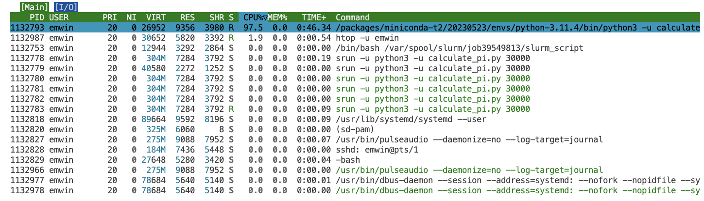

# Advanced Slurm
This lesson expands on the principles of Slurm job configuration and parallelization introduced in the first Slurm lesson. 

## Lesson Setup
For this lesson, you will need to connect to a Talapas login node through a shell application of your choice.

For convenience, we recommend the [Talapas OnDemand shell](https://ondemand.talapas.uoregon.edu/pun/sys/shell/ssh/login1.talapas.uoregon.edu).

Make sure you are in your home directory.

```bash
cd ~
```

Copy the `slurm_day2` folder to your home directory.

```bash
cp -r /projects/racs_training/intro-hpc-f25/slurm_day2/  .
```

Navigate inside the `slurm_day2` directory you copied over.

```bash
cd slurm_day2
```

## Evaluating Resource Usage on Running Jobs with `htop`
Remember the `seff` command? That's a great way to evaluate resource usage of a *finished* job. But what about resource usage for running jobs?

Navigate to the `python_pi_example` directory and inspect the contents.

```bash
cd python_pi_example
ls
```

```output
calculate_pi.py  calculate_pi.sbatch
```

Inspect `calculate_pi.sbatch`.

```bash
cat calculate_pi.sbatch
```

```bash
#!/bin/bash

#SBATCH --partition=preempt              ### Partition (like a queue in PBS)
#SBATCH --account=racs_training          ### Account used for job submission

### NOTE: %u=userID, %x=jobName, %N=nodeID, %j=jobID, %A=arrayMain, %a=arraySub
#SBATCH --job-name=digits_of_pi          ### Job Name
#SBATCH --output=%x.log                  ### File in which to store job output

#SBATCH --time=0-00:60:00                ### Wall clock time limit in Days-HH:MM:SS
#SBATCH --nodes=1                        ### Number of nodes needed for the job
#SBATCH --mem=100M                       ### Total Memory for job in MB -- can do K/M/G/T for KB/MB/GB/TB
#SBATCH --cpus-per-task=1                ### Number of cpus/cores to be launched per Task

### Load needed modules
module purge
module load python3/3.11.4

### Run your actual program
srun -u python3 -u calculate_pi.py 100000
```

This is a serial job that loads the **python3** module and executes a Python script that computes the first 5000 digits of pi. 
Observe that this job runs on the `preempt` partition.

```bash
cat calculate_pi.py
```

```python
 #!/usr/bin/env python3

import sys

def calcPi(limit):  # Generator function
    """
    Prints out the digits of PI
    until it reaches the given limit
    """

    q, r, t, k, n, l = 1, 0, 1, 1, 3, 3

    decimal = limit
    counter = 0

    while counter != decimal + 1:
            if 4 * q + r - t < n * t:
                    # yield digit
                    yield n
                    # insert period after first digit
                    if counter == 0:
                            yield '.'
                    # end
                    if decimal == counter:
                            break
                    counter += 1
                    nr = 10 * (r - n * t)
                    n = ((10 * (3 * q + r)) // t) - 10 * n
                    q *= 10
                    r = nr
            else:
                    nr = (2 * q + r) * l
                    nn = (q * (7 * k) + 2 + (r * l)) // (t * l)
                    q *= k
                    t *= l
                    l += 2
                    k += 1
                    n = nn
                    r = nr


def main():  # Wrapper function

    num_digits = sys.argv[1]

    for d in calcPi(int(num_digits)):
        print(d, end='')

if __name__ == '__main__':
    main()
```

Launch the Slurm job with `sbatch`.

```bash
sbatch calculate_pi.sbatch
```

```output
Submitted batch job 39536983
```

Check your queue. Note the node number (hostname) of the compute node where the job is currently running.

```bash
squeue --me
```

```output
             JOBID PARTITION     NAME     USER ST       TIME  NODES NODELIST(REASON)
          39536983   preempt digits_o    emwin  R       0:02      1 n0105
```

As we can see, we are currently running on node n0105.

Because we have an active Slurm task on node n0105, we can *remote into that compute node* from the login node with `ssh`.

```bash
ssh n0105
```

Enter the password to your DuckID when prompted. Confirm that you are connected with the `hostname` command.
```bash
hostname
```

```output
n0105.talapas.uoregon.edu
```

While you are on the compute node, the [**htop command**](https://linux.die.net/man/1/htop) can be used to evaluate the resources usage of your running processes. 

```bash
htop -u $USER
```



The `RES` column measures RAM per process in KB.
The `TIME` column indicates how long the process has been running.

Your connection to the compute node will terminate when your job terminates.
After the job has finished, you can use `seff` to get more granular information about your job.

Let's use `sacct` to get more information about the finished job.

```bash
sacct --units=M --format=JobId,JobName,ReqMem,MaxRss,ReqCPUs,AllocCPUs,Elapsed,State
```

```output
JobID           JobName     ReqMem     MaxRSS  ReqCPUS  AllocCPUS    Elapsed      State 
------------ ---------- ---------- ---------- -------- ---------- ---------- ---------- 
39536983     digits_of+       100M                   1          1   00:01:01  COMPLETED 
39536983.ba+      batch                 4.64M        1          1   00:01:01  COMPLETED 
39536983.ex+     extern                 0.10M        1          1   00:01:01  COMPLETED 
39536983.0      python3                 5.62M        1          1   00:01:00  COMPLETED
```

If you've run several  jobs recently, 

```bash
-S now-1hour
```

Examine this job's effeciency with `seff`.

```bash
seff 39536983
```

```output
ob ID: 39536983
Cluster: talapas
User/Group: emwin/uoregon
State: COMPLETED (exit code 0)
Cores: 1
CPU Utilized: 00:01:00
CPU Efficiency: 98.36% of 00:01:01 core-walltime
Job Wall-clock time: 00:01:01
Memory Utilized: 5.62 MB
Memory Efficiency: 5.62% of 100.00 MB
```

If this was a fully-fledged job, the low memory effeciency
would suggest that the less memory could be requested in the future.

```bash
sbatch --job-name=digits_of_pi_4cpus --cpus-per-task=4 calculate_pi.sbatch 
```

```output
Submitted batch job 39536997
```

These arguments *overwrite* what you have in your script.


How fast will this job run?

While we requested more CPUs, the underlying Python is not
parallelized. It is a single-threaded job that does not exploit
any additional CPU resources.

```bash
sacct
```

```output
39536997     digits_of+    preempt racs_trai+          4  COMPLETED      0:0 
39536997.ba+      batch            racs_trai+          4  COMPLETED      0:0 
39536997.ex+     extern            racs_trai+          4  COMPLETED      0:0 
39536997.0      python3            racs_trai+          4  COMPLETED      0:0 
```

```bash
seff 39536997
```

```output
Job ID: 39536997
Cluster: talapas
User/Group: emwin/uoregon
State: COMPLETED (exit code 0)
Nodes: 1
Cores per node: 4
CPU Utilized: 00:01:02
CPU Efficiency: 23.85% of 00:04:20 core-walltime
Job Wall-clock time: 00:01:05
Memory Utilized: 6.74 MB
Memory Efficiency: 6.74% of 100.00 MB
```

Let's inspect our
```bash
cat digits_of_pi.log | wc -c
30002
```

Does running a job on different hardware affect performance?
```bash
sbatch --job-name=digits_of_pi_sapphirerapids --constraint=sapphirerapids calculate_pi.sbatch
```

Broadwell processors are the oldest intel processors on the clusters
```bash
/packages/racs/bin/slurm-show-features | grep broadwell
```

```bash
sbatch --job-name=digits_of_pi_broadwell --constraint=broadwell calculate_pi.sbatch
```

Because this is a simple, single-threaded Python script, the newer processor
architecture alone doesn't contribute to performance.

```
39537336     digits_of_pi_sapphirerap+       100M                   1          1   00:00:47  COMPLETED 
39537336.ba+                     batch                 4.64M        1          1   00:00:47  COMPLETED 
39537336.ex+                    extern                 0.10M        1          1   00:00:47  COMPLETED 
39537336.0                     python3                 6.80M        1          1   00:00:47  COMPLETED 
39537337        digits_of_pi_broadwell       100M                   1          1   00:01:00  COMPLETED 
39537337.ba+                     batch                 4.64M        1          1   00:01:00  COMPLETED 
39537337.ex+                    extern                 0.09M        1          1   00:01:00  COMPLETED 
39537337.0                     python3                 5.06M        1          1   00:00:59  COMPLETED 
```

## Helper Scripts From RACS

Need to decide which nodes (and which partitions) are appropriate for your jobs? RACS has a script that shows available CPU and RAM on each node.

```bash
/packages/racs/bin/slurm-show-cpu-mem
```

This script shows the name of the node, the number of CPU cores on the node, and the amount of RAM (in MB) in that order for each node on Talapas.

```output
...
n0187 128 515048
n0188 128 515048
n0189 128 515048
n0190 128 515048
n0191 128 515048
n0192 128 515048
n0193 128 515048
...
```

Nodes on the compute partition typically have 128 CPU cores and 500GB of RAM.

To check which partition a node belongs to, find its name in the output of the `sinfo` command,

```bash
sinfo
```

As you can see, `n0191` is one of the nodes in the **compute** partition.
```output
compute              up 1-00:00:00      1   plnd n0195
compute              up 1-00:00:00      6  drain n[0112-0117]
compute              up 1-00:00:00     35    mix n[0111,0118-0135,0180-0194,0196]
```

You may also want to know what hardware is associated with each node.
```bash
/packages/racs/bin/slurm-show-features
```

This script shows the node name, processor type, processor architecture, and GPU parameters for each node.

Let's inspect `n0191` again.

```output
...
n0191 amd,milan,7713
n0192 amd,milan,7713
n0193 amd,milan,7713
n0194 amd,milan,7713
n0195 amd,milan,7713
n0196 amd,milan,7713
n0197 intel,sapphirerapids,6448y,mem-1tb,l40s,gpu-48gb
...
```

As you can see, `no191` has an AMD processor and it does not have a GPU.

Nodes with extra RAM are indicated with `mem-[amount]` tags.
```output
n0372 intel,broadwell,e7-4830,mem-1t
n0373 intel,broadwell,e7-4830,mem-1tb
n0374 intel,broadwell,e7-4830,mem-4tb
```

Nodes with GPUs are also indicated in this list.
```output
n0149 amd,milan,7413,a100,gpu-10gb
n0150 amd,milan,7413,a100,gpu-40gb
n0151 amd,milan,7413,a100,gpu-10gb
n0152 amd,milan,7413,a100,3xgpu-80gb,no-mig
```
These indicators are called features.
We can use **constraints** to 
direct Slurm to schedule jobs on nodes with specific features (extra RAM, GPU, CPU architecture) based on code hardware requirements.

### Pipeline Example
ADD DIAGRAM

```bash
cd ../pipeline_example
ls -F
```

```output
create_random.sbatch*  scripts/           submit_pipeline.sh*
find_eigh.sbatch*      sort_eigh.sbatch*  sum_eigh.sbatch*
```

* `create_random.py` - creates a matrix of random numbers, writes to file
* `find_eigh.py` - reads in matrix, writes out eigenvalues
* `sum_eigh.py` - reads in eigenvalues, sums them out
* `sort_eigh.py` - sorts eigenvalues, writes them out

Creates 8 different 1000 by 1000 matrices.

```bash
#!/bin/bash

#SBATCH --partition=compute              ### Partition (like a queue in PBS)
#SBATCH --account=racs_training          ### Account used for job submission

### NOTE: %u=userID, %x=jobName, %N=nodeID, %j=jobID, %A=arrayMain, %a=arraySub
#SBATCH --job-name=create_random         ### Job Name
#SBATCH --output=logs/%x-%a.out          ### File in which to store job output
#SBATCH --error=logs/%x-%a.err           ### File in which to store job error messages

#SBATCH --time=0-00:45:00                ### Wall clock time limit in Days-HH:MM:SS
#SBATCH --nodes=1                        ### Number of nodes needed for the job
#SBATCH --mem=4G                         ### Total Memory for job in MB -- can do K/M/G/T for KB/MB/GB/TB
#SBATCH --ntasks-per-node=1              ### Number of tasks to be launched per Node
#SBATCH --cpus-per-task=1                ### Number of cpus/cores to be launched per Task

#SBATCH --array=0-7

srun python3 scripts/create_random.py data/random-data-${SLURM_ARRAY_TASK_ID}.npy 
sleep 10
```

Creates eight sub-jobs that operate on each of the generated arrays in 
parallel.

```bash
#!/bin/bash

#SBATCH --partition=compute              ### Partition (like a queue in PBS)
#SBATCH --account=racs_training          ### Account used for job submission

### NOTE: %u=userID, %x=jobName, %N=nodeID, %j=jobID, %A=arrayMain, %a=arraySub
#SBATCH --job-name=find_eigh             ### Job Name
#SBATCH --output=logs/%x-%a.out          ### File in which to store job output
#SBATCH --error=logs/%x-%a.err           ### File in which to store job error messages

#SBATCH --time=0-00:45:00                ### Wall clock time limit in Days-HH:MM:SS
#SBATCH --nodes=1                        ### Number of nodes needed for the job
#SBATCH --mem=4G                         ### Total Memory for job in MB -- can do K/M/G/T for KB/MB/GB/TB
#SBATCH --ntasks-per-node=1              ### Number of tasks to be launched per Node
#SBATCH --cpus-per-task=1                ### Number of cpus/cores to be launched per Task

#SBATCH --array=0-7

srun python3 scripts/find_eigh.py data/random-data-${SLURM_ARRAY_TASK_ID}.npy data/eigh-output-${SLURM_ARRAY_TASK_ID}.npy
sleep 10
```

```bash
#!/bin/bash

#SBATCH --partition=compute              ### Partition (like a queue in PBS)
#SBATCH --account=racs_training          ### Account used for job submission

### NOTE: %u=userID, %x=jobName, %N=nodeID, %j=jobID, %A=arrayMain, %a=arraySub
#SBATCH --job-name=sum_eigh              ### Job Name
#SBATCH --output=logs/%x-%a.out          ### File in which to store job output
#SBATCH --error=logs/%x-%a.err           ### File in which to store job error messages

#SBATCH --time=0-00:45:00                ### Wall clock time limit in Days-HH:MM:SS
#SBATCH --nodes=1                        ### Number of nodes needed for the job
#SBATCH --mem=4G                         ### Total Memory for job in MB -- can do K/M/G/T for KB/MB/GB/TB
#SBATCH --ntasks-per-node=1              ### Number of tasks to be launched per Node
#SBATCH --cpus-per-task=1                ### Number of cpus/cores to be launched per Task

#SBATCH --array=0-7

srun python3 scripts/sum_eigh.py data/eigh-output-${SLURM_ARRAY_TASK_ID}.npy data/sum-eigh-${SLURM_ARRAY_TASK_ID}.npy
sleep 10
```

Observe that this is *not* an array job. Instead it uses Bash
arguments to pass in files to the job.

```bash
#!/bin/bash

#SBATCH --partition=compute              ### Partition (like a queue in PBS)
#SBATCH --account=racs_training          ### Account used for job submission

### NOTE: %u=userID, %x=jobName, %N=nodeID, %j=jobID, %A=arrayMain, %a=arraySub
#SBATCH --job-name=sort_eigh              ### Job Name
#SBATCH --output=logs/%x-%a.out          ### File in which to store job output
#SBATCH --error=logs/%x-%a.err           ### File in which to store job error messages

#SBATCH --time=0-00:45:00                ### Wall clock time limit in Days-HH:MM:SS
#SBATCH --nodes=1                        ### Number of nodes needed for the job
#SBATCH --mem=8G                         ### Total Memory for job in MB -- can do K/M/G/T for KB/MB/GB/TB
#SBATCH --ntasks-per-node=1              ### Number of tasks to be launched per Node
#SBATCH --cpus-per-task=2                ### Number of cpus/cores to be launched per Task


INPUT_FILES=(data/sum-eigh-*)
srun python3 scripts/sort_eigh.py ${INPUT_FILES[@]} output/sort-output.txt
sleep 10
```

These jobs are parallelized, but each stage must be done in order.

```bash
#!/bin/bash

# Setup the needed directories
mkdir -p logs
mkdir -p data
mkdir -p output


# submit First step of pipeline
jobid_create_random=$(sbatch --parsable create_random.sbatch)

# submit additional steps dependent on previous step completion
jobid_find_eigh=$(sbatch --parsable --depend=afterok:$jobid_create_random find_eigh.sbatch)
jobid_sum_eigh=$(sbatch --parsable --depend=afterok:$jobid_find_eigh sum_eigh.sbatch)


# submit final job step
sbatch --depend=afterok:$jobid_sum_eigh sort_eigh.sbatch
```

`--parsable` makes the output of the command
return the job id so it can be used by
other stages of the pipeline.

The first job's id is stored in the variable
`jobid_create_random`.

`jobid_find_eigh` *depends* on the `jobid_create_random` returning
a finished state. It will not start finding eigenvalues until all 8 arrays
have been generated.

### Slurm Job Dependency Syntax
Slurm pipelines express job depdencies in terms of relationships between
jobids.

**Single Job Dependencies**
* after:jobid -- after job start or cancellation
* afterany:jobid -- after job was terminated
* afternotok:jobid -- after job terminated in failed state
* afterok:jobid -- after job completes successfully

**Multiple Job Dependencies**
* afterok:jobid1:jobid2 -- after both jobs succeed
* afterok:jobid1:jobid2,afterany:jobid3 -- after both job1/job2 succeed AND after job3 terminated 
* afterok:jobid1?afternotok:jobid2 -- after job1 succeeds OR job2 terminated 

Launch your pipeline as a **Bash script** using `./` syntax.

```bash
./submit_pipeline.sh
```

```output
Submitted batch job 39538808
```

```output
          39538808   compute sort_eig    emwin PD       0:00      1 (Dependency)
    39538807_[0-7]   compute sum_eigh    emwin PD       0:00      1 (Dependency)
    39538806_[0-7]   compute find_eig    emwin PD       0:00      1 (Dependency)
        39538805_0   compute create_r    emwin  R       0:01      1 n0190
        39538805_1   compute create_r    emwin  R       0:01      1 n0190
        39538805_2   compute create_r    emwin  R       0:01      1 n0181
        39538805_3   compute create_r    emwin  R       0:01      1 n0181
        39538805_4   compute create_r    emwin  R       0:01      1 n0181
        39538805_5   compute create_r    emwin  R       0:01      1 n0181
        39538805_6   compute create_r    emwin  R       0:01      1 n0181
        39538805_7   compute create_r    emwin  R       0:01      1 n0181
```

The find_eigenvalues jobs must *wait* in the queue as a 
dependency because create_r
hasn't finished.

```bash
    39538808   compute sort_eig    emwin PD       0:00      1 (Dependency)
    39538807_[0-7]   compute sum_eigh    emwin PD       0:00      1 (None)
```

```output
             JOBID PARTITION     NAME     USER ST       TIME  NODES NODELIST(REASON)
          39538808   compute sort_eig    emwin PD       0:00      1 (Dependency)
        39538807_0   compute sum_eigh    emwin  R       0:01      1 n0186
        39538807_1   compute sum_eigh    emwin  R       0:01      1 n0186
        39538807_2   compute sum_eigh    emwin  R       0:01      1 n0186
        39538807_3   compute sum_eigh    emwin  R       0:01      1 n0186
        39538807_4   compute sum_eigh    emwin  R       0:01      1 n0186
        39538807_5   compute sum_eigh    emwin  R       0:01      1 n0186
        39538807_6   compute sum_eigh    emwin  R       0:01      1 n0186
        39538807_7   compute sum_eigh    emwin  R       0:01      1 n0186
```

```bash
ls logs
```

```output
             JOBID PARTITION     NAME     USER ST       TIME  NODES NODELIST(REASON)
          39538808   compute sort_eig    emwin PD       0:00      1 (Dependency)
        39538807_0   compute sum_eigh    emwin  R       0:01      1 n0186
        39538807_1   compute sum_eigh    emwin  R       0:01      1 n0186
        39538807_2   compute sum_eigh    emwin  R       0:01      1 n0186
        39538807_3   compute sum_eigh    emwin  R       0:01      1 n0186
        39538807_4   compute sum_eigh    emwin  R       0:01      1 n0186
        39538807_5   compute sum_eigh    emwin  R       0:01      1 n0186
        39538807_6   compute sum_eigh    emwin  R       0:01      1 n0186
        39538807_7   compute sum_eigh    emwin  R       0:01      1 n0186
```

```bash
ls data
```

```bash
eigh-output-0.npy  eigh-output-5.npy  random-data-2.npy  random-data-7.npy  sum-eigh-4.npy
eigh-output-1.npy  eigh-output-6.npy  random-data-3.npy  sum-eigh-0.npy     sum-eigh-5.npy
eigh-output-2.npy  eigh-output-7.npy  random-data-4.npy  sum-eigh-1.npy     sum-eigh-6.npy
eigh-output-3.npy  random-data-0.npy  random-data-5.npy  sum-eigh-2.npy     sum-eigh-7.npy
eigh-output-4.npy  random-data-1.npy  random-data-6.npy  sum-eigh-3.npy
```

```bash
ls output
```

```output
sort-output.txt
```

### Optional Activity SnakeMake
TODO(emwin) Pull out into a separate lesson!
SnakeMake is a pipeline manager

```bash
cd ../snakemake_example/
ls -F
```

```output
cluster_profile/  scripts/  Snakefile*  snakemakeenv.yml*
```

```bash
ca
```

### Don't Overwhelm the Scheduler!
Do not make 50,000 individual jobs with `srun` and a for-loop.
The maximum number of concurrent array jobs per user on Talapas is 12,000.

To get around these restrictions, you can tell Slurm to limit the nubmer of jobs submitted to the queue at a time.
Using `#SBATCH --array=0-50000%100` parameter submits only 100 subjobs to Slurm at a time.

### The Slurm `nodes` Parameter
Unless you're using an MPI or message passing interface, you should use the default
sbatch param of  `--nodes=1`.
Your jobs can't communicate between computers (nodes) without
code compatible  with MPI. Fall into this case? RACS has a [guide for configuring jobs that use MPI on Talapas](https://hpcrcf.atlassian.net/wiki/spaces/TW/pages/2755756676/How-to+Submit+a+MPI+Job).

## Slurm Defaults on Talapas
 I have selected a few common parameters. These constraints are subject to change and do not necessarily apply on condo nodes.

| Parameter    | Default| Description | Notes
| -------- | ------- | ---------- | ----------------|
| ntasks | 1 | tasks per job | |
| cpus-per-task | 1 | number of  cpu threads per task | |
| mem-per-cpu | 4G  | memory per cpu thread        | |
| mem | 4G* | memory per node | cannot be used with mem-per-cpu |
| nodes |   1  | nodes allocated for the job | [requires mpi](https://hpcrcf.atlassian.net/wiki/spaces/TW/pages/2755756676/How-to+Submit+a+MPI+Job) |
| gpus   | 0   | gpus per job | must be >1 to use gpus|
| error | slurm-%j.err | default error log location | |
| output | slurm-%j.out | default output log location | |

In summary, parallelism on Talapas is enabled by
* using code that *supports* multiple tasks, threads, or nodes
* enabling additional tasks, cores, or nodes as sbatch parameters
* OR using sbatch array jobs to launch simultaneous, independent jobs

Without meeting these requirements, your jobs will run serially.

## Conda Environments
RACS has a detailed guide for [building, creating, and loading conda environments](https://uoracs.github.io/talapas2-knowledge-base/docs/how-to_articles/how-to_create_personal_conda_envs) on Talapas.
We will go over some of the more advanced
capabiltiies of conda today.

Conda is especially popular in data science and scientific computing because it handles complex dependency situations like:
  - Python packages that require older versions of Python
  - non-Python libraries like R and Julia
  - packages from different channels (conda, conda-forge, pip)

### Benefits of Using Conda
1. Conda environments allow for reproducibility and consistency when running code on different devices and operating systems.
2. Conda only loads the packages you need for that specific workflow (helps reduce the amount of "clutter" in your environment)
3. Each Conda environment is a self-contained workspace, so you can: 
    - Use different Python versions side-by-side (e.g. Python 3.10 & 3.12)
    - Avoid dependency conflicts between projects

Many researchers maintain separate conda environments for different projects and contexts.
We highly recommend this approach for reproducibility, consistency, and ease of replicating environmental configurations
among colleagues.

### Conda Options on Talapas 
We have two main conda distributions available to users: 
- **miniconda3/20240410** offical source, maintained by anaconda, uses defaults as default channel, minimal installer for the Anaconda ecosystem
- **miniforge3/20240410** open-source distribution, maintained by community, uses conda-forge as default channel, fully open-source conda installer using community packages. 

### Building a Conda Environment

Navigate back to your home directory.

```bash
cd ~
```

```bash
module load miniconda3/20240410
```


```bash
conda create -n r-4.4.1-2025
```

This creates an empty environment named `r-4.4.1-2025`.

```output
#
# To activate this environment, use
#
#     $ conda activate r-4.4.1-2025
#
# To deactivate an active environment, use
#
#     $ conda deactivate
```

Activate the environment wi

```bash
conda activate r-4.4.1-2025
```

```bash
python --version
```

```output
Python 3.12.1
```

The `-c` indicates using 

Install R version 4.4.1 to the conda environment.

```bash
conda install -c conda-forge  r-base=4.4.1
```

Check your R version.

```bash
R --version
```

To install R packages to your conda environment,

Copy the `conda` folder to your home directory and navigate inside.


```R
library(dplyr)
```

```output
Error in library(dplyr) : there is no package called ‘dplyr’
```

Let's install `dplyr` to the R environment.

```bash
conda install -c conda-forge r-dplyr
```

Check that the dplyr package is installed.


### Exporting Conda Environments
How do you share conda environments? We can export them to `.yml` files.

```bash
conda env export | sed '/prefix:/d' > environment_R_4.4.1.yml
```

This will create a new folder named `environment_R_4.4.1.yml` in your
home directory.

```bash
cat environment_R_4.4.1.yml 
```

```output
name: r-4.4.1-2025
channels:
  - conda-forge
  - defaults
dependencies:
  - _libgcc_mutex=0.1=conda_forge
  - _openmp_mutex=4.5=2_gnu
  - _r-mutex=1.0.1=anacondar_1
  - binutils_impl_linux-64=2.44=h9d8b0ac_4
  - bwidget=1.10.1=ha770c72_1
  - bzip2=1.0.8=hda65f42_8
  - c-ares=1.34.5=hb9d3cd8_0
  - ca-certificates=2025.10.5=hbd8a1cb_0
  - cairo=1.18.4=h3394656_0
  - curl=8.16.0=h4e3cde8_0
  - font-ttf-dejavu-sans-mono=2.37=hab24e00_0
  - font-ttf-inconsolata=3.000=h77eed37_0
  - font-ttf-source-code-pro=2.038=h77eed37_0
  - font-ttf-ubuntu=0.83=h77eed37_3
  - fontconfig=2.15.0=h7e30c49_1
  - fonts-conda-ecosystem=1=0
  - fonts-conda-forge=1=0
  - freetype=2.14.1=ha770c72_0
  - fribidi=1.0.16=hb03c661_0
  - gcc_impl_linux-64=15.2.0=hcacfade_7
  - gfortran_impl_linux-64=15.2.0=h1b0a18f_7
  - graphite2=1.3.14=hecca717_2
  - gsl=2.7=he838d99_0
  - gxx_impl_linux-64=15.2.0=h54ccb8d_7
  - harfbuzz=11.2.1=h3beb420_0
  - icu=75.1=he02047a_0
  - kernel-headers_linux-64=4.18.0=he073ed8_8
  - keyutils=1.6.3=hb9d3cd8_0
  - krb5=1.21.3=h659f571_0
  - ld_impl_linux-64=2.44=h1aa0949_4
  - lerc=4.0.0=h0aef613_1
  - libblas=3.9.0=38_h4a7cf45_openblas
  - libcblas=3.9.0=38_h0358290_openblas
  - libcurl=8.16.0=h4e3cde8_0
  - libdeflate=1.22=hb9d3cd8_0
  - libedit=3.1.20250104=pl5321h7949ede_0
  - libev=4.33=hd590300_2
  - libexpat=2.7.1=hecca717_0
  - libffi=3.4.6=h2dba641_1
  - libfreetype=2.14.1=ha770c72_0
  - libfreetype6=2.14.1=h73754d4_0
  - libgcc=15.2.0=h767d61c_7
  - libgcc-devel_linux-64=15.2.0=h73f6952_107
  - libgcc-ng=15.2.0=h69a702a_7
  - libgfortran=15.2.0=h69a702a_7
  - libgfortran-ng=15.2.0=h69a702a_7
  - libgfortran5=15.2.0=hcd61629_7
  - libglib=2.84.1=h2ff4ddf_0
  - libgomp=15.2.0=h767d61c_7
  - libiconv=1.18=h3b78370_2
  - libjpeg-turbo=3.1.0=hb9d3cd8_0
  - liblapack=3.9.0=38_h47877c9_openblas
  - liblzma=5.8.1=hb9d3cd8_2
  - liblzma-devel=5.8.1=hb9d3cd8_2
  - libnghttp2=1.67.0=had1ee68_0
  - libopenblas=0.3.30=pthreads_h94d23a6_2
  - libpng=1.6.50=h421ea60_1
  - libsanitizer=15.2.0=hb13aed2_7
  - libssh2=1.11.1=hcf80075_0
  - libstdcxx=15.2.0=h8f9b012_7
  - libstdcxx-devel_linux-64=15.2.0=h73f6952_107
  - libstdcxx-ng=15.2.0=h4852527_7
  - libtiff=4.7.0=hc4654cb_2
  - libuuid=2.41.2=he9a06e4_0
  - libwebp-base=1.6.0=hd42ef1d_0
  - libxcb=1.17.0=h8a09558_0
  - libzlib=1.3.1=hb9d3cd8_2
  - make=4.4.1=hb9d3cd8_2
  - ncurses=6.5=h2d0b736_3
  - openssl=3.5.4=h26f9b46_0
  - pango=1.56.3=h9ac818e_1
  - pcre2=10.44=hc749103_2
  - pixman=0.46.4=h54a6638_1
  - pthread-stubs=0.4=hb9d3cd8_1002
  - r-base=4.4.1=h64c9cd0_16
  - r-cli=3.6.5=r44h3697838_1
  - r-crayon=1.5.3=r44hc72bb7e_2
  - r-dplyr=1.1.4=r44h3697838_2
  - r-ellipsis=0.3.2=r44h54b55ab_4
  - r-fansi=1.0.6=r44h54b55ab_2
  - r-generics=0.1.4=r44hc72bb7e_1
  - r-glue=1.8.0=r44h54b55ab_1
  - r-lifecycle=1.0.4=r44hc72bb7e_2
  - r-magrittr=2.0.4=r44h54b55ab_0
  - r-pillar=1.11.1=r44hc72bb7e_0
  - r-pkgconfig=2.0.3=r44hc72bb7e_5
  - r-r6=2.6.1=r44hc72bb7e_1
  - r-rlang=1.1.6=r44h3697838_1
  - r-tibble=3.3.0=r44h54b55ab_1
  - r-tidyselect=1.2.1=r44hc72bb7e_2
  - r-utf8=1.2.6=r44h54b55ab_1
  - r-vctrs=0.6.5=r44h3697838_2
  - r-withr=3.0.2=r44hc72bb7e_1
  - readline=8.2=h8c095d6_2
  - sed=4.9=h6688a6e_0
  - sysroot_linux-64=2.28=h4ee821c_8
  - tk=8.6.13=noxft_hd72426e_102
  - tktable=2.10=h8d826fa_7
  - tzdata=2025b=h78e105d_0
  - xorg-libice=1.1.2=hb9d3cd8_0
  - xorg-libsm=1.2.6=he73a12e_0
  - xorg-libx11=1.8.12=h4f16b4b_0
  - xorg-libxau=1.0.12=hb9d3cd8_0
  - xorg-libxdmcp=1.1.5=hb9d3cd8_0
  - xorg-libxext=1.3.6=hb9d3cd8_0
  - xorg-libxrender=0.9.12=hb9d3cd8_0
  - xorg-libxt=1.3.1=hb9d3cd8_0
  - xz=5.8.1=hbcc6ac9_2
  - xz-gpl-tools=5.8.1=hbcc6ac9_2
  - xz-tools=5.8.1=hb9d3cd8_2
  - zstd=1.5.7=hb8e6e7a_2
```

### Building a Conda Environment from a File

Deactivate your current environment.

```bash
conda deactivate
```


```bash
cp -r /projects/racs_training/intro-hpc-f25/conda  .
cd conda
```

```bash
create-graph-with-ggplot.R  jupyter.yml
```

```bash
conda env create -f jupyter.yml 
```

```output
basic_r.R  conda_notes.md  hello_world.py  jupyter.yml
```

Let's load the `miniconda3/20240410` module.
```bash
module load miniconda3/20240410
```

Before creating an environment to run it, inspect the
Python script `hello_world.py` with `nano`.

```bash
nano hello_world.py
```

```python
import subprocess
import numpy
import time
import pandas as pd

def average_age():
    data = {'Name': ['Alice', 'Bob', 'Charlie'], 'Age': [25, 30, 35]}
    df = pd.DataFrame(data)
    return df['Age'].mean()


def compute_sum():
    res = 4 + 4
    return res

def main():
    print("Hello World!")
    output = compute_sum()
    print(output)
    print(average_age())
    


if __name__ == "__main__":
    main()
```

For those unfamiliar with Python, this script executes the following statements:
  * prints "Hello World!"
  * assigns of the results of the `compute_sum()` function to the variable output
  * prints the value stored at output
  * prints the result of the `average_age()` function, which operates on a [**Pandas DataFrame**](https://pandas.pydata.org/docs/)

A login node is *not* an appopriate location to run non-trivial scripts, but this toy script is safe to test there.

Let's create a new environment named `myenv` that will be stored inside the `.conda` folder of your home directory.
You can specify which python version is used through the `python=` argument.

```bash
conda create --name myenv python=3.12 numpy matplotlib
```

This command creates an environment with the **numpy** and **matplotlib** packages. When Conda finishes building the environment, you will see a message like this.

```output
Preparing transaction: done                                 
Verifying transaction: done                                 
Executing transaction: done                                 
#                                                           
# To activate this environment, use                         
#                                                           
#     $ conda activate myenv                                
#                                                           
# To deactivate an active environment, use                  
#                                                           
#     $ conda deactivate 
```

To activate *myenv*, run the `conda activate` command.

```bash
conda activate myenv
```

Use the `python` command to run the version of Python in the active conda environment.

```bash
python hello_world.py
```

```output
Traceback (most recent call last):
  File "/gpfs/home/emwin/conda/hello_world.py", line 4, in <module>
    import pandas as pd
ModuleNotFoundError: No module named 'pandas'
```

This fails because *myenv* is missing the `pandas` module. 
We need to install pandas to the current environment using `conda install`.

```bash
conda install pandas
```

When the installation is finished, rerun the script.
```bash
python hello_world.py 
```

```output
Hello World!
8
30.0
```
This is the output we expected from inspecting the source code.

### R in Conda

You can also install R and R packages to conda environments.
```bash
conda install R=4.3
```

Let's examine `basic_r.R`

```bash
cat basic_r.R
```

```R
add_numbers1 <- 4 * 2
add_numbers6 <- 4 * 8
add_numbers3 <- 4 * 9
add_numbers4 <- 4 * 12
add_numbers5 <- 9 * 7
add_numbers2 <- 5 * 8

results <- list(
  add_numbers1 = add_numbers1,
  add_numbers2 = add_numbers2,
  add_numbers3 = add_numbers3,
  add_numbers4 = add_numbers4,
  add_numbers5 = add_numbers5,
  add_numbers6 = add_numbers6
)

# Write results to a file
writeLines(paste(names(results), results, sep=": "), "results.txt")
```

Because R has been installed inside the *myenv* Conda environment, the `Rscript` is available on our path when *myenv* is activated.

```bash
which Rscript
```

```output
~/.conda/envs/myenv/bin/Rscript
```

Launch the `basic_r.R` script using `Rscript`.

```bash
Rscript basic_r.R
```

Inspect the results file from the script, `results.txt`.
```output
add_numbers1: 8
add_numbers2: 40
add_numbers3: 36
add_numbers4: 48
add_numbers5: 63
add_numbers6: 32
```

### Exporting a Conda Environment
To share our Conda environment, we can create a textual representation of the environment in the form of a special `.yml` configuration file. 
Conventionally, conda environments bundled with source code are named `environment.yml`.

The `conda env export` command [exports the environment](https://docs.conda.io/projects/conda/en/latest/user-guide/tasks/manage-environments.html#sharing-an-environment), which is written to `myenv-environment.yml`. 

```bash
conda env export > myenv-environment.yml
```
Inspect the contents with `cat`.

```bash
cat myenv-environment.yml
```
```output
name: myenv
channels:
  - defaults
dependencies:
  - _libgcc_mutex=0.1=main
  - _openmp_mutex=5.1=1_gnu
  - _r-mutex=1.0.0=anacondar_1
  - _sysroot_linux-64_curr_repodata_hack=3=haa98f57_10
  - binutils_impl_linux-64=2.40=h5293946_0
  - binutils_linux-64=2.40.0=hc2dff05_2
  - blas=1.0=openblas
  - bottleneck=1.4.2=py312ha883a20_0
  - brotli-python=1.0.9=py312h6a678d5_9
  - bwidget=1.9.16=h9eba36c_0
  - bzip2=1.0.8=h5eee18b_6
  - c-ares=1.19.1=h5eee18b_0
  - ca-certificates=2025.2.25=h06a4308_0
  - cairo=1.16.0=hb05425b_5
...
```
This list is so lengthy because it includes the packages manually installed (numpy, matplotlib, pandas, R) *and* their dependencies.

If you use the `--from-history` flag, conda will only export the packages you indicated, leaving the conda solver to choose versions and dependencies.

```bash
conda env export --from-history
```

```output
name: myenv
channels:
  - defaults
dependencies:
  - matplotlib
  - numpy
  - python=3.12
  - pandas
  - r=4.3
```

### Creating A Conda Environment from a .yml File

Let's inspect an environment file called `jupyter.yml` before creating the environment defined there.

```bash
cat jupyter.yml
```

```output
name: jupyter-racs-f25
channels:
  - conda-forge
dependencies:
  - numpy
  - pandas
  - matplotlib
  - seaborn
  - jupyter
  - r-base
  - r-essentials
  - r-irkernel
  - nodejs
  - ipywidgets
  - pip
  - pip:
    - jupyter
    - git+https://github.com/conery/nbscan.git
```

### Conda Channels
This environment file defines an environment named *jupyter-racs-s25*. 
It uses the **conda-forge** channel. Channels are repositories where packages are downloaded from.

Conda defaults to a channel called **defaults**. The **conda-forge** channel has a larger repository of packages from the broader community.

Conda looks for packages in channels in the order that the channels appear.

This environment also uses pip to install a **nbscan** package that is not available through conda.

If you do not specify version numbers, conda will select the latest *compatible* version of a given package. 

Before we can create our new environment, we need to deactivate our current one.

Then, we can create our new environment as defined in `juptyer.yml` using `conda env create`.

```bash
conda env create -f jupyter.yml
```

When the environment building finishes, you will get a message like this.

```output
#                                                               
# To activate this environment, use                             
#                     
#     $ conda activate jupyter-racs-s25
#
# To deactivate an active environment, use
#
#     $ conda deactivate
```

No two conda environments can have the same name, so this command fail if you try to run it a second time.

We will be using the *jupyter-racs-f25* environment in the JupyterLab session.

### Using Conda Environments in Batch Scripts

To use a Conda environment you created in a Slurm batch script, you can add the following lines to your script.
Don't forget to load `miniconda3/202410` first!

For Python files:
```bash
module load miniconda3/202410
conda activate [env-name]
python [my-special-python-script].py
```

Or for R:
```bash
module load miniconda3/202410
conda activate [env-name]
R [my-special-r-script].R
```

### Debugging Conda
Observing strange behavior with Conda on Talapas? Make sure you're not loading into a conda environment through your .bashrc file.

A default `.bashrc` looks something like this:
```bash
# .bashrc

# Source global definitions
if [ -f /etc/bashrc ]; then
	. /etc/bashrc
fi

# User specific environment
if ! [[ "$PATH" =~ "$HOME/.local/bin:$HOME/bin:" ]]
then
    PATH="$HOME/.local/bin:$HOME/bin:$PATH"
fi
export PATH

# Uncomment the following line if you don't like systemctl's auto-paging feature:
# export SYSTEMD_PAGER=

# User specific aliases and functions
```

Do not run the `conda init` command on Talapas to avoid modifying your .bashrc file unintentionally.
Instead, use `module load` to load either `miniconda3` or `miniforge3`.

### What About `pip`?
Pip is an [alternative package manager](https://www.anaconda.com/blog/understanding-conda-and-pip) and it can be paired with `venv` to create Python virtual environments. Using `pip` within a `conda` environment can introduce problems,
but it can be a necessary evil for packages available in pip but not in conda. 

### Useful Conda Commands

| Command | Description |
| ---------- | ---------------------------------|
| `which python`| see which python you are currently using, helpful for sanity checks | 
| `conda env list`| list out all available conda environments from loaded conda module | 
| `conda activate <environment name>` | activates specified conda environment |
| `pip list` | see packages and their versions that were installed via pip package manager |
| `conda list` | see packages and their versions installed, includes both pip and conda packages | 
| `conda search <package name>` | searches for packages within your environment | 
| `conda list --name ENVNAME --show-channel-url` | useful when trying to figure out what channel was used to install what package | 
| `conda env remove --name <environment name> --all` | deletes a conda environment (make sure you have created a backup) |


