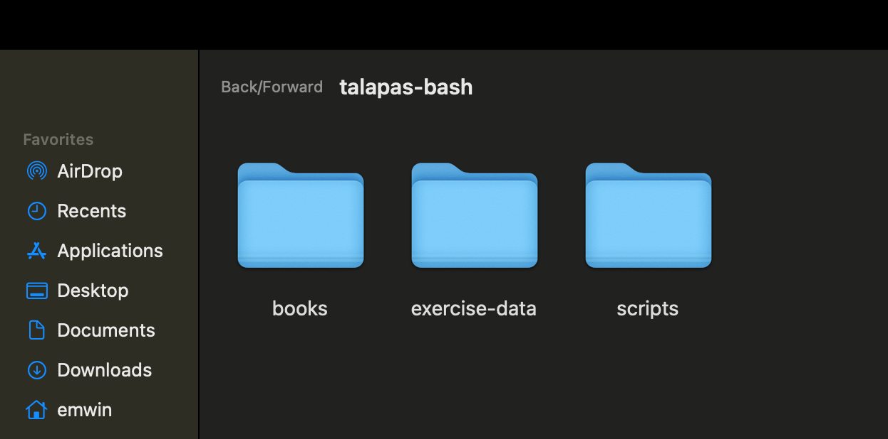
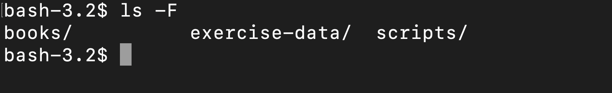
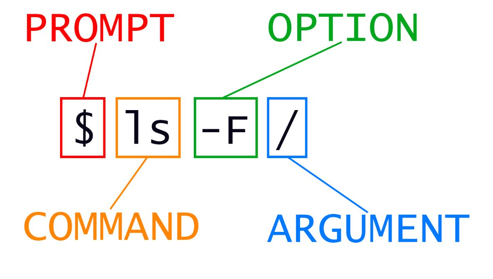
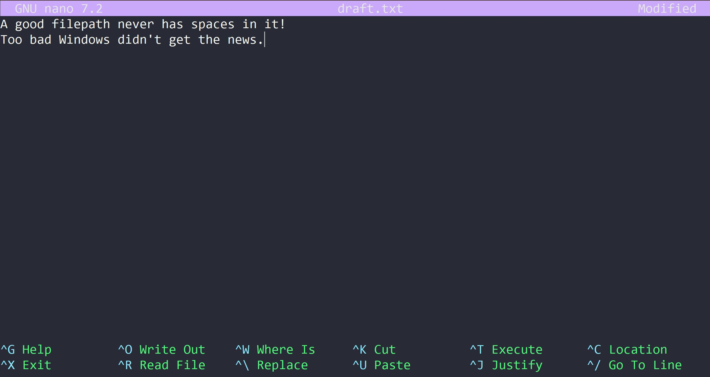

# Day One: Bash and the Command Line
{: .no_toc }
This lesson is adapted from *[The Unix Shell](https://swcarpentry.github.io/shell-novice/aio.html)* lesson of Software Carpentry.
- TOC
{:toc}

## Traversing the Filesystem
The part of the operating system responsible for managing files and directories is called the filesystem. 
It organizes our data into files and folders which hold files or other directories. 

*A screenshot of a folder as it appears in the Finder GUI.*

You have probably interacted with your device's filesystem through GUI  or graphical user interface applications like Finder (MacOS) or File Explorer (Windows).

 *A screenshot of the same folder contents as they appear from the command line.*

To work with high performance-computing systems like Talapas, you will need to interact with files and folders from a shell application called the command line, command prompt, or terminal interchangeably. 
The language to communicate with this shell application is called Bash.

Today's Bash commands are used to create, inspect, rename, and delete files and directories. To start exploring them, move to the Git Bash or Terminal application that you opened during the workshop setup.

## Where Are You? `pwd, cd, ls`

For today's lesson, we will focus on running Bash commands *locally* on your own device. In our next lesson, we will run these commands (and a few new ones) on a *remote* cluster.

### A Note on Example Commands
{: .no_toc }
> I have tested the commands in this workshop on a Windows computer with Git Bash installed. This means that my output paths typically begin with `/c/users/erin` rather than `/users/erin`. 

### Entering Bash Commands
{: .no_toc }

Bash commands can be intimidatingly terse for new programmers. However, if you start with the grammar, you will gradually commit more commands to memory with practice.

The simplest form of Bash's grammar is a single command or program terminated by the Enter-key. Today we will focus on using built-in commands that control the underlying filesystem. 


### Where You Are: `pwd`
{: .no_toc }
Our first Bash command is `pwd`, which stands for **p**rint **w**orking **d**irectory.


```bash
pwd
```

Because terminal applications typically open to your home directory by default, the expected output is the absolute path of your *home directory*, which will vary based on your operating system and your account name. 

```output
/c/Users/Erin
```

This command returns the *absolute path* of the current working directory. All relative file and folder paths used as arguments must be **relative to the current working directory**.

### Home Directory Structure
{: .no_toc }

Each of you will have a different set of files and folders inside your home directory, which would make it difficult for interactive exercises. However, we're going to practice Bash commands from inside the `talapas-bash` folder you extracted from `talapas-bash.zip`.

You should have a folder `/users/home/[YOURNAME]/talapas-bash/` (Unix) or `/c/users/Home/[YOURNAME]/talapas-bash/`(Git Bash) with a set of practice subfolders and files. 

*Please ask for assistance at this point if you need help moving and extracting the`talapas-bash.zip` file.*

### Changing the Current Working Directory: `cd`
{: .no_toc }
Change your working directory to `talapas-bash` using the `cd` command. `cd` takes in a single **argument**, the directory to move to. You can use either absolute or relative paths, but the relative paths must be relative (as always) to the current working directory.

```bash
cd talapas-bash
```


Confirm that you are inside the `talapas-bash` directory by running the `pwd` command again.

```bash
pwd
```

```output
/c/Users/Erin/talapas-bash
```

### Listing "Stuff" With `ls`
{: .no_toc }
This begs the question: what files and folders are here?


Inspect the contents and their respective using `ls`. The `ls` command stands for **l**ist directory content**s**.

```bash
ls
```

```output
books/  exercise-data/  scripts/
```


`ls` is also the first command that we will use with options. 

**Options** are letters signaled by a hyphen that are passed to commands to change the behavior of that command.

 Type `ls -l` with a <kbd>-</kbd> (hyphen) key. Options must come *after* the command they modify and *without space* between the hyphen and the letter representing the option.

```bash
ls -l
```

```output
drwxr-xr-x 1 Erin 197121 0 Feb  3 22:48 books/
drwxr-xr-x 1 Erin 197121 0 Feb  3 22:48 exercise-data/
drwxr-xr-x 1 Erin 197121 0 Feb  3 22:48 scripts/
```

The `-l` option enables "long-listing" format. We'll come back to what each column in this new listing format means later when discussing permissions.

We should still be in the `talapas-bash` directory, which we can check using:

```bash
pwd
```

```output
/Users/emwin/talapas-bash
```

Next, we'll move to the `talapas-bash/exercise-data` directory and see what it contains.

### Auto-Complete with Bash
{: .no_toc }
For lengthy filepaths, the shell can infer file and folder names through auto-completion. This is a great feature for traversing long or complicated file paths! Type `cd exer` and <kbd>Tab</kbd> and the shell will automatically complete it to `exercise-data`. 

```bash
cd exercise-data
ls -l
```

```output
drwxr-xr-x 1 Erin 197121  0 Feb  3 22:48 alkanes/
drwxr-xr-x 1 Erin 197121  0 Feb  3 22:48 animal-counts/
drwxr-xr-x 1 Erin 197121  0 Feb  3 22:48 creatures/
drwxr-xr-x 1 Erin 197121  0 Feb  3 22:49 mice/
-rw-r--r-- 1 Erin 197121 18 Feb  3 22:48 numbers.txt
drwxr-xr-x 1 Erin 197121  0 Feb  3 22:48 writing/
```

You can enable multiple options simultaneously by putting both letters after the hyphen. 

Here, the `h` option stands for "human-readable" and prints file sizes in KB, MB, and GB rather than in bytes for readability.

```bash
ls -lh
```

```output
drwxr-xr-x 1 Erin 197121  0 Feb  3 22:48 alkanes/
drwxr-xr-x 1 Erin 197121  0 Feb  3 22:48 animal-counts/
drwxr-xr-x 1 Erin 197121  0 Feb  3 22:48 creatures/
drwxr-xr-x 1 Erin 197121  0 Feb  3 22:49 mice/
-rw-r--r-- 1 Erin 197121 18B Feb  3 22:48 numbers.txt
drwxr-xr-x 1 Erin 197121  0 Feb  3 22:48 writing/
```

Order among options does not matter when enabling multiple options. 

```bash
ls -hl
```

```output
drwxr-xr-x 1 Erin 197121  0 Feb  3 22:48 alkanes/
drwxr-xr-x 1 Erin 197121  0 Feb  3 22:48 animal-counts/
drwxr-xr-x 1 Erin 197121  0 Feb  3 22:48 creatures/
drwxr-xr-x 1 Erin 197121  0 Feb  3 22:49 mice/
-rw-r--r-- 1 Erin 197121 18B Feb  3 22:48 numbers.txt
drwxr-xr-x 1 Erin 197121  0 Feb  3 22:48 writing/
```

However, options *are* case-sensitive. For example, let's try `ls -F` and `ls -f`.

```bash
ls -F
```

```output
alkanes/  animal-counts/  creatures/  mice/  numbers.txt  writing/
```
The `-F` **option** tells `ls` to add a marker to file and directory names to indicate what they are:
- a trailing `/` indicates that this is a directory
- `@` indicates a link
- `*` indicates an executable

This can be extremely informative. (**Windows:** You may already see these markings by default in Git Bash.)

The `-f` option, however, tells `ls` to remove any color-coding and to show all hidden files.

```bash
ls -f
```

```output
.  ..  alkanes  animal-counts  creatures  mice  numbers.txt  writing
```

If you try to use an option that is not supported, Bash commands will print an error message similar to:

```bash
ls -j
```

```error
ls: invalid option -- 'j'
Try 'ls --help' for more information.
```

## Anatomy of a Bash Command: Command, Options, Arguments

Let's formalize some terminology by looking at an example Bash command:

```bash
ls -F /
```



In the example `ls` is the command, as run with an option `-F` (type indicator flag) and an argument `/` (the root directory). 

There are two types of options: single dash `-` options or short options, and two dashes `--` options or long options. 

A command can be called with more than one option and more than one argument, but a command doesn’t always require an argument or an option. For example, the `pwd` command never takes an argument.

You might sometimes see options being referred to as switches or flags, especially for options that take no argument.

Each part of the command is separated by spaces. If you omit the space between ls and -F the shell will look for a command called `ls-F`, which doesn’t exist. 

When `ls` is used **without** an argument, it displays the files and folders in the *current working directory*. 

When it is used **with** an argument, it displays the files and folders in that directory. 

In this case, `ls -F` will display all the files at the root directory `/`.

#### Quiz
{: .no_toc }
> What happens if we try to `cd exercise-data` from here? Why?

#### Answer
{: .no_toc }
> The command will fail with the following error because there is no `exercise-data` directory inside `exercise-data` and we supplied a relative path.
> ```output
> bash: cd: exercise-data: No such file or directory
>```

## File and Folder Manipulation: `mkdir, nano, mv, cp, rm`

### Special Characters: `~`, `..` and `.`

With our methods so far,
`cd` can only see sub-directories inside your current directory. 

However, there is a shortcut in the shell to move up one directory level without resorting to absolute paths from root. It works as follows:

```bash
cd ..
```

`..` is a special directory, the **parent** of the current directory.
Sure enough, if we run `pwd` after running `cd ..`, we're back in `talapas-bash`:

```bash
$ pwd
```
```output
/c/Users/Erin/talapas-bash/
```

The special directory `..` doesn't usually show up when we run `ls`. If we want to display it, we can add the `-a` option to `ls -F`:

```bash
ls -Fa
```

```output
./  ../  books/  exercise-data/  scripts/ 
```

 It also displays another special directory `.` that points to the current working directory. It may seem redundant to have a folder refer to itself, but it will become useful as we learn more commands.

#### Quiz
{: .no_toc }
> From your current working directory of `writing`, how could use `..` and `ls` to see the contents of the `mice` directory? **Hint**: the `mice` directory path is `talapas-bash/exercise-data/mice`.

#### Answer
{: .no_toc }
> Use `ls ../mice` to look for a directory called `mice` from inside `exercise-data`.
> ```bash
> ls ../mice
> ```
> ```output
> Animals.txt  Tasks.txt  citation.txt
> README.md    Visit.txt
>```
> 

Finally, let's discuss a third special character: `~`. This is shorthand for the absolute path if your *home directory* and it works regardless of your operating system.

```bash
cd ~
ls
```

```output
Applications Documents    Library      Music        Public
Desktop      Downloads    Movies       Pictures
```

#### Quiz
{: .no_toc }
> How would I navigate to talapas-bash using a relative path? How about an aboslute path using the `~` again?

#### Answer
{: .no_toc }
> `cd talapas-bash`, and `cd ~/talapas-bash` respectively


### More Complex Traversals
{: .no_toc }
We don't have to traverse through the filesystem one folder at a time!  

When using auto-complete, if you press <kbd>Tab</kbd> and no paths populate, it means there's more than one possible path with the current prefix. Because `exercise-data/` has multiple files and subfolders inside, the shell can't decide path which to populate. Press <kbd>Tab</kbd> twice to see all the possibilities.

Now, type a single <kbd>w</kbd> for `writing` and press the <kbd>Tab</kbd> key a final time. Then, run the full command.

```bash
cd exercise-data/writing/
```

### Creating Directories with `mkdir`
{: .no_toc }

Inside `writing`, let's create a new empty directory called `thesis` using the command `mkdir thesis`. 

```bash
mkdir thesis
```

`mkdir` means 'make directory'. Since `thesis` is a relative path, the new directory is created in the current working directory: 

```bash
ls -F
```

```output
haiku.txt  LittleWomen.txt  thesis/
```

Since we've just created the `thesis` directory, there's nothing in it yet. We can check this by passing in `thesis` as an argument to `ls`.

```bash
ls -F thesis
```

Note that `mkdir` is not limited to creating single directories one at a time. The `-p` option allows `mkdir` to create nested subdirectories in a single operation. This command creates a `project` directory with two subfolders: `data` and `results`.

```bash
mkdir -p ../project/data ../project/results
```

The `-R` option to the `ls` command will list all nested subdirectories within a directory.

Let's use `ls -FR` to recursively list the new directory hierarchy we just created in the `project` directory:

```bash
ls -FR ../project
```

```output
../project/:
data/  results/

../project/data:

../project/results:
```
### A Beginner-Friendly Text Editor: `nano`
{: .no_toc }

Let's change our working directory to `thesis` using `cd`,
then run a text editor called Nano to create a file called `draft.txt`:

```bash
cd thesis
nano draft.txt
```

Let's type in a few lines of text.


Once we're happy with our text, we can press <kbd>Ctrl</kbd>\+<kbd>O</kbd>
(press the <kbd>Ctrl</kbd> or <kbd>Control</kbd> key and, while
holding it down, press the <kbd>O</kbd> key) to write our data to disk. Press <kbd>Return</kbd> to write out to `draft.txt`.

Once our file is saved, we can use <kbd>Ctrl</kbd>\+<kbd>X</kbd> to quit the editor and return to the shell.

`nano` doesn't leave any output on the screen after it exits,
but `ls` now shows that we have created a file called `draft.txt`:

```bash
$ ls
```

```output
draft.txt
```
### Renaming and Moving with `mv`
{: .no_toc }

Return to the `talapas-bash/exercise-data/writing` directory, using `..`. This means we need to navigate to the parent of `thesis`.

```bash
cd ..
```

In our `thesis` directory we have a file `draft.txt`. Let's change the file's name using `mv`, which is short for 'move':

```bash
mv thesis/draft.txt thesis/wisdom.txt
```

The first argument tells `mv` the source file or folder,
while the second is the destination.
In this case, we're moving `thesis/draft.txt` to `thesis/wisdom.txt`,
which has the same effect as renaming the file.
Now, `ls` shows us that `thesis` now contains one file called `wisdom.txt`:

```bash
ls thesis
```

```output
wisdom.txt
```

One must be careful when specifying the target file name, since `mv` **will silently overwrite** any existing file with the same name. For example, if we *move* LittleWoman.txt to haiku.txt, we will be left with one file named haiku.txt that has the contents of the novel *Little Women*.

```bash
mv LittleWomen.txt haiku.txt
ls -f
```

```output
haiku.txt  thesis/
```

### Looking at Long Files with `less`
{: .no_toc }
Speaking of that long text files, let's practice looking at long files (like logs, extensive code) from the command line with a screen reader called `less`.

```bash
less haiku.txt
```

Use the **arrow keys** to scroll through the text and the <kbd>Q</kbd>-key to exit the manual.


By default, `mv` will not ask for confirmation before overwriting files.
However, an additional option, `mv -i` (or `mv --interactive`), will cause `mv` to request
such confirmation.

Note that `mv` also works on directories.

Let's move `wisdom.txt` into the current working directory `writing`.

We use `mv` once again,
but this time we'll use just the name of a directory as the second argument to tell `mv` that we want to keep the filename
but put the file somewhere new.

In this case, the directory name we use is the special directory name `.` that we mentioned earlier.

```bash
mv thesis/wisdom.txt .
```

This moves `wisdom.txt` from `thesis` to the current working directory. `ls` now shows us that `thesis` is empty:

```bash
ls thesis
```

```output

```
Alternatively, we can confirm the file `wisdom.txt` is no longer present in the `thesis` directory by trying to list it with `ls`. 

This is a helpful debugging strategy for path resolution errors both locally and on Talapas.

```bash
ls thesis/wisdom.txt
```

```error
ls: cannot access 'thesis/wisdom.txt': No such file or directory
```

We can also use this to see that `wisdom.txt` is now present in our current directory:

```bash
ls wisdom.txt
```

```output
wisdom.txt
```

### Copying files and directories: `cp`
{: .no_toc }

The `cp` command is similar to `mv`, except it copies files and folders instead of moving or renaming them.

```bash
cp wisdom.txt thesis/quotations.txt
ls wisdom.txt thesis/quotations.txt
```

```output
wisdom.txt   thesis/quotations.txt
```

We can also copy a directory and its contents by using the
[recursive](https://en.wikipedia.org/wiki/Recursion) option `-r`:

```bash
cp -r thesis thesis_backup
```

We can check the result by listing the contents of both the `thesis` and `thesis_backup` directory. The contents are identical.

```bash
ls thesis thesis_backup
```

```output
thesis:
quotations.txt

thesis_backup:
quotations.txt
```

It is important to include the `-r` flag to recursively copy the folders' contents -- all subfolders and files -- when moving nonempty folders.
If you want to copy a directory and omit this option, you will see a message that the directory has been omitted with `-r not specified`.

``` bash
cp thesis thesis_backup
cp: -r not specified; omitting directory 'thesis'
```

The recursive `-r` flag is an extremely common option. Keep in eye out for it in other Bash commands that manipulate or traverse folders.

### Creating Empty Files: `touch`
{: .no_toc }

To create an empty file, use the `touch` command followed by one or more file paths.

Let's make an empty directory and put a few placeholder (empty) files inside.

```bash
mkdir journal
touch journal/day1.txt journal/day2.txt
```

To show that these files are empty (size 0B), we can use the `ls -l` commands, which shows the directory contents in a long-listing format.

```bash
ls -lh journal
```

```output
-rw-r--r-- 1 Erin 197121 0 Feb  3 00:17 day1.txt
-rw-r--r-- 1 Erin 197121 0 Feb  3 00:17 day2.txt
```

In this case, file size `0` is the 5th column.

### Removing Files and Directories with `rm`
{: .no_toc }

Returning to the `talapas-bash/exercise-data/writing` directory,
let's tidy up this directory by removing the original `wisdom.txt` file we created.

The command we'll use for this is `rm` or **r**e**m**ove:
```bash
rm wisdom.txt
```

Check the file is gone with  `ls`:
```bash
ls wisdom.txt
```

```error
ls: cannot access 'wisdom.txt': No such file or directory
```

If we try to remove the `thesis` directory using `rm thesis`,
we get an error message:

```bash
rm thesis
```

```error
rm: cannot remove 'thesis': Is a directory
```

This happens because `rm` by default only works on files, not directories.

`rm` can remove a directory *and all its contents* if we use the
recursive option `-r`, and it will do so *without any confirmation prompts*:

```bash
rm -r thesis
```

Given that there is no way to retrieve files deleted using the shell,
`rm -r` should be used with great caution. Consider adding the interactive option `rm -r -i`, which will prompt for the individual deletion of each file in the recursive traversal.

### Deleting from the Command Line is Forever
{: .no_toc }
The Unix shell doesn't have a trash bin that we can recover deleted
files from. 

On Talapas, your only hope in scenarios like this is to restore a version of the file or folder from a system backup. As researchers working in a shared computing environment, it is your responsibility not to use `rm` on project files and folders unless it is safe to remove them.

## Wildcards: `*, ?`

`*` is a **wildcard**, which represents zero or more other characters.
Let's consider the `talapas-bash/exercise-data/alkanes` directory.

```bash
cd ~/talapas-bash/exercise-data/alkanes
ls -F
```

```output
cubane.pdb  ethane.pdb  explosive/  methane.pdb  octane.pdb  pentane.pdb  propane.pdb
```

`*.pdb` represents `ethane.pdb`, `propane.pdb`, and every
file that ends with '.pdb'. Let's test this by using with `ls`.

```bash
ls *.pdb
```

```output
cubane.pdb  ethane.pdb  methane.pdb  octane.pdb  pentane.pdb  propane.pdb
```

On the other hand, `p*.pdb` only represents
`pentane.pdb` and `propane.pdb`, because the 'p' at the front can only represent filenames that begin with the letter 'p'.

```bash
ls p*.pdb
```

```output
pentane.pdb  propane.pdb
```

`?` is also a wildcard, but it represents exactly one character.
So `?ethane.pdb` can only represent `methane.pdb` whereas
`*ethane.pdb` represents both `ethane.pdb` and `methane.pdb`.

```bash
ls ?ethane.pdb
```

```output
methane.pdb
```

Wildcards can be used in combination with each other. For example,
`???ane.pdb` indicates three characters followed by `ane.pdb`,
giving `cubane.pdb  ethane.pdb  octane.pdb`.

When the shell sees a wildcard, it expands the wildcard to create a
list of matching filenames *before* running the preceding command.

As an exception, if a wildcard expression does not match
any file, Bash will pass the expression as an argument to the command
as it is. For example, typing `ls *.pdf` in the `alkanes` directory
(which contains only files with names ending with `.pdb`) results in
an error message that there is no file with a `.pdf` extension.

```bash
ls *.pdf
```

```output
ls: cannot access '*.pdf': No such file or directory
```

Commands like `wc` and `ls` see the lists of
file names matching these expressions generated by the shell, but not the wildcards themselves. 
It is the shell itself that expands the wildcards.

## Processing Files with `wc` and `cat`

Let's look more closely at the `alkanes` folder
that contains six files describing some simple organic molecules.

The `.pdb` extension indicates that these files are in Protein Data Bank format, a simple text format that specifies the type and position of each atom in the molecule.

```bash
$ ls
```

```output
cubane.pdb    methane.pdb    pentane.pdb
ethane.pdb    octane.pdb     propane.pdb
```

### Concatenating with `cat`
{: .no_toc }
Let's (con)catenate this file to the terminal to inspect its connects using `cat`. 

```bash
cat methane.pdb
```

```output
COMPND      METHANE
AUTHOR      DAVE WOODCOCK  95 12 18
ATOM      1  C           1       0.257  -0.363   0.000  1.00  0.00
ATOM      2  H           1       0.257   0.727   0.000  1.00  0.00
ATOM      3  H           1       0.771  -0.727   0.890  1.00  0.00
ATOM      4  H           1       0.771  -0.727  -0.890  1.00  0.00
ATOM      5  H           1      -0.771  -0.727   0.000  1.00  0.00
TER       6              1
END
```

Unlike `nano`, `cat` prints the contents of a file directly to the terminal and does not give us the opportunity to edit it. Commands like `cat` are not appropriate for longer files. 

To look at a *numeric summary* of a text file, we can use the versatile `wc` or word count command.

```bash
wc cubane.pdb
```

```output
20  156 1158 cubane.pdb
```

`wc` or "word count" counts the number of lines, words, and characters in files and displays them in that order from left to right.

If we run the command `wc *.pdb`, the `*` in `*.pdb` matches zero or more characters, so the shell turns `*.pdb` into a list of all `.pdb` files in the current directory.

```bash
wc *.pdb
```

```output
  20  156  1158  cubane.pdb
  12  84   622   ethane.pdb
   9  57   422   methane.pdb
  30  246  1828  octane.pdb
  21  165  1226  pentane.pdb
  15  111  825   propane.pdb
 107  819  6081  total
```

Note that `wc *.pdb` also shows the total number of all lines in the last line of the output.

If we run `wc -l` instead of just `wc`,
the output shows only the number of lines per file:

```bash
wc -l *.pdb
```

```output
  20  cubane.pdb
  12  ethane.pdb
   9  methane.pdb
  30  octane.pdb
  21  pentane.pdb
  15  propane.pdb
 107  total
```

The `-m` and `-w` options can also be used with the `wc` command to show only the number of characters or the number of words, respectively.

## Writing Output to Files: `>` and `>>`

Which of these protein database files contains the fewest lines?
It's an easy question to answer when there are only six files,
but what if there were 6000?
Our first step toward a solution is to run the command:

```bash
wc -l *.pdb > lengths.txt
```

The greater than symbol, `>`, tells the shell to **redirect** the command's output to a
file instead of printing it to the screen.

 This command prints no screen output, because
everything that `wc` would have printed has gone into the file `lengths.txt` instead.
If the file doesn't exist prior to issuing the command, the shell will create the file. If the file exists already, it will be silently overwritten.
Thus, **redirect** commands require caution.

`ls lengths.txt` confirms that the file exists:

```bash
ls lengths.txt
```

```output
lengths.txt
```

We can now send the content of `lengths.txt` to the screen using `cat lengths.txt`.

```bash
cat lengths.txt
```

```output
  20  cubane.pdb
  12  ethane.pdb
   9  methane.pdb
  30  octane.pdb
  21  pentane.pdb
  15  propane.pdb
 107  total
```


We'll continue to use `cat` in this lesson, for convenience and consistency, but it has the disadvantage that it always dumps the whole file onto your screen.

## Filtering Output with `sort`, `head`, and `tail`

Next we'll use the `sort` command to sort the contents of the `lengths.txt` file.

The file `talapas-bash/exercise-data/numbers.txt` contains the following lines:

```source
10
2
19
22
6
```

If we run `sort` on this file, the output is:

```output
10
19
2
22
6
```

If we run `sort -n` on the same file, we get this instead:

```output
2
6
10
19
22
```

This is because the `-n` option specifies a numerical rather than an alphanumerical sort.

The `sort` command alone does *not* change input files; it prints their lines in sorted order to the screen.

```bash
sort -n lengths.txt
```

```output
  9  methane.pdb
 12  ethane.pdb
 15  propane.pdb
 20  cubane.pdb
 21  pentane.pdb
 30  octane.pdb
107  total
```

We can put the sorted list of lines in another temporary file called `sorted-lengths.txt`
by putting `> sorted-lengths.txt` after the command,
just as we used `> lengths.txt` to put the output of `wc` into `lengths.txt`.


Once we've done that,
we can run another command called `head` to get the line of `sorted-lengths.txt`:

```bash
sort -n lengths.txt > sorted-lengths.txt
head -n 1 sorted-lengths.txt
```

```output
  9  methane.pdb
```

This tells us that `methane.pdb` is the shortest of the files, with only 9 lines.

Using `-n 1` with `head` tells it that we only want the first line of the file; `-n 20` would get the first 20, and so on.

### Warning: Redirecting to the same file
{: .no_toc }

It's a very bad idea to try redirecting
the output of a command that operates on a file
to the same file. For example:

```bash
sort -n lengths.txt > lengths.txt
```

Doing something like this may give you
incorrect results and/or delete the contents of `lengths.txt`. *Do not actually run this command.*


### Peeking at the Bottom with `tail`
{: .no_toc }

We have already met the `head` command, which prints lines from the start of a file. `tail` is similar, but prints it lines from the end of a file instead.

If we look at the last two lines of sorted-lengths.txt using `tail -n 2 sorted-lengths.txt`, we get the longest and teh total lengths of all the `.pdb` files instead.

```bash
tail -n 2 sorted-lengths.txt
```

```output
  30 octane.pdb
 107 total
```

## Accumulating Text: `>>` and `echo`
The most trivial of the commands that print to the terminal is `echo` which returns the strings or words you pass it as input back to you as output.

```bash
echo "Good afternoon"
```

```output
Good afternoon
```

```bash
echo "Good afternoon" > greeting.txt
```

```bash
cat greeting.txt
```

```output
Good afternoon
```

We can append to an existing file by using `>>`:

```bash
echo "Backup your files" >> greeting.txt
cat greeting.txt
```
```output
Good afternoon
Backup your files
```

#### Quiz
{: .no_toc }
Which would be appropriate for a maintaining a log file that is updated with one line per day representing the
status of scientific pipeline: `>` or `>>`?

#### Answer
{: .no_toc }
You want to concatenate with `>>` because `>` would overwrite the previous day's output. 


### Waiting for Input...
{: .no_toc }

What happens if a command is supposed to process a file, but we
don't give it a filename? For example, what if we type `wc -l` but don't type anything after the command?

```bash
wc -l
```

Since it wasn't supplied filenames as arguments, `wc` waits
for us to give it a path to data interactively.  

If you make this kind of mistake, you can escape out of this state by
holding down the control key (<kbd>Ctrl</kbd>) and pressing the letter
<kbd>C</kbd> once: <kbd>Ctrl</kbd>\+<kbd>C</kbd>. Then release both keys.

<kbd>Ctrl</kbd>\+<kbd>C</kbd> can also be used to exit running programs, so this is an essential skill for interacting with the command line.


## Getting Help with Linux Commands: `man` and `help`
{: .no_toc }
Commands like `ls` have so many options that even the most experienced users wouldn't have them all memorized. As you encounter new commands, use the [GNU manual](https://www.gnu.org/software/coreutils/manual/html_node/index.html) and references like [StackOverflow](https://stackoverflow.com/) to guide you in configuring their options and options.

The manual pages for most commands can be accessed as follows:

#### Mac OS, Linux
{: .no_toc }
```bash
man wc
```
Use the **arrow keys** to scroll through the text and the <kbd>Q</kbd>-key to exit the manual.

#### Windows
{: .no_toc }
```bash
wc --help
```
The `--help` flag prints the contents of the manual directly to the terminal instead. Scroll upwards with your scroll bar to see the output.

### Clearing the Screen: `clear`
{: .no_toc }

As we wrap up for the day, let's clear the text that has been printed to the terminal with the `clear` command. This will not affect your command history or any of your files.

## Today's Bash Command List

| command | description | example usage |
| ----------- | --------------- | ------------- |
| pwd | print working directory | pwd |
| ls | list stuff (files, folders) | ls -lha |
| cd [directory] | change directory | cd ~/Pictures |
| mkdir [directory_name(s)] | make directory | mkdir my_new_dir |
| rm [file(s)] | remove files (permanently) | rm a.txt b.txt |
| nano [filename] | create or open file at filename | nano draft.txt |
| less [filename] | open a paged reader for filename | less bigDoc.md |
| touch [filename] | create an empty file at filename | touch empty.txt |
| mv [old] [new] | move (or rename) files and folders | mv water.txt wine.txt |
| cp [old] [new] | copy files or folders to a new location | cp old.txt backup/ |
| wc [filename] | prints line, word, and char counts | wc list.txt |
| cat [filename] | prints the contents of a file to the screen | cat list.txt |
| clear | clears the terminal screen (not the history) | clear |

## Learn More About Bash
- [*The Linux command line for beginners*](https://ubuntu.com/tutorials/command-line-for-beginners#1-overview), Ubuntu Tutorials.
  - A short Bash tutorial designed for Ubuntu users with a summary of the historical context for UNIX and Linux. You can install Ubuntu for free and follow along in the GUI with [VirtualBox](./extra-resources.md).