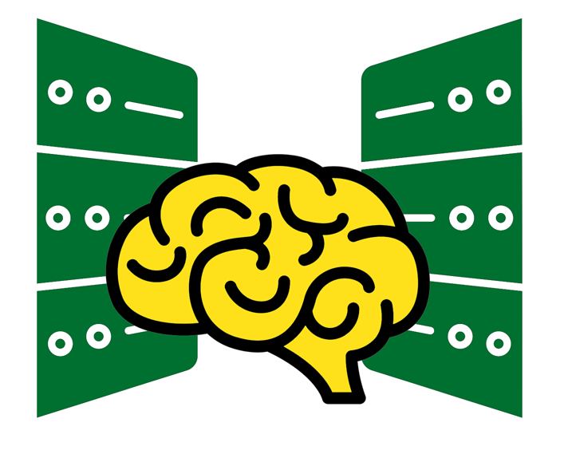

## Introduction to High-Performance Computing
UO Libraries, Research Advanced Computer Services (RACS), and the Lewis Center for Neuroimaging are pleased to announce our Introduction to High Performance Computing workshop series!
This workshop is held in-person in the Knight Library DREAM Lab.

Targeted towards computational researchers, these workshops will introduce UNIX commands, bash scripting, file management, OnDemand, Slurm, PIRGs, JupyterLab integration, job management, and other essential Talapas skills. 

This webpage archives notes, slides, and code samples from the Winter 2025 session of the workshop series. 

## Winter 2025 Schedule
* **[Introduction to High-Performance Computing, UNIX, Bash](./bash/main.html):** February 4th, 2pm - 4pm
* **[Bash Scripting on Talapas](./talapas-scripting/main.html):** February 6th, 2pm - 4pm 
* **[Talapas Essentials](./talapas-essentials/main.html):** February 11th, 2pm - 4pm 
* **[Running Slurm Jobs on Talapas](./slurm/main.html):** February 18th, 2pm - 4pm 
* **[JupyterLab and Data Pipelines](./jupyterlab/main.html):** February 20th, 2pm - 4pm
* **[R on Talapas, Wrapping Up:](./r-talapas/main.html)** February 27th, 2pm - 4pm

This page is maintained by [Erin M. Winter](https://library.uoregon.edu/directory/winter) of UO Libraries.