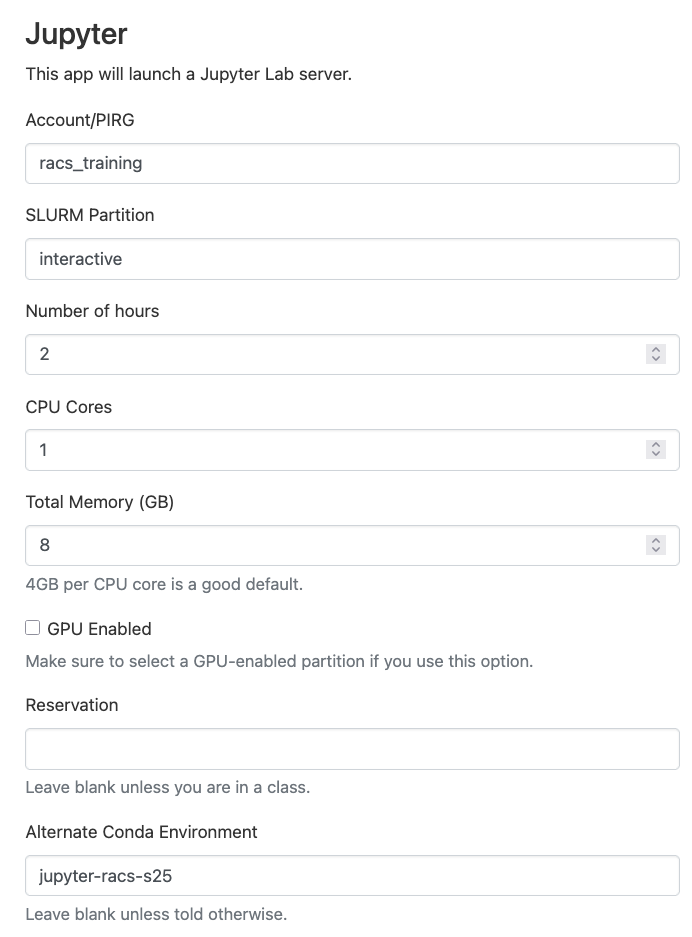
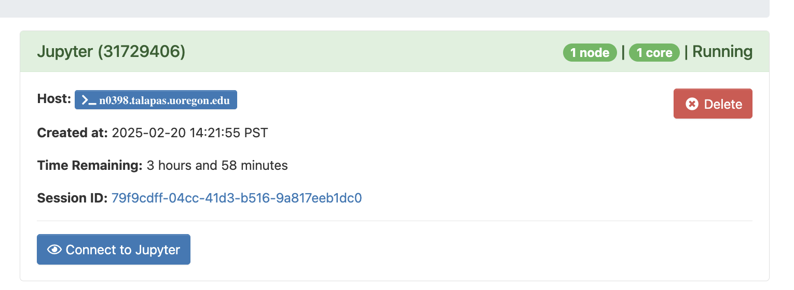
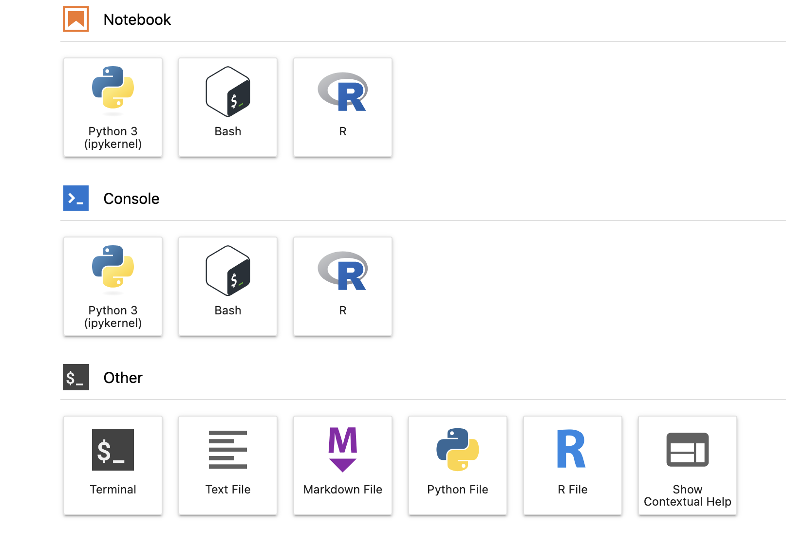
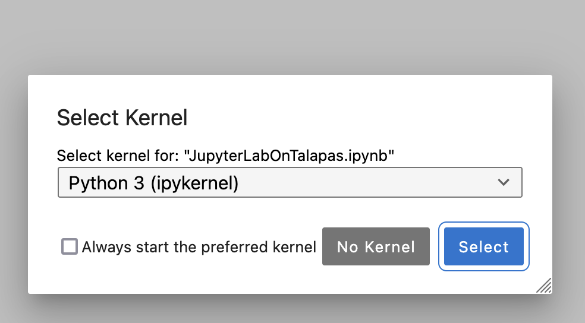

# Configuration

## Checking for the `jupyter-racs-f25` Conda Environment
If you participated in the Advanced Slurm session, you should already have the `jupyter-racs-f25` environment available for today's activity. 

If you did not participate or want to make sure, connect to a Talapas login node through a shell application of your choice.
For convenience, we recommend the [Talapas OnDemand shell](https://ondemand.talapas.uoregon.edu/pun/sys/shell/ssh/login1.talapas.uoregon.edu).

Load the miniconda module and run the `conda env list` command, piping the results to grep to check for an environment named *jupyter-racs-s25*.

```bash
module load miniconda3/20240410
conda env list | grep "jupyter-racs-s25"
```

If you have an environment of this name configured, the command will return a single line referencing an environment in your home directory. Skip to the JupyterLab configuration section.

```output
jupyter-racs-s25         /home/emwin/.conda/envs/jupyter-racs-s25
```


If you do not have an environment of this name configured, the command will result in no output. 

### Building the `jupyter-racs-s25` Environment 

To build the *jupter-racs-s25* environment, create a new file named *jupyter.yml* in `nano`.

```bash
nano jupyter.yml
```

Copy the following text into the .yml file.
```yml
name: jupyter-racs-s25
channels:
  - conda-forge
dependencies:
  - numpy
  - pandas
  - matplotlib
  - seaborn
  - jupyter
  - r-base
  - r-essentials
  - r-irkernel
  - nodejs
  - ipywidgets
  - pip
  - pip:
    - git+https://github.com/conery/nbscan.git
```

Save `nano` with <kbd>Ctrl</kbd>+<kbd>O</kbd>, <kbd>Enter</kbd> to confirm writing out the file, and then <kbd>Ctrl</kbd>+<kbd>X</kbd> to exit.

Create the environment defined the `juptyer.yml` configuration file with `conda env create`.

```bash
conda env create -f jupyter.yml
```

When the build process is finished, you will get the following message.

```output
#                                                               
# To activate this environment, use                             
#                     
#     $ conda activate jupyter-racs-s25
#
# To deactivate an active environment, use
#
#     $ conda deactivate
```

You are now ready to launch JupyterLab with this environment! 
You only need to the define *jupyter-racs-s25* once; it can be reused as many times as you would like in the future.

## Configuring the OnDemand JupyterLab App

Navigate to the [OnDemand homepage](https://ondemand.talapas.uoregon.edu/pun/sys/dashboard) and login with your **DuckID**.

From the **Interactive Apps** dropdown menu, select **Jupyter**.

*An example JupyterLab configuration screen*

**PIRG**: During the training period, you can use `racs_training`, but you should use *your lab's PIRG* after these trainings finish.

**SLURM Partition:** You have two choices: `interactive` (CPU-based jobs) or `interactivegpu` (if you need GPUs). Only request a GPU if your code or software pipeline can use one.

**Number of hours:** Be considerate and ask only for as much time as you need. You can ask for up to 12 hours on `interactive`, 8 hours on `interactivegpu`.

**CPU Cores:** You must ask for at least `1`. Only code or software packages that are configured to do so can take advantage of multiple cores. 

**Total memory:** We typically recommend 4GB per CPU core. You can ask for up to 100GB.

**GPU enabled:** Only check if you require a GPU. To use a GPU, this box must be checked **AND** you must run on the `interactivegpu` partition.

**Reservation:** If you don't know what that means, please leave this box blank.

**Alternate Conda Environment**: To use Jupyter OnDemand with a custom environment, you need to pass in the *name* of the conda environment. For this exercise, use the `jupyter-racs-s25` environment.

When you've adjusted your job settings, click the **Launch** button.

## Launching JupyterLab from Sessions

You will automatically be navigated to the **My Interactive Sessions** page. 



When your interactive job has been scheduled, the **Connect to Jupyter** button will display.

If the button does not appear, check the logs in the **Session ID** link. Keep in mind that the more resources you ask for, the longer it will to schedule.

## Selecting a Kernel
JupyterLab supports interaction through Jupyter notebooks in the **Notebook** menu, through an interactive Python interpreter in the **Console** menu, and text editing functionality in the **Other** menu.



A single `conda` environment can have multiple kernels -- for example, we created one that has both an R and Python kernel. 

To run Jupyter Notebooks, you will need to select a [kernel](https://jupyterlab.readthedocs.io/en/stable/user/running.html). You should select the **Python 3 (ipykernel)** from the **Notebook** menu to create, edit, and execute Jupyter Notebooks.

After clicking, you will be prompted to select a specific Python kernel. 


After selecting a kernel, open the `jupyter_examples` folder in your home directory [from within the JupyterLab interface](https://jupyterlab.readthedocs.io/en/stable/user/files.html).

## Exercise Notebooks

Copy the following folder to your home directory.
```bash
cp -r /projects/racs_training/intro-hpc-f25/jupyter-class/ .
```

You can either reference raw notebooks from this folder or the annotated
versions below.

Today's lesson continues in the [Notebooks](../jupyterlab/notebooks.html) section.
