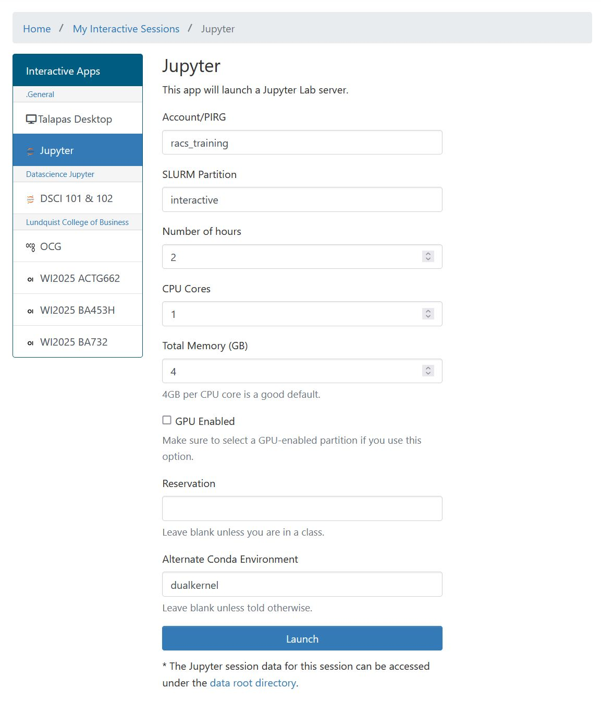
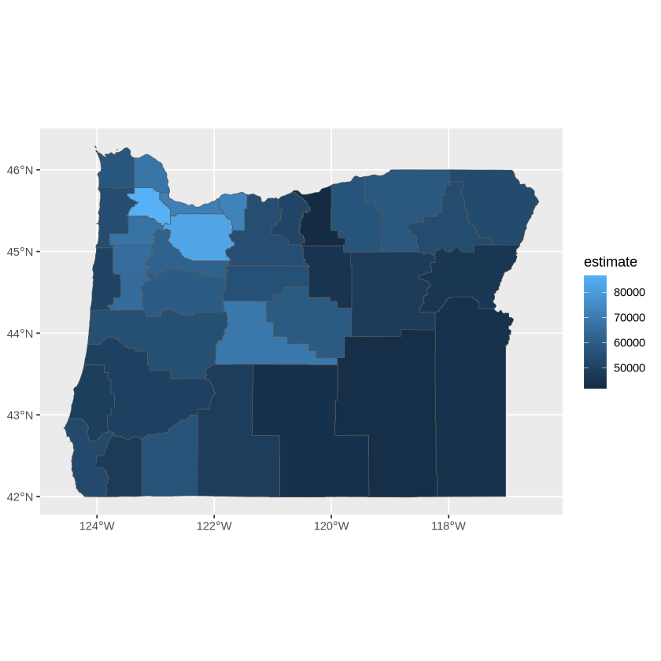

# R on Talapas
R can be used in Talapas in three ways:
* through the RStudio IDE on the Talapas Desktop App
* through the command line in `sbatch` scripts or interactive `srun` jobs
* through JupyterLab OnDemand app with an R-enabled kernel 

You can and should configure your R environment with an package manager like Conda. Whichever option is most 
convenient for you to use, custom environments are available on all three.

As mentioned in a previous class session, `conda` is not CRAN. In some cases, you will need to install 
specialized packages through R's `install.packages()` because
the package simply isn't available through conda.

## Supported Versions of R on Talapas
- R/4.3.2
- R/4.3.3
- R/4.4.2 

## Creating a Custom R Environment
First, let's create our custom R environment from the following `dual-kernel-jupyter.yml` file.

If you would prefer not to create the file from scratch, you can access it from the
 `/projects/racs_training/emwin/r_activity/` folder as follows:

```bash
cp -r /projects/racs_training/emwin/r_activity/ .
cd r_activity
ls
```

```output
dual-kernel-jupyter.yml  multi-r.R  multi-r.sh  serial-r.R  serial-r.sh
```

```bash
cat dual-kernel-jupyter.yml
```

```bash
name: dualkernel
channels:
  - conda-forge
  - defaults
dependencies:
  - python=3.12
  - r-base=4.3.3
  - r-essentials
  - jupyter
  - r-irkernel
  - r-tidyverse
  - r-devtools
  - r-data.table
  - r-tidycensus
  - r-tigris
```

In addition to R 4.3.3 and Python 3.12, this kernel has a special set of packages for running R within the JupyterLab OnDemand app:
  * **jupyter** - allows for running Jupyter 
  * **r-base** - enables R within Conda
  * **r-essentials** - adds some popular R packages
  * **r-irkernel** - enables R within Jupyter

You can modify this template to create your own dual kernel environments.

When you're ready, create the `dualkernel` environment:
```bash
conda env create -f dual-kernel-jupyter.yml --solver=libmamba
```

This command will fail if you already have an environment named `dualkernel`.


## RStudio with a Custom R Environment
Access to the RStudio GUI is described at length in this tutorial for [Talapas Desktop](../talapas-essentials/talapas-desktop.md).

Start a new Talapas Desktop session and open Mate Terminal.

Activate the `dualkernel` environment.

```bash
module load miniconda3/20240410
conda activate dualkernel
```

Before we test it in R studio, let's check the R version inside the `dualkernel` environment in the interactive interpreter.

```bash
R
```

Let's type the `installed.packages` (past tense) in our R interpreter to check that our packages have been installed.

```R
installed.packages()
```


```output
IRdisplay     NA                    NA      NA     NA               "4.3.3"
IRkernel      NA                    NA      NA     "no"             "4.3.3"
```

I can tell this is my special installation because I can see the packages `IRDisplay` and `IRKernel`, which are going to come in handy later.

Exit the R interpreter.

```
quit()
```

### Which RStudio?
There are two primary `rstudio` modules for use with custom environments on Talapas.

- rstudio/base
  - Base Rstudio module that uses whatever R module that the user has loaded 
- rstudio/2024.04.1+748-condaGLIBX
  - Rstudio package that allows for newer library packages to be loaded that need specific GLIBX system libraries


Let's load `rstudio/base`.

```bash
module load rstudio/base
```

We want load the base Rstudio module that uses whatever R module is on our path: the environment named `dualkernel`.

Start Rstudio using `rstudio`.

```bash
rstudio
```

We'll use `find.package()`, which, given the name of a package, looks for the filepath location of its compiled binaries.

```R
find.package("dplyr")
```

```output
[1] "/gpfs/home/emwin/.conda/envs/dualkernel/lib/R/library/dplyr"
```

It should reference the `dualkernel` environment in your home directory on Talapas.


## Freddy's Fun Facts about R
For the sake of reproducibility, write every script assuming it will be run in a fresh R process. 
- User-level setup: Do not save `.RData` when you quit R and don’t load `.RData` when you fire up R.
- In RStudio, this behavior can be requested in the General tab of Preferences.
- If you run R from the shell, put something like this in your .bash_profile: `alias R='R --no-save --no-restore-data'`.
- Don’t do things in your `.Rprofile` that affect how R code runs, such as loading a package like dplyr or ggplot or setting an option such as `stringsAsFactors = FALSE`.

### The Monte Carlo Method for Approximating Pi
We're going to be testing R with a classic parallel computing task: approximating pi.


This code simulates random (x, y) points in a 2-D plane with domain as a square of side 2r units centered on (0,0). Imagine a circle inside the same domain with same radius r and inscribed into the square. 

The more points `n`, the closer our approximation is to pi.

Let's examine write following R function inside RStudio.

```R
monte_carlo_pi <- function(n) {
  x <- runif(n, -1, 1)
  y <- runif(n, -1, 1)
  sum(x^2 + y^2 <= 1) / n * 4
}
```

Let's practice calling this function in the console.

```R
monte_carlo_pi(5)
```

```output
[1] 2.4
```

Let's increase n to 100!

```R
monte_carlo_pi(100)
```

```output
[1] 3.32
```

Now 1000.

```R
monte_carlo_pi(1000)
```

```output
[1] 3.14
```

Finally, 10000000.

```R
monte_carlo_pi(10^7)
```

```output
[1] 3.140647
```

As expected, a larger `n`, produces a better approximation of pi. 

Now, let's produce a better approximation by averaging several concurrently generated samples.

### Vectorized Functions

R programmers typically rely on **vectorized functions** like [**apply**](https://rdrr.io/r/base/apply.html), [**sapply**](https://rdrr.io/r/base/sapply.html), [**lapply**](https://rdrr.io/r/base/lapply.html), and [**tapply**](https://rdrr.io/r/base/tapply.html) to leverage multi-threaded operations. 

The equivalent operations in the Tidyverse library are in the [**dplyr:across**](https://dplyr.tidyverse.org/reference/across.html) function.

Regardless of whether you use base R or Tidyverse, these **vectorized** operations are optimized to have multiple iterations of input processed at the same time, increasing memory and CPU usage in exchange for speed.

`lapply(x, function)` returns a list of the same length as its input, each element of function which is the result of applying FUN to the corresponding element of x. 


For example, let's make a quick list `my_list` in the console.

```R
my_list <- 1:10
my_list
```

You can see it's one dimensional and has the values 1, 2, and 3..10 in that order.

```output
 [1]  1  2  3  4  5  6  7  8  9 10
```


We if apply the `sqrt` function using lapply, we get the square root of each of the values in `my_list`. 

```R
lapply(my_list, sqrt)
```

```output
[[1]]
[1] 1

[[2]]
[1] 1.414214

[[3]]
[1] 1.732051

[[4]]
[1] 2

[[5]]
[1] 2.236068

[[6]]
[1] 2.44949

[[7]]
[1] 2.645751

[[8]]
[1] 2.828427

[[9]]
[1] 3

[[10]]
[1] 3.162278
```

We can also pass in our own functions:

```R
lapply(my_list, monte_carlo_pi)
```

```output
[[1]]
[1] 4

[[2]]
[1] 2

[[3]]
[1] 2.666667

[[4]]
[1] 4

[[5]]
[1] 3.2

[[6]]
[1] 2

[[7]]
[1] 2.857143

[[8]]
[1] 2.5

[[9]]
[1] 2.666667

[[10]]
[1] 3.6
```

But what if we want to run `lapply` on `monte_carlo_pi` with a different argument?


We can run `monte_carlo_pi` with `n=1000` 10 times as follows:

```R
lapply(my_list, function(i) monte_carlo_pi(1000))
```

```output
[[1]]
[1] 3.168

[[2]]
[1] 3.12

[[3]]
[1] 3.256

[[4]]
[1] 3.176

[[5]]
[1] 3.152

[[6]]
[1] 3.192

[[7]]
[1] 3.172

[[8]]
[1] 3.112

[[9]]
[1] 3.064

[[10]]
[1] 3.084
```

In this case, the length of the list passed to `lapply` is what matters, not the values stored there.

Next, benchmarking. Adjust the file as follows in the RStudio file editior as follows.

```R 
monte_carlo_pi <- function(n){
  x <- runif(n, -1, 1)
  y <- runif(n, -1, 1)
  sum(x^2 + y^2 <= 1) / n * 4
}

# Set random seed
set.seed(42)
system.time({
  # Compute 100 approximations of pi
  results_vectorized <- lapply(1:100, function(i) monte_carlo_pi(10^7))
  # Average results
  print(mean(unlist(results_vectorized)))
})
```
### Estimating Resource Usage in R

We're going to time our outputs for these jobs in R using **system.time**, which allows us to see how CPU time was actually used.

This script performs 100 runs of 10M points each of the `monte_carlo_pi` approximation, then averages those 100 results and prints them.

Running it gives a result like this:

```output
[1] 3.141586
   user  system elapsed
 66.004   7.851  74.024
```

* `user`: The time R spent on the CPU(s)
* `system`: Time spent on related system processes
* `elapsed`: wall clock time


**While `lapply` is a vectorized operation, this is technically serial code. You're using only the one CPU core you requested and were allocated.**

## Multithreading, Multicores

But what if we want to use mulithreading or multiple cores in R?

To do so, you will need to need launch batch Slurm jobs. 

Open a connection to a Talapas login node and copy today's files into your working directory.

```bash
cp -r /projects/racs_training/emwin/r_activity/ .
cd r_activity
```

## Running Batch R Jobs with `Rscript`

Take a look at the contents of your `r_activity` folder.

```bash
ls
```

```output
dual-kernel-jupyter.yml  multi-r.R  multi-r.sh  serial-r.R  serial-r.sh
```

First examine, `serial-r.R`. It should look familiar.

```R
monte_carlo_pi <- function(n){
  x <- runif(n, -1, 1)
  y <- runif(n, -1, 1)
  sum(x^2 + y^2 <= 1) / n * 4
}

set.seed(42)
system.time({
  results_vectorized <- lapply(1:100, function(i) monte_carlo_pi(10^7))
  print(mean(unlist(results_vectorized)))
})
```

This script is called by the slurm job `serial-r.sh`.

```bash
#!/bin/bash
#SBATCH --account=racs_training
#SBATCH --job-name=serial-r
#SBATCH --output=serial.out
#SBATCH --error=serial.err
#SBATCH --partition=compute
#SBATCH --time=0-00:10:00
#SBATCH --ntasks=1
#SBATCH --cpus-per-task=1

module purge
module load miniconda3/20240410
conda activate dualkernel
Rscript serial-r.R
```

This is a single-core, serial job, that asks for the default 4GB RAM.

Launch it.

```bash
sbatch serial-r.sh
```

```output
Submitted batch job 31969962
```

After the job completes (within 60 seconds), check its resources usage with `seff`.

```bash
seff 31969962
```

```output
Job ID: 31969962
Cluster: talapas
User/Group: emwin/uoregon
State: COMPLETED (exit code 0)
Cores: 1
CPU Utilized: 00:01:13
CPU Efficiency: 96.05% of 00:01:16 core-walltime
Job Wall-clock time: 00:01:16
Memory Utilized: 332.11 MB
Memory Efficiency: 8.11% of 4.00 GB
```

Now examine `multi-r.R` which performs the same computations using multiple threads.

```R
library(parallel)

# Do not get the number of CPUS on the node
# Get the number you asked for
workers <- as.numeric(Sys.getenv("SLURM_CPUS_PER_TASK"))
cat("using", workers, "workers")
# Fork the process ncpus-1 times to make ncpus total workers
cl <- makeCluster(workers - 1)

system.time({
  monte_carlo_pi <- function(i) {
    n <- 10^7
    x <- runif(n, -1, 1)
    y <- runif(n, -1, 1)
    sum(x^2 + y^2 <= 1) / n * 4
  }
  results <- parLapply(cl, 1:100, monte_carlo_pi)
  print(mean(unlist(results)))
})

stopCluster(cl)
```

This script instantiates as many threads as CPUs requested from Slurm. 

The number of requested CPUs for each Slurm job is stored in the `SLURM_CPUS_PER_TASK` environment variable and corresponds to the value passed to the `#SBATCH --cpus-per-task=` parameter.

These threads are instantiated with R's built-in [**parallel**](https://dept.stat.lsa.umich.edu/~jerrick/courses/stat506_f24/16-parallel-processing.html) package and executed using the parallel version of lapply called [**parLapply**](https://www.rdocumentation.org/packages/parallel/versions/3.6.2/topics/clusterApply).

This package is not the only option for performing parallel computation in R, nor is `parLapply` its only option. I have included a list of additional resources in the [Additional R Resources](../r/r-resources.html) section.

Regardless of what package you use, take advantage of environment variables like `SLURM_CPUS_PER_TASK` to make
sure you instantiate threads appropriate to the number of CPUs allocated.

Creating more threads than can be scheduled on the CPUs allocated to you will not speed up your job.

Inspect `multi-r.sh`.

```bash
#!/bin/bash
#SBATCH --account=racs_training
#SBATCH --output=multi.out
#SBATCH --error=multi.err
#SBATCH --job-name=multi-r
#SBATCH --partition=compute
#SBATCH --time=0-00:10:00
#SBATCH --ntasks=1
#SBATCH --cpus-per-task=4

module purge
module load miniconda3/20240410
conda activate dualkernel
Rscript multi-r.R
```

This job requests 4 CPUs, so multi-r.R will run with **4** threads.

Launch the job. It should finish in about 20 seconds. Because of scheduling and overhead, it is not 4x faster than the serial version.

```bash
sbatch multi-r.sh
```

```output
Submitted batch job 31969987
```

When the job finishes, run the `seff` command to examine its resource usage.

```bash
seff 31969987
```

```output
Job ID: 31969987
Cluster: talapas
User/Group: emwin/uoregon
State: COMPLETED (exit code 0)
Nodes: 1
Cores per node: 4
CPU Utilized: 00:00:53
CPU Efficiency: 55.21% of 00:01:36 core-walltime
Job Wall-clock time: 00:00:24
Memory Utilized: 4.16 MB
Memory Efficiency: 0.03% of 16.00 GB
```

Examine the distinction between the `Job Wall-clock time` and `CPU Utilized` time. 

Because multiple CPU threads were used concurrently, 53 seconds of work was performed in 24 seconds.


## R on the JupyterLab OnDemand App

You *can* run R on the JupyterLab app, and while it's not quite RStudio, it's a fast and interactive way to create figures with tools like GGPlot generated from data that's on Talapas.

To run R on JupyterLab, you will need to create a special `conda` environment with (at least) these packages:
* **jupyter** - allows for running Jupyter 
* **r-base** - enables R within Conda
* **r-essentials** - adds some popular R packages
* **r-irkernel** - enables R within Jupyter

Want to learn more about which R packages are available in Jupyter? Anaconda keeps [a list of them](https://repo.anaconda.com/pkgs/r/).

Open the [JupyterLab OnDemand](https://ondemand.talapas.uoregon.edu/pun/sys/dashboard/batch_connect/sys/jupyter/session_contexts/new) app, but make sure to pass in your `dualkernel` environment to the **custom environment** box.




Today, we're going to use JupyterLab to play around with `ggplot`.

Running R in JupyterLab is slower in terms of computational power, but its interface is much better than a command line experience for generating and iterating on data visualizations. 

## R Activity

Open a new notebook with the **R** kernel selected.


Creating variables in R doesn't look that different from Python.

```R
x <- 3 # Create a variable called x
y <- 5 # Create a variable called y
```

If I evaluate this cell, I will get 8.

```R
x + y
```

```output
8
```

Let's practice visualizing data with [**ggplot2**](https://ggplot2.tidyverse.org/). 

R has a convenient [**tidycensus**](https://walker-data.com/tidycensus/) package that can be used to download data from the Census API.

# GGPlot2 in JupyterLab

Load required libraries.

```R
library(ggplot2)
library(tidycensus)
library(tigris)
```

Get the [median income by county](https://api.census.gov/data/2020/acs/acs5/groups/B19013.html) or "B19013_001" in Oregon.

```R
oregon_incomes <- get_acs(
  geography = "county",
  variables = "B19013_001",
  year = 2020,
  state = "OR",
  geometry = TRUE,
) 
```
Plot the data.

```R
ggplot(data = oregon_incomes, aes(fill = estimate)) + 
  geom_sf()
```
   

    
Add axes and a title using the `labs` or labels parameter.

```R
ggplot(data = oregon_incomes, aes(fill = estimate)) + 
  geom_sf() + 
  labs(title = "  Median Household Income by County",
       caption = "Data source: 2020 ACS, US Census Bureau",
       fill = "ACS estimate") 
```
   

```R
Adjust the palette with the `scale_fill_distiller`.
```

```R
ggplot(data = oregon_incomes, aes(fill = estimate)) + 
  geom_sf() + 
  labs(title = "  Median Household Income by County",
       caption = "Data source: 2020 ACS, US Census Bureau",
       fill = "ACS estimate")  +
  scale_fill_distiller(palette = "PuBu", 
                       direction = 1)
```
    


Use `theme_void()` to adjust the display of white space.

```R
ggplot(data = oregon_incomes, aes(fill = estimate)) + 
  geom_sf() + 
  labs(title = "  Median Household Income by County",
       caption = "Data source: 2020 ACS, US Census Bureau",
       fill = "ACS estimate")  +
  scale_fill_distiller(palette = "PuBu", 
                       direction = 1) +
  theme_void()
```
    


To write out your plot to file, save it as a variable. Then use [**ggsave**](https://ggplot2.tidyverse.org/reference/ggsave.html).

```R
orplot <- ggplot(data = oregon_incomes, aes(fill = estimate)) + 
  geom_sf() + 
  scale_fill_distiller(palette = "PuBu", 
                       direction = 1) + 
  labs(title = "  Median Household Income by County in Oregon",
       caption = "Data source: 2020 ACS, US Census Bureau",
       fill = "ACS estimate") + 
  theme_void()
```

Write out your file to `oregon_incomes.png`. This will be saved to your current working directory in Jupyter.

```R
ggsave(filename="oregon_incomes.png", plot = orplot, width =12, height=10, dpi=300, units="cm")
```

## Additional R Resources

### R for Computational Reserachers
-  [**Reproducibility in R and RStudio**](https://unc-libraries-data.github.io/R-Open-Labs/week2_Workflow/R_OpenLabs_Workflow.html) A lesson on reproducibility in R and Rstudio from UNC's BeginR curriculum.
- [**R for Data Science**](https://r4ds.had.co.nz/index.html) A free book on data analysis in R using [**Tidyverse**](https://www.tidyverse.org/).

### R Parallel Computing Packages
CRAN has an extensive list of [**parallel computing**](https://cran.r-project.org/web/views/HighPerformanceComputing.html) packages. 
We've tested a few.

- [**R Futures**](https://cran.r-project.org/web/packages/future/vignettes/future-1-overview.html) An R API for asynchronous programming compatible with Slurm.
- [**parallel**](https://r-universe.dev/manuals/parallel.html) This built-in R library will behave differently on Windows than on Linux machines like Talapas compute nodes.
- [**foreach**](https://cran.r-project.org/web/packages/foreach/vignettes/foreach.html) This package can be used in combination with [**doparallel**](https://cran.r-project.org/web/packages/doFuture/vignettes/doFuture-2-dopar.html) or [**doFuture**](https://cran.r-project.org/web/packages/doFuture/vignettes/doFuture-3-dofuture.html) backends to run flexible multi-core R jobs using special for-loop constructs.
