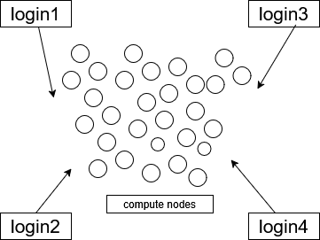

# Talapas Essentials: The Structure of Talapas

## RACS
The Talapas (from Chinook for coyote) cluster is managed by [Research Advanced Computing Services](https://racs.uoregon.edu/) or RACS. RACS administers the hardware, software, PIRGS, and other key services for Talapas. Troubleshooting Talapas? Need to request software for your team? The best way to reach RACS is through their [customer portal](https://hpcrcf.atlassian.net/servicedesk/customer/portal/1).

## RACS Resources:
* [Talapas Knowledge Base/Documentation](https://uoracs.github.io/talapas2-knowledge-base/)
* [How to Login to Talapas](https://uoracs.github.io/talapas2-knowledge-base/docs/how-to_articles/how-to_login_to_talapas/)
* [Talapas Quick Start Guide](https://uoracs.github.io/talapas2-knowledge-base/docs/quickstart_guide/)
* [Talapas Customer Portal](https://hpcrcf.atlassian.net/servicedesk/customer/portal/1)

## A University Supercomputer

Talapas enables programming tasks that could not be computed without more CPU cores, GPU cores, or memory than are available on consumer hardware.
It also accelerates research at UO by offloading
repetitive, highly parallel computational jobs from researchers' devices, allowing scientists to focus on more important tasks.

Talapas is a heterogenous cluster consisting of hundreds of individual computers called nodes. 
It is made up of login nodes, compute nodes, and private "condo" nodes. 
These nodes are much more powerful than a personal computer! Each compute node has up to 128 CPU cores. Nodes typically have at least 500GB of RAM, 
and specialized nodes for large memory jobs can have up to 4TB of RAM.



Talapas is a living, growing computational ecosystem. New software is added upon request, 
CPU and GPU hardware is periodically upgraded, and new computing nodes are added as research groups buy special "condo" nodes for their needs.

### Getting to Talapas: Login Nodes

The four login nodes are shared by hundreds of Talapas users simultaneously. 
The login nodes share the same filesyste. Having multiple login nodes adds redundancy and fewer points of failure to the Talapas ecosystem.
Login nodes are intended for loading data, transferring large datasets from the internet or the cloud to the Talapas filesystem, preparing software environments, and connecting to IDEs. Unlike other nodes in the cluster, login nodes are open to connections from the broader internet. 

The CPU cores and memory on login nodes are **not** for doing computational work.

[There's a detailed tutorial for connecting to login nodes here](../talapas-scripting/setup.html).

### What is `login.talapas.uoregon.edu`?

Talapas has a load balancer at `login.talapas.uoregon.edu`
that  distributes users as evenly as possible among
the four entry or "login" nodes. 

If you connect to `login.talapas.uoregon.edu` through your terminal, you will be routed to one of the four login nodes -- *login1*, *login2*, *login3*, or *login4* -- based on how many people are currently connected to each node.

If connecting directly to a given login node doesn't work, try another. For example, try login1 if login2 times out. If you can't reach *any* of the login nodes, please open a ticket with RACS.

### Compute Nodes
The login and compute nodes share the same filesystem, but
all non-trivial work occurs on *compute nodes*. 

The compute nodes on Talapas are grouped into *partitions* based
on what resources they have, how long those resources can be used, and (in the case of condo nodes) which users can access them.

## The Talapas Filesystem

Talapas uses a networked filesystem called GPFS to make code, input files, and other crucial pieces of data available across all nodes in the cluster.

All users have 250GB of storage available to them in their home directory at `/home/yourDuckID`. 
No other users have permission to access to your home directory.

You can check your home directory path by using the following Bash command.

```bash
echo $HOME
```

If you have access to Talapas, you are also part of a PIRG. Your research group's data should live in `/projects/PIRG_NAME`.
Unless extra storage has been negotiated, PIRG project directories have a maximum of 2TB of storage. 

Because the [file structure for PIRGs recently changed](https://uoracs.github.io/talapas2-knowledge-base/docs/directory_structure/), some PIRGS may have a slightly different stucture in their `/projects/PIRG_NAME` folder.

You can also explore the filesystem and even upload files of up to 10GB in the [Talapas Files app](../talapas-scripting/setup.html#OnDemand -> Files).

Need temporary storage? The `/scratch/PIRG_NAME` directory
associated with your PIRG has 20TB of storage. Data in
`/scratch/` not accessed within the last 90 days will be
deleted.

### New PIRGs
Joined Talapas recently? This implementation assumes all files and folders within a PIRG are shared among all members.
That means any files stored in `/projects/PIRG` are, by default, readable by members of that PIRG. 

For example, all members of `racs_training` can access files and folders in the `/projects/racs_training` directory. 
This is why everyone was added to a single, temporary PIRG
for the purpose of sharing files among all members of the workshop.

### Sharing Files in Legacy PIRGs
Older PIRGS were created with the same storage limit but a *different permissions structure*.
This implementation had problems for collaboration among lab members, as labs have members that leave to work at other institutions. 

Each user had their own folder within their PIRG with files their labmates couldn't see at `/projects/PIRG/DuckID`
While all members could access data shared in `/projects/PIRG/shared` 

Shared data was reserved for the folder `/projects/PIRG/shared`, but it wasn't uncommon for lab members to want to share files and folders from their `/projects/PIRG/DuckID` folders with fellow lab members.

### I am a PI and have a legacy PIRG. Can you fix our my group's permissions now that members have left?
Yes, to fix the file structure and permissions within your `projects/PIRG` directory, [open a ticket with RACS](https://hpcrcf.atlassian.net/servicedesk/customer/portal/1). 
RACS can help retrofit your PIRG into a flatter file structure with simpler permissions. 
When your PIRG is modified, you can choose to keep the existing file and permissions structure or have the new file permissions scheme implemented.

### Symlinks
If you do an `ll` or long-listing command on Talapas, you will see special folders in your home directory that begin with `@`.

```bash
ll
```

```output
...
lrwxrwxrwx. 1 root  root         26 May 28  2024 library_it -> /projects/library_it/emwin
lrwxrwxrwx. 1 root  root         23 Sep  5 16:22 racs_training -> /projects/racs_training
```

These folders aren't *actually* in your home directory. Symlinks or *symbolic links* are references between different locations in the filesystem. If you `cd` into the `/home/racs_training` symlink, you will be redirected or *linked* to `/projects/racs_training`.

These pointers are added for your convenience so that you can move files and code from your home directory to your project directory.

Some new PIRGs do not have this symlink in place. Do not worry, you can still access the same folder through `/projects/PIRG_NAME`. PIs can request that the symlink be added to their lab members' project directories.

## Which Folder Should I Use for What?
`/home/yourDuckID` - **250GB quota**
- code, testing instances, personal work

`/projects/yourPIRG` - **2TB shared quota**
- datasets, project data, code you want to share with other members of your PIRG

`/scratch/yourPIRG` - **20GB shared quota**
- data used within 90 days, intermediate outputs or inputs, temporary files

## Transferring Files to Talapas
There are a variety of ways to transfer files to and from Talapas based on your use case.

- To transfer files to Talapas from your web browser you can use the [Talapas file browser](../talapas-scripting/setup.html#OnDemand -> Files). There's 10GB limit on what you can upload at a time.
- To transfer files from the command line, use the `scp` command.
- To transfer datasets to Talapas from the internet, use the `wget http:/<filepath>` command on a **login node**. Remember, compute nodes are firewalled.
- For complex or large-scale transfers, try [Globus](https://uoracs.github.io/talapas2-knowledge-base/docs/data_movement/globus) or FTP tools like [Filezilla](https://filezilla-project.org/).

## Software: Modules on Talapas
Software on Talapas is controlled through [lmod](https://lmod.readthedocs.io/en/latest/) modules.

You don't need to worry too much lmod's implementation details to use modules, especially if the software you need is already available in the module catalogue.

To run software from within a Slurm job, you'll need to load the appopriate modules.

For example, let's load Python.
```bash
module load python3
```
<kbd>Tab</kdb> to autocomplete is available to you when searching through the list of modules.

To see the modules you currently have loaded, run `module list`.
```bash
module list
```

```output
Currently Loaded Modules:
  1) miniconda-t2/20230523
  2) python3/3.11.4
```

Now that Python has been loaded, you can access it from your path at `python3`. 
This version of Python has been added to your PATH through lmod.

```bash
which python3
```

```output
/packages/miniconda-t2/20230523/envs/python-3.11.4/bin/python
```


```bash
python3 --version
```

```output
Python 3.10.13
```

To remove a module, use the `module unload` command followed by the module name.

```bash
 module unload python3/3.11.4 
```

Or get rid of ALL modules with `module purge`.

```bash
module purge
```

Now, you can see that there are no modules loaded. 

```bash
module list
```

### Modules and PATH
The lmod system works by modifying your PATH variable.

The PATH variable defines the shell’s search path for executables: the list of directories that the shell looks in for runnable programs when you type in a program name without specifying what directory it is in. 

When you type a command, the shell checks each directory in the PATH variable in turn, looking for a program with the requested name in that directory. As soon as it finds a match, it stops searching and runs the program.

For example, loading Python added `/packages/miniconda-t2/20230523/envs/python-3.10.13` to my path. This is because miniconda is a *dependency* of the Python package.

```bash
module load python3/3.10.13
echo $PATH
```

```output
/packages/miniconda-t2/20230523/envs/python-3.10.13/bin:/packages/miniconda-t2/20230523/condabin:/packages/miniconda-t2/20230523/bin:/packages/miniconda-t2/20230523/envs/python-3.11.4/bin:/packages/miniconda-t2/20230523/condabin:/home/emwin/.local/bin:/home/emwin/bin:/gpfs/t2/slurm/apps/current/bin:/gpfs/t2/slurm/apps/current/sbin:/usr/local/bin:/usr/bin:/usr/local/sbin:/usr/sbin:/opt/dell/srvadmin/sbin
```

Talapas also supports compiled languages like C and C++. Compilers like gcc and aocc are available as modules.

### Browsing Modules
Want a more user friendly list of modules available?

Try `module spider [keyword]`. Below, I'll search for the neuroscience related software, FSL.

```bash
module spider fsl
```

```output
-----------------------------------------------------------------------------------------------------------------
  fsl:
-----------------------------------------------------------------------------------------------------------------
     Versions:
        fsl/5.0.9
        fsl/5.0.10
        fsl/6.0.1
        fsl/6.0.7
        fsl/6.0.7.9
     Other possible modules matches:
        FSL  FSLeyes  fsleyes  fslpy

-----------------------------------------------------------------------------------------------------------------
  To find other possible module matches execute:

      $ module -r spider '.*fsl.*'

```

Alternatively, you can use the `module avail` command to get a full list without relying on the spider search mechanism.

```bash
module avail
```

```output
---------- /packages/modulefiles/t2/modulefiles/mpi/gcc/13.1.0 --------------
   mpich/4.1.1 (L)    openmpi/4.1.6

--------------------- /packages/modulefiles/t2/modulefiles ---------------------
   AOCL/4.2.0
   Geneious
   MRIConvert/2.1.0
   Mathematica/11.3
   Mathematica/12.0                                (D)
   NonLinLoc/20221102
   OpenDX/4.4.4
   R/3.4.2-lcni
   R/4.3.2
   R/4.3.3
   R/4.4.2                                         (D)
   RECON/1.08
   RFdiffusion1/RFdiffusion1
   RepeatMasker/4.0.7racs1
   RepeatModeler/1.0.10
   RepeatScout/1.0.5
   adapterremoval/2.1.7
   adapterremoval/2.3.3   
```

You can scroll through the list produced by `module avail` using the arrow keys. Press <kbd>Q</kbd> to quit. Default versions of a module are indicated 
with `(D)`. Remember that defaults can change over time!

Talapas modules are maintained by RACS. If software you need
for your workflow is unavailable, you can request the creation
of new modules [through the Talapas ticketing system](https://hpcrcf.atlassian.net/servicedesk/customer/portal/1).

### Reproducibility with Modules
Always use complete module names in your batch jobs and scripts when possible.

For example, `module load fsl/6.0.7.9` is preferred to `module load fsl` because
the default version will change over time. The default version could be out of date.

You should always know which packages and which versions your code relies upon, as it will make it easier for other scientists to **reproduce** your code.

## Talapas Partitions: Where Do I Run My Jobs

Here is a summary of the primary partitions on Talapas so you can decide where to schedule your jobs at a glance.

| Partition | Max Job Time | GPUs | Description | CPU Type |
| ---------- | ----- | --- | --------------------------------- |
| compute | 24 hrs | no | default partition, appropriate for most users | AMD |
| compute_intel | 24 hrs | no | for software that requires *Intel* processors, older computers | Intel |
| computelong | 2 wks | no | default partition for jobs that take longer than 24 hours | AMD |
| computelong_intel | 2 wks | no | default partition for jobs that take longer than 24 hours | Intel |
| gpu | 24 hrs | yes | for shorter jobs that requires GPUs | AMD |
| gpulong | 2 wks | yes | partition for GPU jobs that take longer than 24 hours | AMD |
| interactive | 12 hrs | no | partition for interactive `srun` jobs, OnDemand apps Talapas Desktop, JupyterLab | AMD |
| interactivegpu | 8 hrs | yes | GPU partition for interactive `srun` jobs, OnDemand apps Talapas Desktop, JupyterLab | AMD |
| memory | 24 hrs | no | for memory-intensive jobs that require up to 4TB of RAM | AMD |
| memorylong | 2 wks | no | for memory-intensive jobs that require up to 4TB of RAM of a long duration | AMD |
| *preempt* | 1 wk | yes | [special "partition" that appropriates nodes in other partitions](https://uoracs.github.io/talapas2-knowledge-base/docs/how-to_articles/how-to_use_the_preempt_partition/) | Various |

### Partition Status: `sinfo`

Want to know the current status and time limits of *all* the partitions on Talapas? The command `sinfo` displays all available partitions that **you** can schedule jobs on.

```bash
sinfo
```

Each partition has one line for each state in order to list the number of nodes in each of the following states: mix, alloc, and idle.

```output
PARTITION         AVAIL  TIMELIMIT  NODES  STATE NODELIST
compute              up 1-00:00:00      1   drng n0135
compute              up 1-00:00:00     35    mix n[0111-0120,0122-0133,0181-0185,0187,0189-0190,0192-0196]
compute              up 1-00:00:00      4  alloc n[0180,0186,0188,0191]
compute              up 1-00:00:00      2   idle n[0121,0134]
compute_intel        up 1-00:00:00     17    mix n[0055-0056,0063-0064,0073,0078,0081-0082,0084,0087-0089,0092,0094,0096,0106-0107]
compute_intel        up 1-00:00:00     33  alloc n[0049-0050,0052-0054,0057-0062,0065-0072,0074-0077,0079-0080,0083,0085-0086,0090-0091,0093,0095,0105]
computelong          up 14-00:00:0      1   drng n0136
computelong          up 14-00:00:0     23    mix n[0119-0120,0122-0133,0181-0185,0187,0189-0190,0192]
computelong          up 14-00:00:0      4  alloc n[0180,0186,0188,0191]
computelong          up 14-00:00:0      2   idle n[0121,0134]
computelong_intel    up 14-00:00:0     17    mix n[0055-0056,0063-0064,0073,0078,0081-0082,0084,0087-0089,0092,0094,0096,0106-0107]
computelong_intel    up 14-00:00:0     33  alloc n[0049-0050,0052-0054,0057-0062,0065-0072,0074-0077,0079-0080,0083,0085-0086,0090-0091,0093,0095,0105]
gpu                  up 1-00:00:00     19    mix n[0149-0160,0162-0167,0301]
gpu                  up 1-00:00:00      1  alloc n0171
gpu                  up 1-00:00:00      3   idle n[0168-0169,0172]
gpulong              up 14-00:00:0     12    mix n[0150,0152-0153,0155-0157,0162-0167]
gpulong              up 14-00:00:0      1  alloc n0171
gpulong              up 14-00:00:0      3   idle n[0168-0169,0172]
interactive          up   12:00:00      9    mix n[0210,0212,0302,0308-0309,0311-0313,0398]
interactive          up   12:00:00      9  alloc n[0209,0211,0303-0307,0310,0399]
interactivegpu       up    8:00:00      1    mix n0161
memory               up 1-00:00:00      7    mix n[0148,0372,0374,0376-0379]
memory               up 1-00:00:00      9  alloc n[0141-0147,0373,0375]
memorylong           up 14-00:00:0      5    mix n[0148,0372,0374,0376,0378]
memorylong           up 14-00:00:0      3  alloc n[0142,0144,0146]
preempt              up 7-00:00:00      2   drng n[0135-0136]
preempt              up 7-00:00:00    114    mix n[0038-0039,0041,0043,0055-0056,0063-0064,0073,0078,0081-0082,0084,0087-0089,0092,0094,0096,0106-0107,0111-0120,0122-0133,0148-0167,0170,0181-0185,0187,0189,0192-0196,0210,0212-0214,0216,0221-0222,0224-0226,0267,0270,0301-0302,0308-0309,0311-0313,0363-0364,0368,0370,0372,0374,0376-0379,0388-0389,0391-0394,0396-0398]
preempt              up 7-00:00:00    181  alloc n[0037,0040,0042,0044-0046,0049-0050,0052-0054,0057-0062,0065-0072,0074-0077,0079-0080,0083,0085-0086,0090-0091,0093,0095,0105,0109-0110,0141-0147,0171,0173-0180,0186,0188,0191,0197,0201-0209,0211,0215,0218-0220,0223,0227-0242,0244-0266,0268-0269,0303-0307,0310,0314-0348,0359-0362,0369,0371,0373,0375,0380-0387,0390,0395,0399,0996-0999]
preempt              up 7-00:00:00      5   idle n[0121,0134,0168-0169,0172]
```
You can interpret the results from `sinfo` as follows. 
Nodes are grouped by partition and state.

* The **AVAIL** column represents the status of partition.
* The **TIMELIMIT** column represents max job time in days. `1-00:00:00` is 24 hours.
* The **NODES** column indicates how many nodes are in the partition have a given state.
* The **STATE** column lists the node states, ie. are the nodes `alloc` allocated, idle, or in a mixture of idle and allocated states.
* The **NODELIST** column lists the node in each of the possible states within a partition. Each node can be
a member of one or more partitions.

To learn more, see the [Slurm documentation](https://slurm.schedmd.com/sinfo.html) for `sinfo`.

If your PIRG has purchased condo nodes, you will see
additional nodes in the list returned by `sinfo`.

The `preempt` partition is a special partition that 
allows users to take advantage of additional computational
resources in a [low-priority queue](https://uoracs.github.io/talapas2-knowledge-base/docs/how-to_articles/how-to_use_the_preempt_partition/). 

Do not run critical jobs on preempt, as there's always
a risk of having your job cancelled.

On any other partition, your job will run until it either
finishes, meets the time limit you requested, or 
exceeds the resources you requested.

## Introducing Conda Environments
[Conda](https://docs.conda.io/projects/conda/en/stable/user-guide/getting-started.html) is 
tool for managing virtual environments
available on Talapas.
Conda helps you manage different coding environments for different projects. 

We will discuss Conda more in future lessons, but today we will
demonstrate how it works and how
to use it to create Python environments
from the command line.

### Loading the Conda Module
To use Conda, you must load the `miniconda3/20240410` module.
```bash
module load miniconda3/20240410
```

Check the module is loaded with `module list`.
```bash
module list
```

```output
Currently Loaded Modules:
  1) miniconda3/20240410
```

### Looking at Available Conda Environments
List the conda environments available to you with `conda env list`. 

There are a number of public conda environments maintained by RACS in the `/packages/miniconda3/20240410/envs/` folder.
If you have not created any conda environments of your own, then only the public environments compiled by
RACS will be listed. 

```bash
conda env list
```

```output
# conda environments:
#
base                     /packages/miniconda3/20240410
R-test-pack              /packages/miniconda3/20240410/envs/R-test-pack
SE3nv                    /packages/miniconda3/20240410/envs/SE3nv
ancestryhmm-v2           /packages/miniconda3/20240410/envs/ancestryhmm-v2
argweaver-20241202       /packages/miniconda3/20240410/envs/argweaver-20241202
bgchm-20241008           /packages/miniconda3/20240410/envs/bgchm-20241008
brainiak-20240412        /packages/miniconda3/20240410/envs/brainiak-20240412
...
```

### Creating Conda Environments 
Let's create a new environment named `workshop-fall` that will be stored inside the `.conda` folder of your home directory.
You can specify which python version is used through the `python=` argument.

```bash
conda create --name workshop-fall python=3.12 numpy matplotlib
```

This command creates an environment with the **numpy** and **matplotlib** packages. When Conda finishes building the environment, you will see a message like this.

```output
Preparing transaction: done                                 
Verifying transaction: done                                 
Executing transaction: done                                 
#                                                           
# To activate this environment, use                         
#                                                           
#     $ conda activate fall-workshop                               
#                                                           
# To deactivate an active environment, use                  
#                                                           
#     $ conda deactivate 
```

To activate *myenv*, run the `conda activate` command.

```bash
conda activate fall-workshop
```

Observe that your environment name will now appear to the left of your terminal prompt.
```output
(fall-workshop) [emwin@login2 conda]$     
```

From inside our conda environment, we can run the `which python` command to confirm we are using the Python instance stored inside *myenv*.

```bash
which python
```

```output
~/.conda/envs/fall-workshop/bin/python  
```

To see which packages are in the current environment, use `conda list`.

```bash
conda list
```

We can scroll through the list to find `matplotlib` and `numpy`.
```output
...
matplotlib                3.10.0          py312h06a4308_0  
matplotlib-base           3.10.0          py312hbfdbfaf_0  
mkl                       2023.1.0         h213fc3f_46344  
mkl-service               2.4.0           py312h5eee18b_2  
mkl_fft                   1.3.11          py312h5eee18b_0  
mkl_random                1.2.8           py312h526ad5a_0  
mysql                     8.4.0                h721767e_2  
ncurses                   6.4                  h6a678d5_0  
numpy                     2.2.5           py312h2470af2_0
...
```

Alternatively, use of piping and `grep` will return only the lines that reference the packages of interest.
```bash
 conda list | grep -E "matplotlib|numpy"
```

```output
matplotlib                3.10.0          py312h06a4308_0  
matplotlib-base           3.10.0          py312hbfdbfaf_0  
numpy                     2.2.5           py312h2470af2_0  
numpy-base                2.2.5           py312h06ae042_0  
```

Confirm that your conda environment works by opening
a Python interpreter and importing one of the 
installed packages. Remember, you should not be
doing *work* on the login node.

```bash
python
```

```output
Python 3.12.12 | packaged by Anaconda, Inc. | (main, Oct 21 2025, 20:16:04) [GCC 11.2.0] on linux
Type "help", "copyright", "credits" or "license" for more information.
```

Let's import numpy `import numpy as np` and confirm that
it works by creating a 1-dimensional array and summing it.

```python
x = np.array([1,2,3])
x.sum()
```

```output
np.int64(6)
```

### Creating Conda Environments for Your Code
As you migrate Python code to Talapas, inspect *import statements*
to identify packages that will need you need to install
to a conda environment on Talapas. 

Not sure what version of a Python package you're running?
You can quickly check by using the `__version__` attribute.

```python
# Replace lxml with your package of choice
import lxml
print(lxml.__version__)
```


## Slurm: The Talapas Scheduler
[Slurm](https://slurm.schedmd.com/slurm.html) is the job scheduling software used on the Talapas. While Talapas has scheduling policies, partitions, and PIRGs that are specific to UO, 
Slurm is used for job scheduling on high-performance computing clusters around the world.

To schedule jobs on Talapas, you must give Slurm a *partition* where the job must run
and an *account* (PIRG) associated with the job.

Slurm manages a queue of jobs that determines which node(s) on a partition your job will run.

### Scheduling Simple Jobs with Slurm
To practice with Slurm tasks, connect to a Talapas login node. For this exercise, feel free to use the [Talapas OnDemand shell](https://ondemand.talapas.uoregon.edu/pun/sys/shell/ssh/login1.talapas.uoregon.edu).

## Batch Scheduling with `sbatch`

Batch scripts in Slurm are configured [through special comments](https://slurm.schedmd.com/sbatch.html) prefixed with `#SBATCH`. 

All batch jobs should have `#!/bin/bash` on the first line followed by `#SBATCH` options in any order. 
It doesn't matter what order you specify your `#SBATCH` options in as long you specify them one per line.

```bash
#!/bin/bash
#SBATCH --partition=compute
#SBATCH --account=racs_training
```
This set of comments represent the **minimum** required options for a Slurm job of Talapas:
* a valid Talapas partition
* an account (PIRG)


```bash
nano first.sbatch
```

Inside `nano`, enter the following lines. When you're finished, use <kbd>Ctrl</kbd>+<kbd>O</kbd>
and <kbd>Ctrl</kbd>+<kbd>X</kbd> to write out to the `first.sbatch` file and then exit `nano`.

```bash
#!/bin/bash
#SBATCH --partition=compute
#SBATCH --account=racs_training
echo "Hello!"
```

### Required Slurm Job Elements
* `#!/bin/bash` on the first line
* `--partition=[a valid partition]` 
* `--account==[your PIRG]`

All other parameters like `mem`, `ntasks`, and `--cpus-per-task` have default values by partition.
The default value for job memory as configured through the `--mem-per-cpu` is 4GB per CPU.
For single core jobs, that means *single-core jobs start with 4GB RAM unless you specify otherwise*.

Let's run our minimum viable job by passing it to the `sbatch` command.

```bash
sbatch first.sbatch
```

You will get a response with a (unique) job number when your job is submitted successfully.

```output
Submitted batch job 34704033
```

Check your job's status in the queue using the `squeue` command. The `--me` flag is a
helpful trick if you don't want to type `-u [yourDuckID]` each time.

```bash
squeue --me
```

With a job this simple, it's probably already finished.

```output
JOBID PARTITION     NAME     USER ST       TIME  NODES NODELIST(REASON)
```

If you see an empty queue like this, go ahead and check your most recent *finished* jobs with `sacct`.

```bash
sacct
```

```output
34704033     first.sba+    compute racs_trai+          1  COMPLETED      0:0 
34704033.ba+      batch            racs_trai+          1  COMPLETED      0:0 
34704033.ex+     extern            racs_trai+          1  COMPLETED      0:0
```

This job doesn't have a specified output and error log file name, so it uses the slurm defaults: `slurm-[jobid].out`.
Doing an ls, we see a file that was created with the default parameters at `slurm-[jobid].out`.
You can see where a `#SBATCH --job-name` might be more helpful in the debugging process.

Let's check the contents of the output log.
If it worked as intended, we should the results of the `echo` command from `first.sbatch`.

```bash
cat slurm-34704033.out
```

```output
Hello!
```

We will look at Slurm and several associated commands in detail in the next session!

## Shared Resource Etiquette
- Be conscientious about your use of shared storage in the `/projects/[yourPIRG]` folder.
- Close out your jobs when you're done!
- Avoid *modifying* the same files concurrently; this is a shared filesystem.
- Book your interactive jobs for as long as you need, but not longer.
- You will not be warned when time is about to run out when running interactive jobs or the Talapas Desktop app. Track your own time conscientiously. 