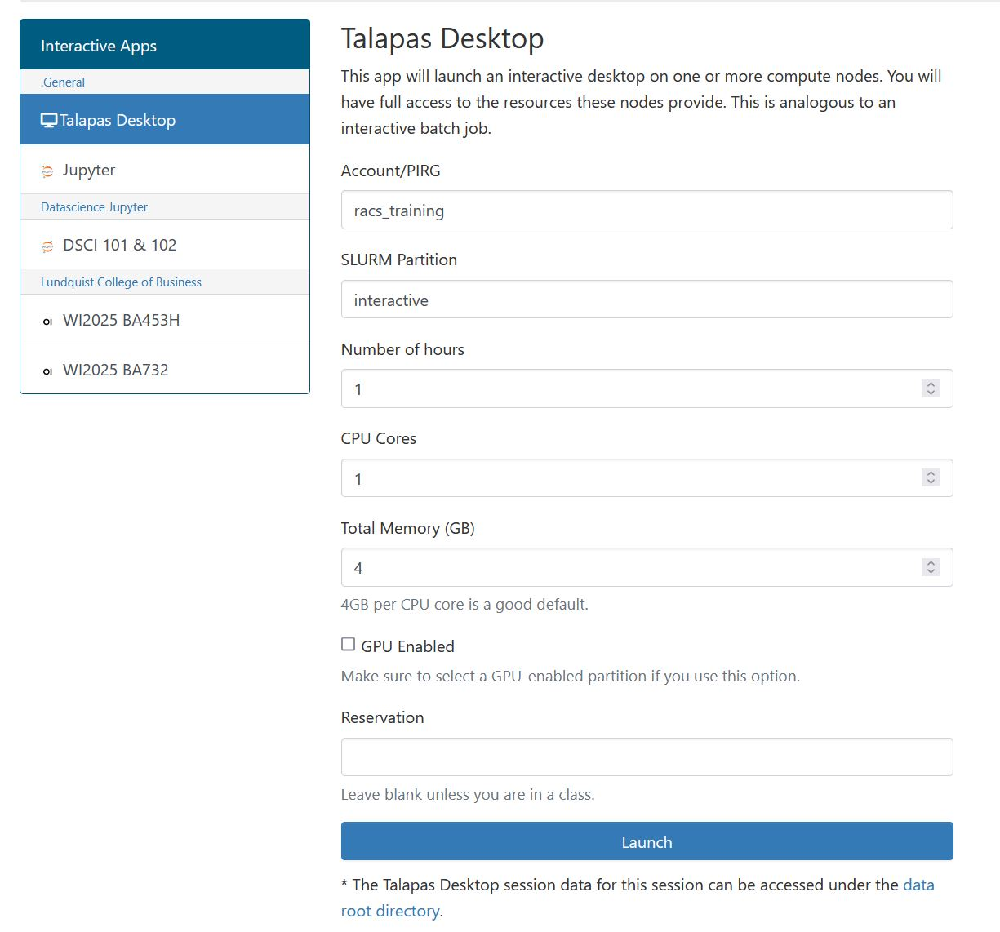
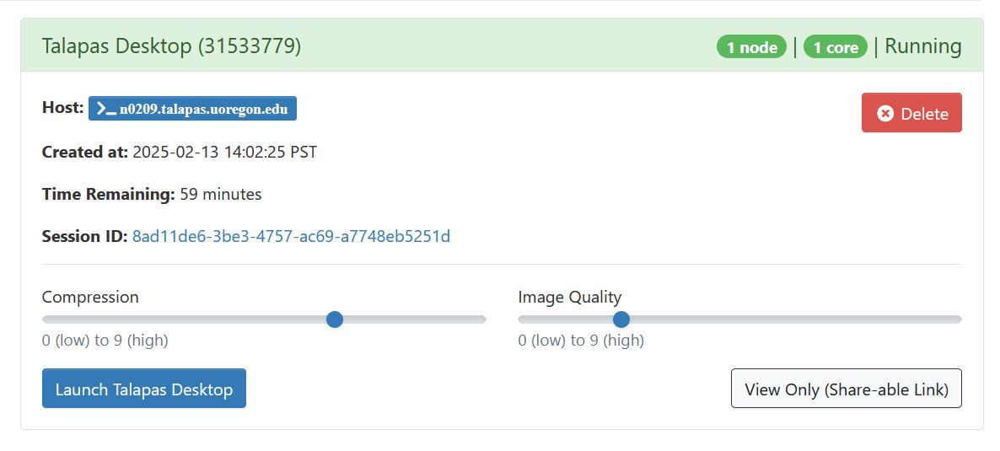
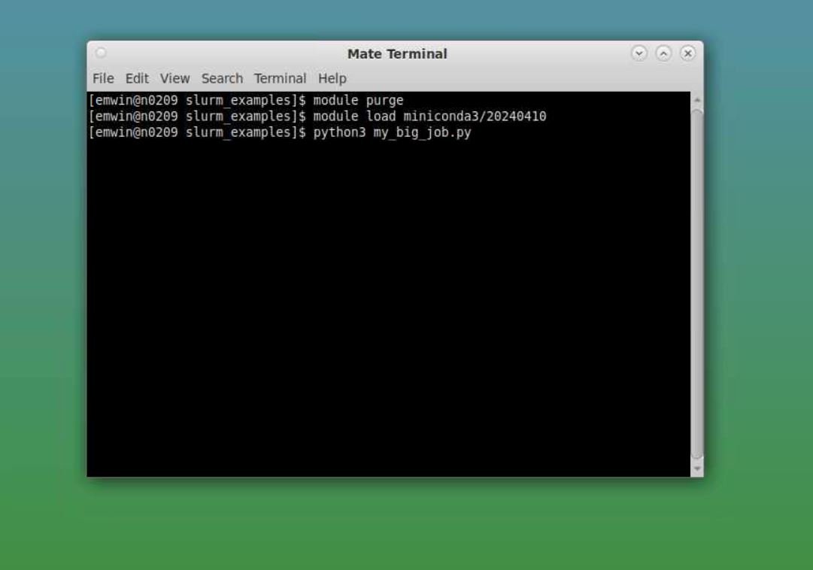

# Talapas Desktop

Want to use Talapas with a GUI? You can use the [Talapas Desktop App](https://ondemand.talapas.uoregon.edu/pun/sys/dashboard/batch_connect/sys/bc_desktop/talapas/session_contexts/new) to run code on *interactive* compute nodes for up to 12 hours. This app will launch an interactive desktop on one or more compute nodes. You will have full access to the resources these nodes provide. This is analogous to an [interactive Slurm job](https://hpcrcf.atlassian.net/wiki/spaces/TW/pages/2755756536/How-to+Start+an+Interactive+Job).

Because Talapas Desktop sessions are connected to compute nodes, you can run code (through the terminal) or software applications directly.

## Configuring Talapas Desktop
The [Talapas Desktop App](https://ondemand.talapas.uoregon.edu/pun/sys/dashboard/batch_connect/sys/bc_desktop/talapas/session_contexts/new) can be found by navigating to **OnDemand**->**Interative Apps**->**Talapas Desktop**. Before the applications starts, you will encounter a configuration screen. 
Just like any Talapas job, the more resources you ask for, the longer it will take to schedule.

*An example Talapas Desktop configuration screen*


**PIRG**: During the training period, you can use `racs_training`, but you should use *your lab's PIRG* after these trainings finish.

**SLURM Partition:** You have two choices: `interactive` (CPU-based jobs) or `interactivegpu` (if you need GPUs). Only request a GPU if your code or software pipeline can use one.

**Number of hours:** Be considerate and ask only for as much time as you need. You can ask for up to 12 hours on `interactive`, 8 hours on `interactivegpu`.

**CPU Cores:** You must ask for at least `1`. Only code or software packages that are configured to do so can take advantage of multiple cores.

**Total memory:** We typically recommend 4GB per CPU core. You can ask for up to 192GB *total* on `interactive` and up to 48GB *total* on `interactivegpu`. 

**GPU enabled:** Only check if you require a GPU. To use a GPU, this box must be checked **AND** you must run on the `interactivegpu` partition.

**Reservation:** If you don't know what that means, please leave this box blank.

When you have configured this to your satisfaction (the default settings are adequate for most users), press **Launch**.

## Using Talapas Desktop

After pressing **Launch**, you will be navigated to the [OnDemand Sessions](https://ondemand.talapas.uoregon.edu/pun/sys/dashboard/batch_connect/sessions) page.

*An example Talapas Desktop session screen*
This page stores records of current and previous sessions. When your Talapas Desktop job schedules, you will see a screen like this. The more resources you ask for, the longer it will take for the Talapas Desktop session to begin. 

Click the **Launch Talapas Desktop** button to open the application.

## Running Code on Talapas Desktop

Talapas Desktop sessions are held on **compute** nodes. That means you can open the **Mate Terminal**rsdum application in the top left corner,
load desired modules, and run scripts against data on GPFS *without* interacting with Slurm because you're already on the *interactive* partition.


## RStudio on Talapas Desktop 

Want to run RStudio on Talapas? Perform the following steps:

1. Open a Mate Terminal session from within Talapas Desktop. 
You need to be on Talapas Desktop in order
to see the RStudio interface.
2. Load the version of R you require. Here we use 4.4.2, but feel free to choose whichever you need.
    ```bash
    module load R/4.4.2
    ```
3. Load the `rstudio` module. Freddy has a custom version with the following name.
     ```bash
    module load rstudio/base
    ```
4. Launch the RStudio app by typing the following into the terminal.
    ```bash
    rstudio
    ```
5. RStudio should launch inside Talapas Desktop.

*An example RStudio session on Talapas Desktop*

## Troubleshooting Talapas Desktop
If you finish your work before the time limit ends, you 
can free up resources for other Talapas users by clicking the red **Delete** button
for the job as it appears on the OnDemand sessions page.

Your Talapas Desktop session will continue to run until the requested time limit elapses or until you cancel the job. If you have trouble starting an
interactive session, *make sure that you don't have another one running*.


