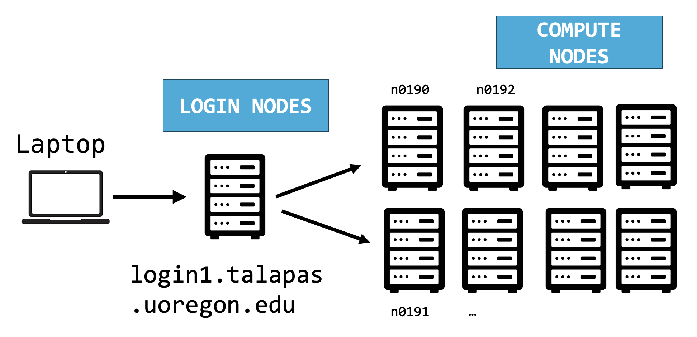

# Day Two: Bash Scripting on Talapas
{: .no_toc }
This lesson is adapted from *[The Unix Shell](https://swcarpentry.github.io/shell-novice/aio.html)* lesson of Software Carpentry.
- TOC
{:toc}

## Where Are You? (Revisited)
Open your terminal application.

Enter the `hostname` command, which prints the name of the current computer or "host" for the shell. 

```bash
hostname
```

The result will vary from person to person, as this should be the system name of *your* laptop.
```output
UO-2012173
```

Let's connect to one of the Talapas login nodes through `ssh`. For the purposes of this exercise, let's connect to `login2.talapas.uoregon.edu`, one of the four login nodes.


```bash
ssh [yourDuckID]@login2.talapas.uoregon.edu
```

You will prompted for the password for your DuckID. When you enter your password, you should see a welcome screen that looks something like this, followed by a `$` prompt symbol.

```output
# Welcome to Talapas!
# Data on Talapas is NOT backed up. Data management is each users responsibility.
#
#
# Need support? Please visit the Talapas Knowledge Base:
#https://uoracs.github.io/talapas2-knowledge-base/
```

You should now be inside your home directory on Talapas. Just like on your local filesystem, the default working directory on login is your home directory.

```bash
pwd
```

```output
/home/emwin
```

Note that just this working directory path is not enough to tell you *where* are you really are. 
As a device keyed to the same DuckID, my work laptop has an `emwin` home directory too, but it's a completely separate filesystem.

Talapas's network filesystem is physically located in the Millrace building by the river. Though it might be backed up to a cloud service provider like OneDrive, your laptop's filesystem is stored on a disk drive inside your laptop. 

We're going to talk about the process of transferring files to and from the cluster in detail soon, but the aspect of filesystem separation is worth considering from the outset. 

## Shell Access: Login Nodes and Compute Nodes
 *A simplified diagram of the structure of Talapas*
Whether you choose to access Talapas through the web terminal or through the command line, you will start at a **login node**. 

The **login node** is a place to prepare input data, organizes, edit code, and configure environment object but it's not the appropriate node for executing non-trivial code. The **login node** should be used to launch Slurm jobs on **compute nodes**.

How much work is too much work? Any script that takes longer than a few seconds should be run on a **compute node** instead. 
There are only four login nodes relative to the hundreds of compute nodes.

**Before running computationally intensive code check if are you running locally, on a login node, or on an interactive node.**

## Who and Where Am I: `hostname`, `whoami`, `who`
To find out the name of the computer (or node) you are connected to, use the `hostname` command.

```bash
hostname
```

```ouput
login2.talapas.uoregon.edu
```

As expected, we are on one of the login nodes. There are four login or "head" nodes for Talapas numbered `login1`, `login2`, `login3`, and `login4` respectively.

You can `ssh` to `login.talapas.uoregon.edu` to let special load balancer decide which login node connect to
instead of selecting a particular node. 

Let's try another command. Who are you? `whoami`
```bash
whoami
```
This should give you your DuckID.
```output
emwin
```
Talapas access is given through your **DuckID**. This is why, unlike
other workshops we hold on campus, you must be an active member of the 
UO community to participate.

Let's do a more interesting command: `who`. This command will let you see the DuckIDs of everyone connected to the current login node. 

Run it and you should see a list of the DuckIDs of your classmates 
in the room *and* the DuckIDs of other researchers connected to
the login node right now.

```bash
who
```

```output
emwin
...
```

If you see a name twice, someone has multiple open terminals
connected to Talapas right now. This is a common use case for
users who might need to manage code in one filesystem location
and inspect outputs in another.

## Unix Permissions
Now that we're on Talapas, let's do an ls command with the long-listing argument and a human readable flag. 

I want to take this opportunity to talk about UNIX permissions now that we're all on machines with the same operating system. 
Because software **cannot manipulate open, write or execute files without permission to do so for each file**, permissions are a common source of code failures on shared filesystems.

Though many of you come from different labs, we all share a *racs_training* PIRG. That means, everyone should have access to the shared `racs_training` folder located in `/projects/racs_training`. Let's examine the permissions of a certain file in the `racs_training` folder.

```bash
ls -lh /projects/racs_training/intro-hpc-f25/bash-on-talapas/greeting.txt
```

```output
-r-xr-xr--. 1 emwin is.racs.pirg.racs_training 29 Oct 15 11:33 /projects/racs_training/intro-hpc-f25/bash-on-talapas/greeting.txt
```

It's time to unpack results from the `-l` or long listing flag. Let's see if we can understand **what each field of a given row represents**,
working left to right.

1. **Permissions:** On the very left side, there is a string of the characters
   `d`, `r`, `w`, `x`, and `-`. The `d` indicates if something is a directory
   (there is a `-` in that spot if it is not a directory). The other `r`, `w`,
   `x` bits indicate permission to **R**ead, **W**rite, and e**X**ecute a file.
   There are three fields of `rwx` permissions following the spot for `d`. If a
   user is missing a permission to do something, it's indicated by a `-`.
   - The first set of `rwx` are the permissions that the owner of the file has.
   - The second set of `rwx`s are permissions that members of the file's
     group share (in this case, the group is named `racs_training`).
   - The third set of `rwx`s are permissions for everyone else not in the group. 
2. **References:** This counts the number of references ([hard
   links](https://en.wikipedia.org/wiki/Hard_link)) to the item (file, folder,
   symbolic link or "shortcut").
3. **Owner:** This is the username of the user who owns the file. Their
   permissions are indicated in the first permissions field.
4. **Group:** This is the PIRG (racs_training) associated with the file. Members of
   this user group have permissions indicated in the second permissions field.
5. **Size of item:** This is the number of bytes in a file, in human-readable form thanks to the -h flag.
6. **Time last modified:** This is the last time the file was modified.
7. **Filename:** Filename.

Group membership is very important on Talapas, because it is configured such that research groups cannot see each other's data. It's also configured such that your home directory's data is private to you.

For example, you can open files I've created within the racs_training project directory because this file has **read** permissions enabled for members of the racs_training PIRG.

Some labs have more complicated permissions hiearchies implemented in their ACL groups, but those will be covered
in the Talapas-specific lesson.

We should all be able to `cat` this file to the terminal.

To avoid typing the long absolute path again, remember to use the 
up arrow key to traverse through your previous commands, and the left arrow
to change `ls` to `cat`.

```bash
cat /projects/racs_training/intro-hpc-f25/bash-on-talapas/greeting.txt
```

```output
Good afternoon! You'll need to make a copy of this file to modify it.
```

We can't run the `ls` or `cat` command on files and folders we don't have permission to read. For example, I'll get a permissions error if I try to list the contents of someone else's home directory.

```bash
ls /home/ghayden/
```

```output
ls: cannot open directory '/home/ghayden': Permission denied
```

Note that, even if there were files in Gabriele's home directory that *were* readable by anyone, I could not read them because I cannot traverse into her home directory.

To share a file or directory that you own with someone in your PIRG, you can grant read and execute privileges for them within the shared `/project/[pirg_name]` directory. However, you must also set the same privileges on any parent directories above the item you're sharing. The execute bit for directories controls whether or not the folder can be **traversed**. Without execute permissions, you cannot see the child folders and files of folders you can otherwise read.

The best place to share files are in folders that are shared by your research group, like a project `/projects/[pirg_name]/` directory.

#### Quiz
{: .no_toc }
On websites like StackOverflow, you may advised to use the command `chmod 777` or `chmod -R 777` to alter the permissions of shared input files.
Test this theory on an empty file in your home directory.

```bash
cd ~
touch the-universal-file.txt
chmod 777
```
What does this do? Why is this such a bad idea on shared filesystems?

#### Answer
{: .no_toc }
Use `ls -lh` to examine how the permissions on the file have changed.
```bash
ls -lh the-universal-file.txt
```

```output
-rwxrwxrwx. 1 emwin uoregon 0 Oct 15 13:19 the-universal-file.txt
```

This is a bad idea because it grants read, write, and execute permissions to **all** users for the file. 
In the majority of cases, your problems can be solved by giving **group** read access using to files and execute access on folders for your colleagues traversal, namely your PIRG's `/projects/pirg_name` 
folder.


## Transferring Files to and from Talapas with `scp`

Speaking of separate filesystems, today's zip file isn't on Talapas.
Let's move it there with the `scp` command.

The `scp` command needs to be run from our local machine, so let's 
exit the login node briefly by typing `exit`.

```bash
exit
```

You should see a message like this after exiting.
```ouput
logout
Connection to login2.talapas.uoregon.edu closed.
```

Confirm your terminal is connected to your laptop with the hostname command.

```bash
hostname
```

```output
UO-2012173
```

Use `pwd` to check that you are in your home directory and `ls talapas-bash.zip` to make sure you have today's zip folder ready.

```bash
pwd
ls talapas-bash.zip
```

```output
talapas-bash.zip
```

Remember the `cp` command? With SSH access, you can use the `scp` or "secure copy" command to copy files/folders to and from Talapas. 

Just like the `cp` command, the arguments for `scp` are indicated in [source] [destination] order. 

To indicate a remote filesystem location, use the `[yourDuckID]@login[node].talapas.uoregon.edu:` prefix. Every character after the : refers to the filesystem as appears on a Talapas login node.

```bash
scp talapas-bash.zip [yourDuckID]@login2.talapas.uoregon.edu:~
```

```output
talapas-bash.zip                              100% 7187KB   5.4MB/s   00:01
```

#### Quiz
{: .no_toc }
How would I copy the `/projects/racs_training/intro-hpc-f25/bash-on-talapas/greeting.txt` file to my home directory on my laptop using `scp`? (Use auto-complete on this lengthy path.)

**Hint**: Remember what the `.` character means?
#### Answer
{: .no_toc }
```bash
scp [yourDuckID]@login2.talapas.uoregon.edu:/projects/racs_training/intro-hpc-f25/bash-on-talapas/greeting.txt .
```

```output
greeting.txt                     00%   52     0.8KB/s  00:00
```
Check the file transfer worked by using `cat` to concatenate its contents to the terminal.

```bash
cat greeting.txt
```

```output
Good afternoon! You'll need to make a copy of this file to modify it.
```

Let's get back to learning Bash. Use the arrow keys to traverse your command history and run the `ssh` command again.

```bash
ssh [yourDuckID]@login2.talapas.uoregon.edu
```

Confirm your zip file safely arrived at its destination in your Talapas home directory with an `ls`.
```bash
ls talapas-bash.zip
```

```output
talapas-bash.zip
```

Now, let's unzip it from the command line using the `unzip` command. (This may take a minute.)

```bash
unzip talapas-bash.zip
```

Use `ls -F` to confirm that you have an unzipped `talapas-bash` folder in your home directory.
```output
...
talapas-bash.zip
talapas-bash/
...
```

When the file is unzipped, change your current working directory
to `talapas-bash`. 
The contents of the folder should be familiar to you at this point.

```bash
cd talapas-bash
ls -F
```

```output
books/  exercise-data/  scripts/
```

Let's use auto-complete with `tab` to navigate to the `exercise-data` directory.

```bash
cd exercise-data
ls -F
```

```output
alkanes/  animal-counts/  creatures/  mice/  numbers.txt  writing/
```

### Putting it Together: Pipes and Filters
{: .no_toc }

This idea of linking commands through pipelines is part of the Unix 'pipes and filters' model.
We've already seen pipes;
a **filter** is a program like `wc` or `sort`
that transforms a stream of input into a stream of output.

The key is that any program that reads lines of text from standard input
and writes lines of text to standard output
can be combined with every other program that behaves this way as well.

Let's put some of these skills into practice.

Move into the `mice` directory and take a look at the files there.

```bash
cd mice
ls
```

```output
Animals.txt  README.md  Tasks.txt  Visit.txt  citation.txt
```

We can pipe the results of the `ls` command to `wc -l` to count how many objects in the current working directory. 

```bash
ls | wc -l
```

```output
5
```

#### Quiz
{: .no_toc }
How could I modify this command to get the number of `.txt` files in the current directory?

#### Answer
{: .no_toc }
```bash
ls *.txt | wc -l
```
```output
4
```

This folder contains data from a behavioral experiment on mice described in `citation.txt`. 

The files `Animals.txt`, `Tasks.txt` and `Visit.txt` contain tab-separated observations with the first line of each observation indicating the variables in each row. Let's see what each file tracks by using `head -n 1` on each of the three files.

```bash
head -n 1 Animals.txt Tasks.txt Visit.txt
```

```output
==> Animals.txt <==
Animal  Tag     Sex     Group   CornerAssigned

==> Tasks.txt <==
Date    Night   Task

==> Visit.txt <==
VisitID VisitOrder      Animal  Tag     Sex     Group   
Module  Cage    Corner     CornerCondition PlaceError      
SideErrors      TimeErrors      ConditionErrors    NosepokeNumber  
NosepokeDuration        LickNumber      LickDuration       
LickContactTime StartDate       StartTime       StartTimecode      
EndDate EndTime EndTimecode     VisitDuration   Session
```

## Finding Lines in Files with `grep`

Searching for something in one or more files is something we'll often need to do, so let's introduce a command for doing that: `grep` (short for **global regular expression print**). As the name suggests, it supports regular expressions and is therefore only limited by your imagination, the shape of your data, and - when working with thousands or millions of files - the processing power at your disposal.


Now let's try our first search to find the row corresponding to mouse `GK-1893` in `Animals.txt`. 

```bash
grep GK-1893 Animals.txt
```

```output
GK-1893 981098102199262 Female  IC b    4
```

`Visit.txt` has 172197 rows documenting each behavioral event for each mouse in the study.
Let's use `grep`, `wc`, and `|` to find how many times (in how many rows) mouse `GK-1983` was documented in `Visit.txt`.

```bash
grep GK-1893 Visit.txt | wc - l
```

```output
11675
```

Grep always takes a pattern first, followed by the file or files to be searched for that pattern.

Remember that the shell will expand `*.txt` to a list of all the `.txt` files in the directory. `grep` will then search these for instances of the string "1990" and print the matching lines. 

If you're debugging a large programming project, the ability to quickly search for specific function or statements through the command line is crucial. Bash's text search functionality is very fast.

By default `grep` prints the entire line, not just the portion that happens to match. It is also case-sensitive UNLESS we pass the -i flag.

Compare the results of these two queries.

```bash
grep -i Male Animals.txt
```

```bash
grep Male Animals.txt`
```

What's happening here?

There are no `Male` animals in the study, but the `-i` searches with case-insensitivity.

Grep can be very useful, and I would recommend reading over its `man` page to play around with some of the options.

`man grep` (MacOS)

`grep --help` (Git Bash/Windows)

Grep is a great way to quickly make sense of a large file or large set of data. You can even use it to search the outputs of other commands.

### Managing Command History: `history`
{: .no_toc }
We've done a lot of typing so far. Conveniently, the shell tracks the commands you've typed. Don't count on this history to be there after a reboot though.

To see your command history, type `history`.

```bash
history
```

#### Quiz
{: .no_toc }
How can we use `|` and `grep` and `wc` to count how many times you've typed the command `pwd` on Talapas today?

#### Answer
{: .no_toc }
```bash
history | grep 'pwd' | wc -l
```


## Finding Files by Name with `find`

While `grep` finds lines in files,
the `find` command finds files themselves.
Like `grep`, `find` has many sophisticated options worth exploring independently.

Let's move up the filesystem tree to the `talapas-bash` directory.

```bash
cd ..
```

To get a picture of the full tree rooted at `talapas-bash` use `ls -R`.

```bash
ls -R
```

```output
.:
books  exercise-data  scripts

./books:
bleak-house.txt  call-of-the-wild.txt  pride-and-prejudice.txt

./exercise-data:
alkanes        creatures        mice         sorted-numbers.txt
animal-counts  first-script.sh  numbers.txt  writing

./exercise-data/alkanes:
cubane.pdb           lengths.txt  propane.pdb
ethane.pdb           methane.pdb  sorted-lengths.txt
explosive            octane.pdb
folder_contents.txt  pentane.pdb

./exercise-data/alkanes/explosive:
ethane.pdb  methane.pdb

./exercise-data/animal-counts:
animals.csv

./exercise-data/creatures:
basilisk.dat  minotaur.dat  unicorn.dat

./exercise-data/mice:
Animals.txt  citation.txt  README.md  Tasks.txt  Visit.txt

./exercise-data/writing:
haiku.txt  LittleWomen.txt

./scripts:
a-slow-script.sh
```

Here's how find behaves without specifying a filename pattern to match. 

```bash
find .
```

```ouput
.
./books
./books/pride-and-prejudice.txt
./books/call-of-the-wild.txt
./books/bleak-house.txt
...
```

This gives us *everything* in the current directory.

As always, the `.` on its own means the current working directory,
which is where we want our search to start.

If we try the type option to filter our input, by using `-type d` to find **directories** we get more granular results.

```bash
find . -type d
```

```ouput
.
./books
./exercise-data
./exercise-data/writing
./exercise-data/mice
./exercise-data/alkanes
./exercise-data/alkanes/explosive
./exercise-data/creatures
./exercise-data/animal-counts
./scripts
```

Notice that the objects `find` finds are not listed in any particular order.
If we change `-type d` to `-type f`,
we get a listing of all the files instead:

```bash
find . -type f
```

```output
./books/pride-and-prejudice.txt
./books/call-of-the-wild.txt
./books/bleak-house.txt
./exercise-data/writing/haiku.txt
./exercise-data/writing/LittleWomen.txt
...
```

But what if we want to specify files with names (or patterns for names)? This is helpful when tracking down data with a detailed metadata structure. We can use the the `-name` option for this.

```bash
find . -name '*.md'
```

```output
./exercise-data/mice/README.md
```

This returns only files that end in `.md`. Quoting is very important here, as [Bash treats single-quotes and double-quotes differently](https://www.gnu.org/software/bash/manual/html_node/Quoting.html).

## Bash Scripts

We've been running increasingly complicated commands, and it's time to think about putting them into a script to make them reusable.


When you give batch jobs to Slurm on Talapas, you will have typically give them in the form of shell scripts, signified by the `.sh` file extension.

Let's use nano to write our first script.

```bash
nano hello.sh`
```

```bash
#!/bin/bash
# This is a comment, which will be ignored
echo "Hello World"
```
As always, use <kbd>Ctrl</kbd>+<kbd>O</kbd> then **Enter** to
write out your text to `hello.sh`. Then use <kbd>Ctrl</kbd>+<kbd>X</kbd> to exit `nano`.

The `#!/bin/bash` comment is important, it communicates which executable (which shell) should run this script. Normally `#` indicates a commented line in Bash and causes the line to be ignored during execution.

Now, if we try to run it like any old command, we'll get an error.

```bash
hello.sh
```

```output
-bash: hello.sh: command not found
```

The `source` command tells the 
current shell to execute each line of a text file as a sequence of commands.

```bash
source hello.sh
```

```output
Hello World
```
You could choose to execute it using `./hello.sh`, which is much like running `python3 myfile.py` or `Rscript myscript.R` on Python and R scripts respectively. This works as long as we have execute permissions on the file. 

```bash
ls -lh hello.sh
chmod u+x hello.sh
./hello.sh
```

```output
Hello World
```
 
Congratulations, you've written your Bash first script!

For our next exercise, move to the `talapas-bash` parent directory.

`cd ~/talapas-bash`

Now, let's write a script that uses the `find` command to find files that end in `.txt` in the exercise-data` directory.

```bash
nano find-text.sh
```

```bash
#!/bin/bash
find exercise-data -name '*.txt'
```

Let's run it to see if it works.

```bash
chmod +x find-text.sh
./find-text.sh
```

```output
exercise-data/numbers.txt
exercise-data/alkanes/lengths.txt
exercise-data/alkanes/sorted-lengths.txt
exercise-data/mice/citation.txt
exercise-data/mice/Tasks.txt
exercise-data/mice/Animals.txt
exercise-data/mice/Visit.txt
exercise-data/writing/journal/day1.txt
exercise-data/writing/journal/day2.txt
exercise-data/writing/haiku.txt
exercise-data/writing/thesis/quotations.txt
```

It works, so let's move it to that scripts directory we already have.

```bash
mv find-text.sh scripts
ls -F
```

```output
books/		scripts/
exercise-data/
```

Navigating to the `scripts` folder, we can see it's there now.

```bash
cd scripts
ls
```

```output
a-slow-script.sh
find-text.sh
```

#### Quiz
{: .no_toc }
Now, something different is going to happen when I run the `find-text.sh` from inside the `scripts` directory.
Why?

```bash
./find-text.sh
```

```output
find: exercise-data: No such file or directory
```

#### Answer
{: .no_toc }
The reason we get a "no such file or directory" error is that the filesystem as seen by a script is relative to the *current working directory*.

The *current working directory* is the `scripts` diretory, so the `exercise-data` folder is nowhere to be found.

Let's use **command-line arguments** to make this script more flexible.

```bash
nano find-text.sh
```

We're going to replace `exercise-data` with a special symbol that indicates an *argument*.
```bash
#!/bin/bash
find "$1" -name '*.txt'
```

Inside a Bash script, `$1` means the first filename (or other argument) on the command line. 
The quotes around it are to capture files with spaces in their names.

We can now run our script like this on an arbitrary directory like `mice` instead:

```bash
./find-text.sh ../exercise-data/mice/
```

```output
../exercise-data/mice/citation.txt
../exercise-data/mice/Tasks.txt
../exercise-data/mice/Animals.txt
../exercise-data/mice/Visit.txt
```

To reference additional arguments, use `$2`, `$3` and so on. 

## Variables in Bash

The shell is just a program, and like other programs, it has variables.
Those variables control its execution,
so by changing their values
you can change how the shell and other programs behave.

Every variable has a name.
By convention, variables that are always present (constants) are given upper-case names.

Let's show the value of the variable `HOME`, or the path of *your* home directory:

```bash
echo HOME
```

```output
HOME
```

That just prints "HOME", which isn't what we wanted.
Let's try this instead:

```bash
echo $HOME
```

```output
/home/emwin
```

This behavior is different from languages like R and Python. The dollar sign tells the shell that we want the *value* of the variable rather than its name.

```bash
echo $HOSTNAME
```

```output
login2.talapas.uoregon.edu
```

To set our own variables for a given terminal session, we can use the following syntax:

```bash
FAMILY_PET='Scout'
echo $FAMILY_PET
```

```output
Scout
```

## Stdout, Stderr

Thus far, you have learned to run Bash commands in which output is either directed to
stdout, the terminal, or [redirected](https://www.gnu.org/software/bash/manual/html_node/Redirections.html?ref=vegastack.com) to a file.

We will now differentiate between standard out (stdout) and (stderr).

For any given command or program, output can be written to stdout or stderr. 
Stderr, by default, is a separate stream from stdout, even though it prints to the terminal by default too.

Let's navigate back to the `talapas-bash` directory and do a quick `ls`.

```bash
cd
ls
```

```output
books		scripts
exercise-data
```

This command runs without creating errors; it prints a list of folders to stdout.
But what if try to inspect the contents of a folder that doesn't exist?

```bash
ls FAKEDIR
```

```output
ls: FAKEDIR: No such file or directory
```

If we try to redirect the output of this command, something strange happens: the error message
still prints to the terminal and `log.txt` remains empty.

```bash
ls FAKEDIR > log.txt
```

```output
ls: FAKEDIR: No such file or directory
```

To redirect stderr to file, we must prefix `>` with `2>` to indicate that 
we want to redirect stderr. 

```bash
ls FAKEDIR 2> error.txt
cat error.txt
```

```output
ls: FAKEDIR: No such file or directory
```

A command that does *not* print to  stderr will returns it output through
stdout as usual.

```bash
echo "This won't error out" 2> error.txt
```

```output
This won't error out
```

Because nothing was written out to stderr, `error.txt` is an empty file.
```bash
cat error.txt
```

```output
```

The difference between stdout and
stderror is important because Slurm jobs write output and error logs 
to separate files.

## Loops: Easy as `for`, `do`, `done`
**Loops** are a programming construct which allow us to repeat a command or set of commands
for each item in a list.
As such they are key to productivity improvements through automation.
Similar to wildcards and tab completion, using loops also reduces the
amount of typing required (and hence reduces the number of typing mistakes).

Let's copy a certain folder from the `racs_training` folder to your home directory.
You will need to use the recursive flag `-r` to copy the *contents* of the folder.
Use the tab auto-complete feature rather than try to memorize the path.

```bash
cp -r /projects/racs_training/intro-hpc-f25/bash-on-talapas .
cd bash-on-talapas
```

If you look inside your copy of the `bash-on-talapas` directory, you'll see a script called `loop.sh`.

Use `cat` to print it to the terminal.

```bash 
cat loop.sh
```

```output
#!/bin/bash
for i in 1 2 3 4 5 6 7 8 9 10 11 12 13 14 15; 
do
	echo $i # Print the current number
	sleep 1 # Wait one second before the next
done
```

Let's unpack it line-by-line!

It's a bash script, so it has `#!/bin/bash` line.


When the shell sees the keyword `for`,
it knows to repeat a command (or group of commands) once for each item in a list.
Each time the loop runs (called an iteration), an item in the list is assigned in sequence to
the **variable**, and the commands inside the loop are executed, before moving on to
the next item in the list.
Inside the loop,
we call for the variable's value by putting `$` in front of it.

The `$` tells the shell interpreter to treat
the variable as a variable name and substitute its value in its place,
rather than treat it as text or an external command.

It uses our first for-loop, which is indicated by `for`. The loop runs once for each possible value of the loop variable `i`. `i` will take on each value of the numbers that follow `in` once and in order. That is, it will take on the value of 1-15 inclusive, and then the loop will terminate at `done`.

For-loops are a popular *control flow* structure in Python, too.

This code is equivalent to this loop in Python.

```python
# Python
import time # Sleep is separate module in Python
for i in range(1, 16): #16 is not included
    print(i) # Print i
    sleep(1) # Wait for one second
```

And it's equivalent to this loop in R.

```R
# R
for (i in 1:15){ # 1-15 inclusive
  print(i) # Print i
  Sys.sleep(1) # Wait for one second
}
```

Check that you have permission to run the script.

```bash
ls -lh
```

```output
-r--r--r--. 1 emwin uoregon  159 May 14 08:38 a-slow-script.sh
```

In this case, I do *not* have permission to execute this file. I need to add **execute** permissions.

```bash
chmod u+x a-slow-script
ls -lh
```

```output
-r-xr-xr-x. 1 emwin uoregon  159 May 14 08:38 a-slow-script.sh
```

Now, I can run the script.

```bash
./a-slow-script.sh
```


```output
1
2
3
```

This script will run for at least fifteen seconds before terminating on its own, which could be bothersome.

This brings me to **Ctrl+C**. Use it to commands or programs that are running too slowly, caught in loops, or printing too much text to standard out.

Cancel the script using **Ctrl+C** before it prints all fifteen numbers.

Loops are a crucial control flow construct among all programming languages.
Looking ahead, one way of *parallelizing* code written in *serial form* is to identify independent, non-sequential operations
represented by a loop and to convert them into separate or threads processes that can be 
distributed on several CPU-cores simultaneously.

## Our First Slurm Job

You will learn more about Slurm in detail next week. Before we go, I'd like to demonstrate the role Bash plays in distributing work among compute nodes in the cluster.

Navigate inside the `slurm` directory and inspect `who.sh`.

```bash
cd slurm
cat who.sh
```

```output
#!/bin/bash

echo "Good afternoon!"
echo "This script is running as" $(whoami)
echo "This script is running on" $HOSTNAME
echo 'Done.'
```

Mark the script as executable and run it.

```bash
chmod u+x who.sh
./who.sh
```

```output
Good afternoon!
This script is running as emwin
This script is running on login2.talapas.uoregon.edu
Done.
```

As we would expect, this script runs on the login node (where we shouldn't do significant work) and writes its output to the terminal.
When we run batch jobs on Talapas, we want work to be done *on the compute nodes* of the cluster and for their textual output, if any, to be written to a log file to be inspected later.

Now, let's concatenate `slurm-who.sbatch` to the terminal and dissect it piece by piece.
It looks very similar to `who.sh`, but it has special comments at the top that
distinguish it as a script intended for the Slurm scheduler.

```bash
cat slurm-who.sbatch
```

```bash
#!/bin/bash
#SBATCH --account=racs_training
#SBATCH --partition=compute
#SBATCH --output=who-out.txt
#SBATCH --error=who-error.txt
#SBATCH --time=0-00:05:00
#SBATCH --cpus-per-task=1
#SBATCH --mem-per-cpu=500M

echo "Good afternoon!"
echo "This script is running as" $(whoami)
echo "This script is running on" $HOSTNAME
echo 'Done.'
```

At the top, it has the `!/bin/bash` sequence to indicate to Slurm that this is a Bash script. 
Slurm will not run files that are not Bash scripts.

What follows are sequences of special comments that tell Slurm *how* to run this script. 
These are parameters that are passed to Slurm that will decide when, where, and with how many resources, your job is run.

* **account** must be a valid PIRG. For this exercise, it's racs_training. In the future, this will be your lab's PIRG.
* **job-name** allows you to set the job name of your job for easy debugging and management. Modify this to FirstJob[YourDuckID]
* **partition** indicates which of Talapas's partitions this job will run on. For most purposes, **compute** is appropriate. 
* **time** total run time limit in (HH:MM:SS) before SLURM kills the job. Real-world jobs will take minutes to hours rather than seconds.
* **cpus-per-task** should be set to 1 for jobs that do not explicitly use multiprocessing libraries like OpenMPI. 
* **mem-per-cpu** amount of memory per CPU core
* **output** the file location where the ouput from **stdout** should be logged
* **error** the file location where the output from **stderror** should be logged. will generate an empty file on job with no errors.


Let's try running this file two ways: as a Bash script executed in the shell and as input to Slurm.
First, give yourself e**x**ecute permissions using `chmod`. Then, run the file using `./slurm-greeting.sbatch`.

```bash
chmod +x slurm-who.sbatch
./slurm-who.sbatch
```

```output
Good afternoon!
This script is running as emwin
This script is running on login2.talapas.uoregon.edu
Done.
```

But we don't want it to run on the login node. Let's pass it to SLURM using `sbatch`.

After you've carefully configured the job, queueing it is easy.

```bash
sbatch slurm-who.sbatch
```

```output
Submitted batch job 39136076
```

Now that your job is queued, check its status using the `squeue` command.

Replace the following command with your DuckID.

```bash
squeue -u [MYDUCKID]
```

Or, use this shorthand.

```bash
squeue --me
```

If you see an empty queue, your job has already completed. 

Check your job history using `sacct`. Scroll to the bottom to find the status of your most recent Talapas jobs.

```bash
sacct
```

```output
JobID           JobName  Partition    Account  AllocCPUS      State ExitCode 
------------ ---------- ---------- ---------- ---------- ---------- -------- 
39136076     slurm-who+    compute racs_trai+          1  COMPLETED      0:0 
39136076.ba+      batch            racs_trai+          1  COMPLETED      0:0 
39136076.ex+     extern            racs_trai+          1  COMPLETED      0:0
```

Now that the job has terminated, let's look at the results. 

```bash
cat who-out.txt
```

```output
Good afternoon!
This script is running as emwin
This script is running on n0135
Done.
```

After being queued with `sbatch`, the job ran on `n0135`, a **compute node**.

Because the job didn't err out, the `who-err.txt` file should be *empty*.

```bash
cat who-err.txt
```

```output
```

This is a sneak peek of Slurm to demonstrate the role of Bash scripting on Talapas.
We will dive deeper into this topic next week. 

## Today's Bash Command List

| command | description | example usage |
| ----------- | --------------- | ------------- |
| whoami | prints username | whoami |
| hostname | print hostname (computer name) | hostname |
| who | display list of user(s) on the system | who |
| ssh | opens OpenSSH remote login app | ssh [yourDuckID]@login2.talapas.uoregon.edu |
| scp [source] [dest] | copy files from source to dest over ssh | scp [duckID]@login2.talapas.uoregon:~/output.zip . |
| [cmd1] \| [cmd2] | pipe output of cmd1 to cmd2 | history \| grep  `ls' |
| unzip [zip folder] | unzip zipped folder | unzip example.zip |
| chmod [permissions] [file or folder] | give permissions to users or groups for file | chmod -R g+rwx ShareInputs |
| sort [file] | sort lines within a file or input buffer | sort -n ids.txt |
| head -n [# lines] [file] | print the first n lines of a file or files | head -n long-novel.txt |
| tail -n [# lines] [file] | print the last n lines of a file or files | tail -n long-novel.txt |
| echo [string] | print textual input to terminal | echo "echo echo echo" |
| [cmd] > [file] | redirect output of [cmd] to file | echo "Hello" > file.txt |
| [cmd] >> [file] | concatenate redirected output of [cmd] to file | echo "Another Line" >> file.txt |
| history | show command line history | history |
| grep [pattern] [file or files] | find instances of pattern in file | grep -r 'assignment' . |

## Learn More 
- [*Linux file permissions explained*](https://www.redhat.com/en/blog/linux-file-permissions-explained), Scott McBrien.
  - A short article and video tutorial that explains RedHat Linux permissions in detail. While
  the group permissions enabled by the PIRG model a [little more complicated](https://hpcrcf.atlassian.net/wiki/spaces/TW/pages/2767126529/Managing+Project+Permissions) than the structure outlined here, the rest of the lesson is thorough and relevant.