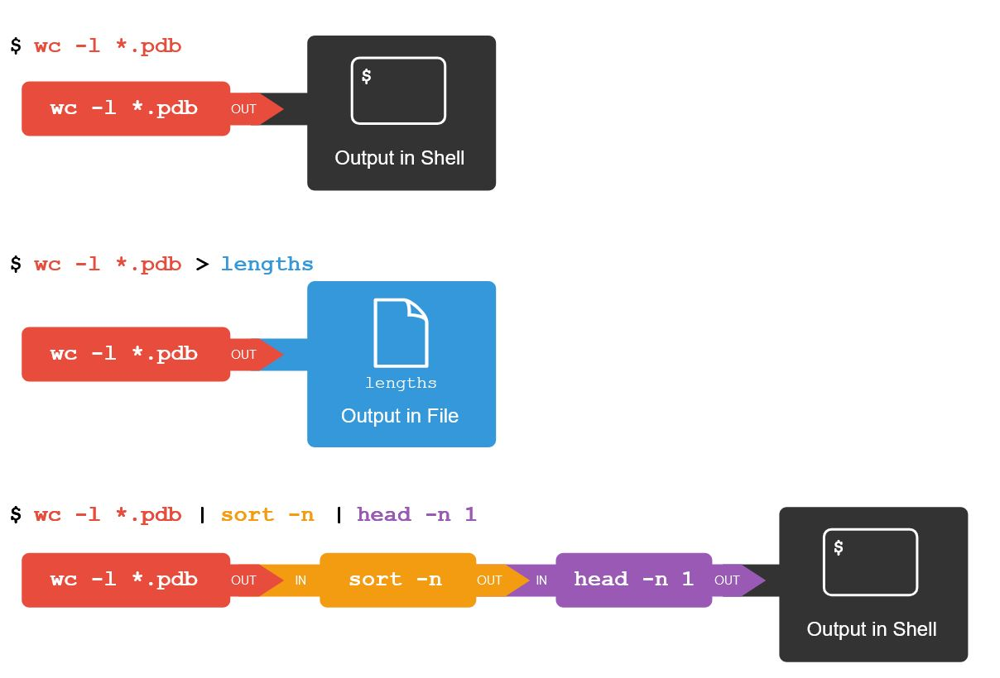

# Day Two: Bash Scripting on Talapas
{: .no_toc }
This lesson is adapted from *[The Unix Shell](https://swcarpentry.github.io/shell-novice/aio.html)* lesson of Software Carpentry.
- TOC
{:toc}

## The Talapas Shell
You should now be inside your home directory on Talapas. Just like on your local filesystem, the default working directory on login is your home directory.

```bash
pwd
```

```output
/home/emwin
```

Note that just this working directory path is not enough to tell you *where* are you really are. 
As a device keyed to the same DuckID, my work laptop has an `emwin` home directory too, but it's a completely separate filesystem.

Talapas's network filesystem is physically located in the Millrace building by the river. Though it might be backed up to a cloud service provider like OneDrive, your laptop's filesystem is stored on a disk drive inside your laptop. 

We're going to talk about the process of transferring files to and from the cluster in detail soon, but the aspect of filesystem separation is worth considering from the outset. 

## Shell Access: Login Nodes and Compute Nodes
 *A simplified diagram of the structure of Talapas*
Whether you choose to access Talapas through the web terminal or through the command line, you will start at a **login node**. 

The **login node** is a place to prepare input data, organizes, edit code, and configure environment object but it's not the appropriate node for executing non-trivial code. The **login node** should be used to launch jobs on **compute nodes**.

How much work is too much work? Any script that takes longer than a few seconds should be run on a **compute node** instead. 
There are only four login nodes to the hundreds of compute nodes.

**Before running computationally intensive code check if are you running locally, on a login node, or on an interactive node.**

## Who and Where Am I: `hostname`, `whoami`, `who`
To find out the name of the computer (or node) you are connected to, use the `hostname` command.

```bash
hostname
```

```ouput
login1.talapas.uoregon.edu
```

As expected, we are on one of the login nodes. There are four login or "head" nodes for Talapas numbered `login1`, `login2`, `login3`, and `login4` respectively.

You can `ssh` to `login.talapas.uoregon.edu` to let special load balancer decide which login node connect to
instead of selecting a particular node. 

Let's try another command. Who are you? `whoami`
```bash
whoami
```
This should give you your DuckID.
```output
emwin
```
Talapas access is given through your **DuckID**. This is why, unlike
other workshops we hold on campus, you must be an active member of the 
UO community to participate.

Let's do a more interesting command: `who`. This command will let you see the DuckIDs of everyone connected to the current login node. 

Run it and you should see a list of the DuckIDs of your classmates 
in the room *and* the DuckIDs of other researchers connected to
the login node right now.

```bash
who
```

```output
emwin
...
```

If you see a name twice, someone has multiple open terminals
connected to Talapas right now. This is a common use case for
users who might need to manage code in one filesystem location
and inspect outputs in another.

## Unix Permissions
Now that we're on Talapas, let's do an ls command with the long-listing argument and a human readable flag. 

I want to take this opportunity to talk about UNIX permissions now that we're all on machines with the same operating system. 
Because software **cannot manipulate open, write or execute files without permission to do so for each file**, permissions are a common source of code failures on shared filesystems.

Though many of you come from different labs, we all share a *racs_training* PIRG. That means, everyone should have access to the racs_training folder located in `/projects/racs_training`.

```bash
cd /projects/racs_training
ls -lh
```

```output
-rw-r--r--.   1 emwin   is.racs.pirg.racs_training   52 Feb  6 11:30 test.txt
```

It's time to unpack results from the `-l` or long listing flag. Let's see if we can understand **what each field of a given row represents**,
working left to right.

1. **Permissions:** On the very left side, there is a string of the characters
   `d`, `r`, `w`, `x`, and `-`. The `d` indicates if something is a directory
   (there is a `-` in that spot if it is not a directory). The other `r`, `w`,
   `x` bits indicate permission to **R**ead, **W**rite, and e**X**ecute a file.
   There are three fields of `rwx` permissions following the spot for `d`. If a
   user is missing a permission to do something, it's indicated by a `-`.
   - The first set of `rwx` are the permissions that the owner of the file has.
   - The second set of `rwx`s are permissions that members of the file's
     group share (in this case, the group is named `racs_training`).
   - The third set of `rwx`s are permissions that everyone else with access to
     this computer can do with a file. 
2. **References:** This counts the number of references ([hard
   links](https://en.wikipedia.org/wiki/Hard_link)) to the item (file, folder,
   symbolic link or "shortcut").
3. **Owner:** This is the username of the user who owns the file. Their
   permissions are indicated in the first permissions field.
4. **Group:** This is the ACL/PIRG group associated with the file. Members of
   this user group have permissions indicated in the second permissions field.
5. **Size of item:** This is the number of bytes in a file, in human-readable form thanks to the -h flag.
6. **Time last modified:** This is the last time the file was modified.
7. **Filename:** Filename.

Group membership is very important on Talapas, because it is configured such that research groups cannot see each other's data. It's also configured such that your home directory's data is private to you.

For example, you can open files I've created within the racs_training project directory because this file has **read** permissions enabled for members of the racs_training PIRG.

Some labs have more complicated permissions hiearchies implemented in their ACL groups, but those will be covered
in the Talapas-specific lesson.

We should all be able to `cat` this file to the terminal.
```bash
cat test.txt
```

```output
Is this the first file you've looked at on Talapas?
```

However, we'll get a permissions error if we try to read Gabriele's home directory.

```bash
ls /home/ghayden/
```

```output
ls: cannot open directory '/home/ghayden': Permission denied
```

Note that, even if there were files in Gabriele's home directory that *were* readable by anyone, I could not read them because I cannot traverse into her home directory.

To share a file or directory that you own with someone in your PIRG, you can grant read and execute privileges for them within the shared `/project/[pirg_name]` directory. However, you must also set the same privileges on any parent directories above the item you're sharing. The execute bit for directories controls whether or not the folder can be **traversed**. Without execute permissions, you cannot see the child folders and files of folders you can otherwise read.

The best place to share files are in folders that are shared by your research group, like a project `/projects/[pirg_name[/` directory.

#### Quiz
{: .no_toc }
On websites like StackOverflow, you will often see bad advice that recommends you use the command `chmod 777` or `chmod -R 777` to alter the permissions of shared input files.

```bash
touch the-universal-file.txt
chmod 777
```
What does this do? Why is this such a bad idea on shared filesystems?

#### Answer
{: .no_toc }
Use `ls -lh` to examine how the permissions on the file have changed.
```bash
ls -lh the-universal-file.txt
```

```output
-rwxrwxrwx. 1 emwin uoregon 0 Feb  5 11:21 the-universal-file.txt
```

This is a bad idea because it grants read, write, and execute permissions to **all** users for the file. 
In the majority of cases, your problems can be solved by giving **group** read access using  to files and execute access on folders for your labmates' traversal. 


## Transferring Files to Talapas with `scp`

Speaking of separate filesystems, today's zip file isn't on Talapas.
Let's move it there with the `scp` command.

The `scp` command needs to be run from our local machine, so let's 
exit the login node briefly by typing `exit`.

```bash
exit
```

You should see a message like this after exiting.
```ouput
logout
Connection to login1.talapas.uoregon.edu closed.
```

You should be back on your local machine. Use `pwd` to check that you are in your home directory and `ls talapas-bash.zip` to make sure you have today's zip folder ready.

```bash
pwd
ls talapas-bash.zip
```

```output
talapas-bash.zip
```

Remember the `cp` command? With SSH access, you can use the extremely convenient `scp` or "secure copy" command to copy files/folders to 
and from Talapas. 

Just like the `cp` command, the arguments for `scp` are indicated in [source] [destination] order. 

To indicate a remote filesystem location, use the `[yourDuckID]@login1.talapas.uoregon.edu:` prefix. Every character after the : refers to the filesystem as appears on a Talapas login node.

```bash
scp talapas-bash.zip [yourDuckID]@login1.talapas.uoregon.edu:~
```

```output
talapas-bash.zip                              100% 7187KB   5.4MB/s   00:01
```

#### Quiz
{: .no_toc }
How would I copy the `/project/racs_training/test.txt` file to my home directory on my laptop using `scp`?

**Hint**: Remember what the `.` character means?
#### Answer
{: .no_toc }
```bash
scp [yourDuckID]@login1.talapas.uoregon.edu:/projects/racs_training/test.txt .
```

```output
test.txt                     00%   52     0.8KB/s  00:00
```
Check the file transfer worked by inspecting its contents in `nano`. Remember `nano`?

```bash
nano test.txt
```

Use <kbd>Ctrl</kdb>+<kbd>X</kdb> to exit Nano.

Let's get to learning Bash! Let's ssh to Talapas again. Use the arrow keys to traverse your command history and grab the right command.

```bash
ssh [yourDuckID]@login1.talapas.uoregon.edu
```

Confirm your zip file safely arrived at its destination in your Talapas home directory with an `ls`.
```bash
ls talapas-bash.zip
```

```output
talapas-bash.zip
```

Now, let's unzip it from the command line using the `unzip` command. (This may take a minute.)

```bash
unzip talapas-bash.zip
```

When the file is unzipped, change your current working directory
to talpas-bash. 
The contents of the folder should be very familiar to you at this point

```bash
cd talapas-bash
ls
```

```output
books/  exercise-data/  scripts/
```

Let's use auto-complete with `tab` to navigate to the `exercise-data/alkanes` directory.

```bash
cd exercise-data/alkanes
ls -F
```

```output
cubane.pdb  explosive/   octane.pdb   propane.pdb
ethane.pdb  methane.pdb  pentane.pdb
```
## Writing Output to Files: `>` and `>>`

Remember the `wc` command?

```bash
wc -l *.pdb
```

```output
  20 cubane.pdb
  12 ethane.pdb
   9 methane.pdb
  30 octane.pdb
  21 pentane.pdb
  15 propane.pdb
 107 total
```

Which of these protein database files contains the fewest lines?
It's an easy question to answer when there are only six files,
but what if there were 6000?
Our first step toward a solution is to run the command:

```bash
wc -l *.pdb > lengths.txt
```

The greater than symbol, `>`, tells the shell to **redirect** the command's output to a
file instead of printing it to the screen.

 This command prints no screen output, because
everything that `wc` would have printed has gone into the file `lengths.txt` instead.
If the file doesn't exist prior to issuing the command, the shell will create the file. If the file exists already, it will be silently overwritten.
Thus, **redirect** commands require caution.

`ls lengths.txt` confirms that the file exists:

```bash
ls lengths.txt
```

```output
lengths.txt
```

We can now send the content of `lengths.txt` to the screen using `cat lengths.txt`.

```bash
cat lengths.txt
```

```output
  20  cubane.pdb
  12  ethane.pdb
   9  methane.pdb
  30  octane.pdb
  21  pentane.pdb
  15  propane.pdb
 107  total
```


We'll continue to use `cat` in this lesson, for convenience and consistency, but it has the disadvantage that it always dumps the whole file onto your screen.

## Filtering Output with `sort`, `head`, and `tail`

Next we'll use the `sort` command to sort the contents of the `lengths.txt` file.

The file `talapas-bash/exercise-data/numbers.txt` contains the following lines:

```source
10
2
19
22
6
```

If we run `sort` on this file, the output is:

```output
10
19
2
22
6
```

If we run `sort -n` on the same file, we get this instead:

```output
2
6
10
19
22
```

This is because the `-n` option specifies a numerical rather than an alphanumerical sort.

The `sort` command alone does *not* change input files; it prints their lines in sorted order to the screen.

```bash
sort -n lengths.txt
```

```output
  9  methane.pdb
 12  ethane.pdb
 15  propane.pdb
 20  cubane.pdb
 21  pentane.pdb
 30  octane.pdb
107  total
```

We can put the sorted list of lines in another temporary file called `sorted-lengths.txt`
by putting `> sorted-lengths.txt` after the command,
just as we used `> lengths.txt` to put the output of `wc` into `lengths.txt`.


Once we've done that,
we can run another command called `head` to get the line of `sorted-lengths.txt`:

```bash
sort -n lengths.txt > sorted-lengths.txt
head -n 1 sorted-lengths.txt
```

```output
  9  methane.pdb
```

This tells us that `methane.pdb` is the shortest of the files, with only 9 lines.

Using `-n 1` with `head` tells it that we only want the first line of the file; `-n 20` would get the first 20, and so on.

### Warning: Redirecting to the same file
{: .no_toc }

It's a very bad idea to try redirecting
the output of a command that operates on a file
to the same file. For example:

```bash
sort -n lengths.txt > lengths.txt
```

Doing something like this may give you
incorrect results and/or delete the contents of `lengths.txt`. *Do not actually run this command.*


### Peeking at the Bottom with `tail`
{: .no_toc }

We have already met the `head` command, which prints lines from the start of a file. `tail` is similar, but prints it lines from the end of a file instead.

If we look at the last two lines of sorted-lengths.txt using `tail -n 2 sorted-lengths.txt`, we get the longest and teh total lengths of all the `.pdb` files instead.

```bash
tail -n 2 sorted-lengths.txt
```

```output
  30 octane.pdb
 107 total
```

## Accumulating Text: `>>` and `echo`
The most trivial of the commands that print to the terminal is `echo` which returns the strings or words you pass it as input back to you as output.

```bash
echo "Good afternoon"
```

```output
Good afternoon
```

```bash
echo "Good afternoon" > greeting.txt
```

```bash
cat greeting.txt
```

```output
Good afternoon
```

We can append to an existing file by using `>>`:

```bash
echo "Backup your files" >> greeting.txt
cat greeting.txt
```
```output
Good afternoon
Backup your files
```

#### Quiz
{: .no_toc }
Which would be appropriate for a maintaining a log file that is updated with one line per day representing the
status of scientific pipeline: `>` or `>>`?

#### Answer
{: .no_toc }
You want to concatenate with `>>` because `>` would overwrite the previous day's output. 

## Pipelines: The Magic of `|`

In our example of finding the file with the fewest lines,
we used intermediate files `lengths.txt` and `sorted-lengths.txt` to store output.
This is a confusing way to work because
even once you understand what `wc`, `sort`, and `head` do,
those intermediate files make it hard to follow what's going on.
We can make it easier to understand by running `sort` and `head` together:

```bash
sort -n lengths.txt | head -n 1
```

```output
  9  methane.pdb
```

The vertical bar, `|`, between the two commands is called a **pipe**.
It tells the shell that we want to use
the output of the command on the left
as the input to the command on the right.

This has removed the need for the `sorted-lengths.txt` file.

Nothing prevents us from chaining pipes consecutively.
We can for example send the output of `wc` directly to `sort`,
and then send the resulting output to `head`.
This removes the need for any intermediate files.

We'll start by using a pipe to send the output of `wc` to `sort`:

```bash
wc -l *.pdb | sort -n
```

```output
   9 methane.pdb
  12 ethane.pdb
  15 propane.pdb
  20 cubane.pdb
  21 pentane.pdb
  30 octane.pdb
 107 total
```

We can then send that output through another pipe, to `head`, so that the full pipeline becomes:

```bash
wc -l *.pdb | sort -n | head -n 1
```

```output
   9  methane.pdb
```

The redirection and pipes used in the last few commands are illustrated below:




### Putting it Together: Pipes and Filters
{: .no_toc }

This idea of linking programs together is why Unix has been so successful.
Instead of creating enormous programs that try to do many different things,
Unix programmers focus on creating lots of simple tools that each do one job well,
and that work well with each other.
This programming model is called 'pipes and filters'.
We've already seen pipes;
a **filter** is a program like `wc` or `sort`
that transforms a stream of input into a stream of output.

The key is that any program that reads lines of text from standard input
and writes lines of text to standard output
can be combined with every other program that behaves this way as well.

Let's put some of these skills into practice.

Move into the `mice` directory.
```bash
cd ..
cd mice
```

We can pipe the results of the `ls` command to `wc -l` to count how many objects in the current working directory. 

```bash
ls | wc -l
```

```output
5
```

#### Quiz
{: .no_toc }
How could I modify this command to get the number of `.txt` files in the current directory?

#### Answer
{: .no_toc }
```bash
ls *.txt | wc -l
```
```output
4
```

This folder contains data from a behavioral experiment on mice described in `citation.txt`. 

The files `Animals.txt`, `Tasks.txt` and `Visit.txt` contain tab-separated observations with the first line of each observation indicating the variables in each row. Let's see what each file tracks by using `head -n 1` on each of the three files.

```bash
head -n 1 Animals.txt Tasks.txt Visit.txt
```

```output
==> Animals.txt <==
Animal  Tag     Sex     Group   CornerAssigned

==> Tasks.txt <==
Date    Night   Task

==> Visit.txt <==
VisitID VisitOrder      Animal  Tag     Sex     Group   
Module  Cage    Corner     CornerCondition PlaceError      
SideErrors      TimeErrors      ConditionErrors    NosepokeNumber  
NosepokeDuration        LickNumber      LickDuration       
LickContactTime StartDate       StartTime       StartTimecode      
EndDate EndTime EndTimecode     VisitDuration   Session
```

## Fun with Tab-Separated Values: `cut`

The `cut` command is used to remove or ‘cut out’ certain sections of each line in the file, and cut expects the lines to be separated into columns by a <kbd>Tab</kbd> character, just like our mouse data.

Cut must be used in combination with a `-f` argument indicating the fields we want to extract. In the event your data *isn't* tab-separated, you can use `-d` to specify delimiters like commas.

Let's try it with `Animals.txt`.

```bash
cut -f 1 Animals.txt
```

```output
Animal
GK-1894
GK-1895
GK-1896
GK-1897
GK-1898
GK-1899
GK-1900
GK-1901
GK-1902
GK-1903
GK-1904
GK-1905
GK-1890
GK-1891
GK-1892
GK-1893
```

This gives us the first column of the tab-separated value file: namely, the unique identifiers for each mouse in the study.

#### Quiz
{: .no_toc }
> Datasets are often keyed or indexed by the value in their first column. What if, instead of the entire first column, I wanted to know the name of the first variable in each of the three text files? As a hint, you'll need to combine the last two operations we discussed with a pipe.

#### Answer
{: .no_toc }
```bash
head -n 1 Animals.txt Tasks.txt Visit.txt | cut -f 1
```

```output
==> Animals.txt <==
Animal

==> Tasks.txt <==
Date

==> Visit.txt <==
VisitID
```

## Finding Lines in Files with `grep`

Searching for something in one or more files is something we'll often need to do, so let's introduce a command for doing that: `grep` (short for **global regular expression print**). As the name suggests, it supports regular expressions and is therefore only limited by your imagination, the shape of your data, and - when working with thousands or millions of files - the processing power at your disposal.


Now let's try our first search to find all the instances in the mouse study where mouse `GK-1893` is documented or observed:

`grep GK-1893 *.txt`

Grep always takes a PATTERN first, then the file, files, or folder of files to be searched for that pattern.

Remember that the shell will expand `*.txt` to a list of all the `.txt` files in the directory. `grep` will then search these for instances of the string "1990" and print the matching lines. 

If you're debugging a large programming project, the ability to quickly search for specific functions in the command line is crucial. Bash's text search functionality is very, very fast.

By default grep prints the entire line, not just the portion that happens to match. It is also case-sensitive UNLESS we pass the -i flag.

Compare the results of these two queries.

```bash
grep -i Male Animals.txt
```

```bash
grep Male Animals.txt`
```

What's happening here?

There are no `Male` animals in the study, but the `-i` searches with case-insensitivity.

Grep can be very useful, and I would recommend reading over its `man` page to play around with some of the options.

`man grep` (MacOS)

`grep --help` (Git Bash/Windows)

Grep is a great way to quickly make sense of a large file or large set of data. You can even use it to search the outputs of other commands.

### Managing Command History: `history`
{: .no_toc }
We've done a lot of typing so far. Conveniently, the shell tracks the commands you've typed. Don't count on this history to be there after a reboot though.

To see your command history, type `history`.

```bash
history
```

#### Quiz
{: .no_toc }
How can we use `|` and `grep` and `wc` to count how many times you've typed the command `pwd` on Talapas today?

#### Answer
{: .no_toc }
history | grep 'pwd' | wc -l


## Finding Files by Name with `find`

While `grep` finds lines in files,
the `find` command finds files themselves.
Like `grep`, `find` has many sophisticated options worth exploring independently.

Let's move up the filesystem tree to the `talapas-bash` directory.

```bash
cd ..
```

To get a picture of the full tree rooted at `talapas-bash` use `ls -R`.

```bash
ls -R
```

```output
.:
books  exercise-data  scripts

./books:
bleak-house.txt  call-of-the-wild.txt  pride-and-prejudice.txt

./exercise-data:
alkanes        creatures        mice         sorted-numbers.txt
animal-counts  first-script.sh  numbers.txt  writing

./exercise-data/alkanes:
cubane.pdb           lengths.txt  propane.pdb
ethane.pdb           methane.pdb  sorted-lengths.txt
explosive            octane.pdb
folder_contents.txt  pentane.pdb

./exercise-data/alkanes/explosive:
ethane.pdb  methane.pdb

./exercise-data/animal-counts:
animals.csv

./exercise-data/creatures:
basilisk.dat  minotaur.dat  unicorn.dat

./exercise-data/mice:
Animals.txt  citation.txt  README.md  Tasks.txt  Visit.txt

./exercise-data/writing:
haiku.txt  LittleWomen.txt

./scripts:
a-slow-script.sh
```

Here's how find behaves without specifying a filename pattern to match. 

```bash
find .
```

```ouput
.
./books
./books/pride-and-prejudice.txt
./books/call-of-the-wild.txt
./books/bleak-house.txt
...
```

This gives us *everything* in the current directory.

As always, the `.` on its own means the current working directory,
which is where we want our search to start.

If we try the type option to filter our input, by using `-type d` to find **directories** we get more granular results.

```bash
find . -type d
```

```ouput
.
./books
./exercise-data
./exercise-data/writing
./exercise-data/mice
./exercise-data/alkanes
./exercise-data/alkanes/explosive
./exercise-data/creatures
./exercise-data/animal-counts
./scripts
```

Notice that the objects `find` finds are not listed in any particular order.
If we change `-type d` to `-type f`,
we get a listing of all the files instead:

```bash
find . -type f
```

```output
./books/pride-and-prejudice.txt
./books/call-of-the-wild.txt
./books/bleak-house.txt
./exercise-data/writing/haiku.txt
./exercise-data/writing/LittleWomen.txt
...
```

But what if we want to specify files with names (or patterns for names)? This is helpful when tracking down data with a detailed metadata structure. We can use the the `-name` option for this.

```bash
find . -name '*.md
```

```output
./exercise-data/mice/README.md
```

This returns only files that end in `.md`. Quoting is very important here, as [Bash treats single-quotes and double-quotes differently](https://www.gnu.org/software/bash/manual/html_node/Quoting.html).

## Bash Scripts

We've been running increasingly complicated commands, and it's time to think about putting them into a script to make them reusable.


When you give batch jobs to Slurm on Talapas, you will have typically give them in the form of shell scripts, signified by the `.sh` file extension.

Let's use nano to write our first script.

```bash
nano first-script.sh`
```

```vim
#!/bin/bash
echo "Hello World"
```
As always, use <kbd>Ctrl</kbd>+<kbd>O</kbd> then **Enter** to
write out your text to `first-script.sh`. Then use <kbd>Ctrl</kbd>+<kbd>X</kbd> to exit `nano`.

The `#!/bin/bash` comment is important, it communicates which executable (which shell) should run this script. Normally `#` indicates a commented line in Bash and causes the line to be ignored during execution.

Now, if we try to run it like any old command, we'll get an error.

`first-script.sh`

We need to specify that bash should run this script.

`bash first-script.sh`

This mode of executing the script is much like running `python3 myfile.py` or `Rscript myscript.R`

If the script doesn't execute, make sure it has execute permissions. 

`ls -lh first-script.sh`
`chmod u+x first-script.sh`
`./first-script.sh`

You should now see a "Hello World" message. 
Congratulations, you've written your first script!

For our next exercise, move up to the `talapas-bash` parent directory.

`cd ~/talapas-bash`

Now, let's write a script that uses the `find` command we learned to find files that end in `.txt` in the exercise-data` directory.

`nano find-text.sh`

```
#!/bin/bash
find exercise-data -name "*.txt"
```
Let's run it to see if it works.

`chmod u+x find-text.sh`

`./find-text.sh`

It works, so let's move it to that scripts directory I already have.

`mv find-text.sh scripts`

An `ls` shows the file is gone.

Navigating to the `scripts` folder, we can see it's there now.

`cd scripts`

Now, something different is going to happen when I run the script now. Why?

```bash
./find-text.sh`
```

The reason we get a "no such file or directory" error is that the filesystem as seen by a script is relative to the *current working directory*.

The *current working directory* is the `scripts` diretory, so the `exercise-data` folder is nowhere to be found.

Let's use **command-line arguments** to make this script more flexible.

```bash
nano find-text.sh`
```

```output
#!/bin/bash
find "$1" -name '*.txt'
```

Inside a shell script, `$1` means 'the first filename (or other argument) on the command line'. The quotes around it are to capture files with spaces in their names.

We can now run our script like this:

```bash
./find-text.sh ../exercise-data/
```

To reference additional arguments, use `$2`, `$3` and so on. 

We're now done with the `talapas-bash` folder. Let's look at our first **job script** as a sneak preview of how the Talapas scheduler, Slurm works.

## Our First Slurm Job

Inside your home directory on Talapas, let's make a new folder called `TalapasWorkshop`. 

```bash
mkdir TalapasWorkshop
cd TalapasWorkshop
```

Once inside the Talapas Workshop directory, you're going to use the `cp` command to take a script I've already written and put a copy in your directory. This is important because you want to avoid a situation where multiple people are modifying the same at the same time. The best practice is to edit a copy.

```bash
cp /projects/racs_training/emwin/first.sh .
```

You'll also need to copy the associated Python file to the current directory.

```bash
cp /projects/racs_training/emwin/hello_world.py .
```

Confirm that you can see the script components in the current directory.

```bash
ls
```

```output
first.sh  hello_world.py
```

Now, let's concatenate `first.sh` to the terminal and dissect it piece by piece.

```bash
cat first.sh
```

```bash
#!/bin/bash
#SBATCH --account=racs_training
#SBATCH --job-name=first
#SBATCH --partition=compute
#SBATCH --time=0-00:05:00
#SBATCH --cpus-per-task=1
#SBATCH --mem-per-cpu=500M
#SBATCH --output=first-log.txt
#SBATCH --error=first-error.txt

module purge
module load miniconda3/20240410
echo "Running on $HOSTNAME"
python3 hello_world.py
```

At the top, it has the `!/bin/bash` sequence to indicate to Slurm that this is a batch script. Slurm will not run files that are not shell scripts.

The lines beginning `module purge` and `module load` are common to almost all Slurm jobs. They are used to remove any existing modules, then load the softwar modules necessary for running the job. 
In this case, `miniconda` is loaded so Python can be run. 
An R job, however, would load something like `R/4.3.2` instead `miniconda3/20240410`.
Modules will be discussed at length in the Talapas lessons.

What follows are sequences of comments that are not comments. These are parameters that are passed to Slurm that will decide when, and with how many resources, your job is run.

* **account** must be a valid PIRG. For this exercise, it's racs_training. In the future, this will be your lab's PIRG.
* **job-name** allows you to set the job name of your job for easy debugging and management. Modify this to FirstJob[YourDuckID]
* **partition** indicates which of Talapas's partitions this job will run on. For most purposes, **compute** is appropriate. 
* **time** total run time limit in (HH:MM:SS) before SLURM kills the job. Real-world jobs will take minutes to hours rather than seconds.
* **cpus-per-task** should be set to 1 for jobs that do not explicitly use multiprocessing libraries like OpenMPI. 
* **mem-per-cpu** should be set to the total amou
* **output** the file location where the ouput from **stdout** should be logged
* **error** the file location where the output from **stderror** should be logged. will generate an empty file on job with no errors.

Let's check the Python script too! Python students: what does this do?

```bash
cat hello_world.py
```

```output
print("Hello world!")
```

It prints the string "hello word" and exits.

Normally, it's not good practice to run a script on a login node, but I want to you go ahead and so.

First, give yourself **u**ser e**x**ecute permissions using `chmod`. Then, run the file using `./first.sh`.

```bash
chmod u+x first.sh
./first.sh
```

```output
Running on login2.talapas.uoregon.edu
Hello world!
```

Looks good? But we don't want it to run on the login node. Let's pass it to SLURM using `sbatch`.

After you've carefully configured the job, queueing it is easy.

```bash
sbatch first.sh
```

```output
Submitted batch job [NUMBER]
```

Now that your job is queued, check for its presence and status using `squeue`.

Replace the following command with your DuckID.

```bash
squeue -u [MYDUCKID]
```

Or, use this shorthand.

```bash
squeue -u $(whoami)
```

If you see an empty queue, your job has already completed. 

Check your job history using `sacct`. Scroll to the bottom to find the status of your most recent Talapas jobs.

```bash
sacct
```

```output
JobID           JobName  Partition    Account  AllocCPUS      State ExitCode 
------------ ---------- ---------- ---------- ---------- ---------- -------- 
31458049          first    compute racs_trai+          1  COMPLETED      0:0 
31458049.ba+      batch            racs_trai+          1  COMPLETED      0:0 
31458049.ex+     extern            racs_trai+          1  COMPLETED      0:0 
```

Now that the job has terminated, let's look at the results. This job doesn't manipulate files in and of itself, it only writes to standard out.

```bash
cat first-log.txt
```

```output
Running on n0135
Hello world!
```

After being queued with `sbatch`, the job ran on `n0135`, a **compute node**.

Because the job didn't err out, the `first-errortxt` file should be *empty*.

```bash
cat first-error.txt
```

```output
```

This is a sneak peek of Slurm to demonstrate the role of Bash scripting on Talapas.
We will dive deeper into this topic next week!

## Today's Bash Command List

| command | description | example usage |
| ----------- | --------------- | ------------- |
| whoami | prints username | whoami |
| hostname | print hostname (computer name) | hostname |
| who | display list of user(s) on the system | who |
| ssh | opens OpenSSH remote login app | ssh [yourDuckID]@login2.talapas.uoregon.edu |
| scp [source] [dest] | copy files from source to dest over ssh | scp [duckID]@login2.talapas.uoregon:~/output.zip . |
| [cmd1] \| [cmd2] | pipe output of cmd1 to cmd2 | history \| grep  `ls' |
| unzip [zip folder] | unzip zipped folder | unzip example.zip |
| chmod [permissions] [file or folder] | give permissions to users or groups for file | chmod -R g+rwx ShareInputs |
| sort [file] | sort lines within a file or input buffer | sort -n ids.txt |
| head -n [# lines] [file] | print the first n lines of a file or files | head -n long-novel.txt |
| tail -n [# lines] [file] | print the last n lines of a file or files | tail -n long-novel.txt |
| echo [string] | print textual input to terminal | echo "echo echo echo" |
| [cmd] > [file] | redirect output of [cmd] to file | echo "Hello" > file.txt |
| [cmd] >> [file] | concatenate redirected output of [cmd] to file | echo "Another Line" >> file.txt |
| history | show command line history | history |
| grep [pattern] [file or files] | find instances of pattern in file | grep -r 'assignment' . |
| cut -d [delimiter] -f [field #] | cut delimited data at field # | cut -f 2 tabbed_data.tsv |

## Learn More 
- [*Linux file permissions explained*](https://www.redhat.com/en/blog/linux-file-permissions-explained), Scott McBrien.
  - A short article and video tutorial that explains RedHat Linux permissions in detail. While
  the group permissions enabled by the PIRG model a [little more complicated](https://hpcrcf.atlassian.net/wiki/spaces/TW/pages/2767126529/Managing+Project+Permissions) than the structure outlined here, the rest of the lesson is thorough and relevant.