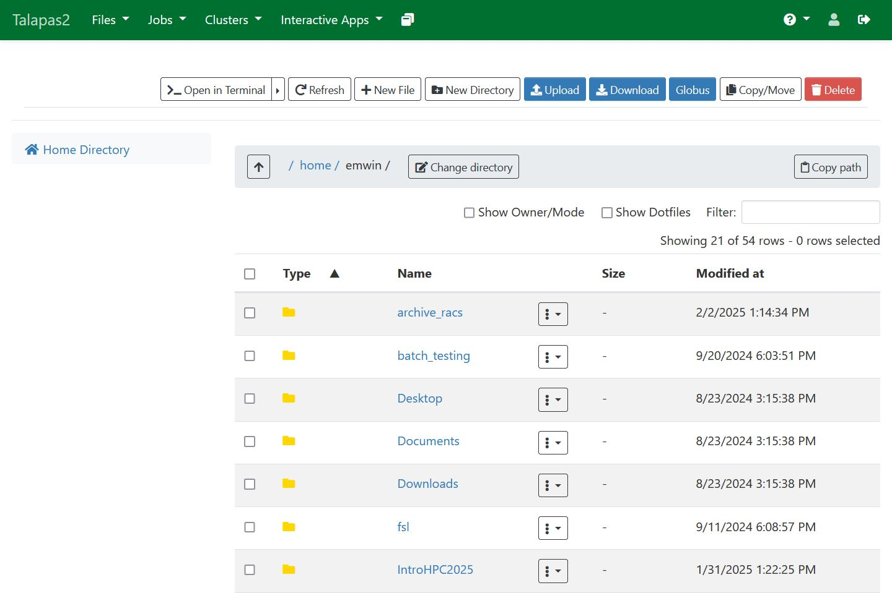
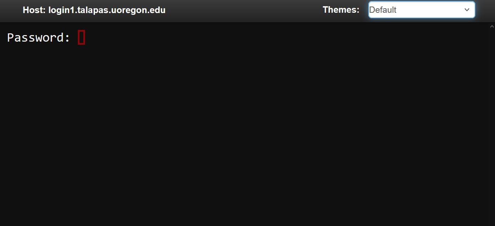
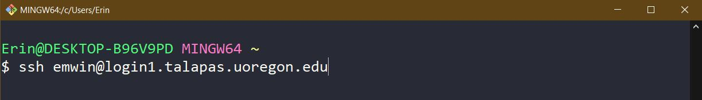

# Getting to Talapas
Today's activities will take place on Talapas. There are a few more methods of getting to and using Talapas that we will discuss next week and the week after, but these are the most common.

## Accessing Talapas Through Your Web Browser
Note that Safari is *not* recommended, as RACS staff have documented compatibility problems with certain OnDemand web apps and Safari.

### [OnDemand -> Files](https://ondemand.talapas.uoregon.edu/pun/sys/dashboard/files)
 *A screenshot of the OnDemand File browsing interface*

A web app in the OnDemand client that allows you to browse the Talapas GPFS filesystem in a web browser.

- A quick peek at files you have access to
- Upload and download small files
- Not suitable for writing or editing code, large transfers

### [OnDemand -> Clusters -> Talapas Shell Access](https://ondemand.talapas.uoregon.edu/pun/sys/shell/ssh/login1.talapas.uoregon.edu) 
 *A screenshot of the OnDemand Talapas Shell Access app*

A web app in the OnDemand client that provides command line to access to Talapas from your web browser without SSH.
- Connects you directly to a **login node**
- Enter the password for your **DuckID** to proceed
- Launch interactive or batch jobs
- Unlike with SSH from your personal terminal, **you can't transfer files to/from your local machine here**

## Tired of All the Duo 2FA Prompts? UO VPN
While using the UO VPN is **not required** for today's activities, [RACS recommends](https://hpcrcf.atlassian.net/wiki/spaces/TW/pages/2755758386/Release+Notes+for+the+new+Talapas2+2024) that you install and connect to the [UO VPN](https://service.uoregon.edu/TDClient/2030/Portal/KB/ArticleDet?ID=31471) by following this guide.
You will receive fewer Duo 2FA authentication prompts if you 
connect to Talapas while on the UO VPN.

## Workshop Setup
Download a fresh copy of the `talapas-bash.zip` to your home directory if you deleted the copy from last time.

Open Terminal (MacOS, Linux) or Git Bash (Windows) and you're ready for today's session.

## Getting to Talapas Through the Command Line + SSH
 *A screenshot of ssh usage through Git Bash*

 This is the primary and most versatile way to access Talapas. 
 It allows users to transfer files, schedule jobs, and run interactive jobs all from the same terminal application. However, you need to create an SSH key to use this method.
 
 Because you only need to set up SSH key access to Talapas once **per device**, we will go through the SSH access tutorial as a class. Setting up SSH keys can be tedious and unintuitive, but they make connecting to Talapas a breeze once you've set them up.

  

[Download Zip](../downloads/talapas-bash.zip){: .btn .btn-purple}
