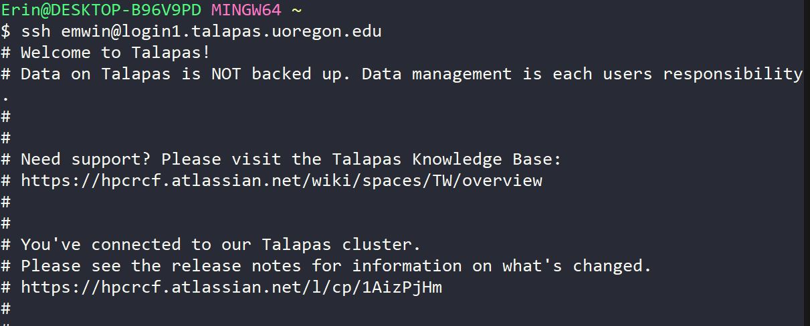

# SSH Key Tutorial 
{: .no_toc }
This lesson is adapted from the *[Connecting to the remote HPC System](https://www.hpc-carpentry.org/hpc-shell/01-connecting/index.html)* lesson of HPC Carpentry.
- TOC
{:toc}

## What is an SSH Key?
SSH keys are a method for authentication for command line access to remote computing systems. 
After creating an SSH key on a given device, you likely won't need to 
create another one.

SSH keys can also be used for authentication when transferring files from shared servers or for accessing version control systems like GitHub. 

In this section you will create a pair of SSH keys, a private key which you keep on your own computer and a public key which is placed on the remote HPC system that you will log in to.

### A Note on OS Compatibility
If you installed Git Bash using my [recommended instructions](, you should have access all the ssh key generation commands that your UNIX classmates have through Git Bash. 
You should not need to install any additional software.

If something doesn't work as intended, please raise your hand!

## Checking for Existing Keys
Those of you who have used platforms like GitHub before may have
created an SSH key without realizing you had done so.

SSH keys are their associated configurations are typically stored 
in a hidden folder called `.ssh` in your your home directory.

Hidden folders are hidden from GUIs like File Explorer and Finder by default. 
To see them you must either change how your GUI displays files or use the special `-a` flag with commands like `ls`.

```bash
ls -aF ~
```

You'll probably see a bunch of hidden files related to different
applications, but for now, see if a .ssh folder is there. Don't worry if you don't have one, as the SSH key creation process will take care of that.
```output
.ssh/
...
```

If you do have a hidden `.ssh` folder, check its contents as follows.
```bash
ls ~/.ssh/
```

If you've created an SSH key before, you'll have a list of text files that look something like this.
ed25519 refers to cryptographic algorithm for generating SSH key pairs, so `id_ed25519` is the default name for SSH keys generated using that tool.
```output
config      id_ed25519.pub  known_hosts.old  
id_ed25519  known_hosts     
```
If you have two files named `id_ed25519.pub` and `id_ed25519` respectively, wait. You will **not need** to do the next steps.

## No SSH Key Pair? Create One
From your terminal run the following command: 
```bash
ssh-keygen -t ed25519 -C "[YOURDUCKID]@uoregon.edu"
```
This creates a new SSH key with the ed25519 algorithm, using your UOregon (presumably professional) email as a label.

```ouput
> Generating public/private ALGORITHM key pair.
> Enter a file in which to save the key: [Press enter]
```

When you're prompted, type **Enter** to accept the default file location. 
The default location is the `~/.ssh` directory we just checked.

**Do not do this step if you already have a key in this location to avoid overwriting it.**

You will then prompted to enter an optional passphrase for your SSH key.
```output
> Enter passphrase (empty for no passphrase): [Type a passphrase]
> Enter same passphrase again: [Type passphrase again]
```
To leave your SSH key without a passphrase, type **Enter** twice more.

## Add Your SSH Key to Talapas

At this point, all of you should be ready to connect to Talapas. Type the following command into your terminal application.

```bash
ssh [yourDuckID]@login.talapas.uoregon.edu
```
If this is your first time connecting to Talapas through SSH, you will be prompted with a long, unwieldy message that ends with this line.

```ouput
Are you sure you want to continue connecting (yes/no)?  # type "yes"!
```

Type `yes` (lowercase) and press **Enter** to dismiss the message. You will not prompted with it again unless you change devices or create a new SSH key.

In the future, feel free to use any of the 4 login nodes or to choose the load balancer at `login.talapas.uoregon.edu`. For today, let's
all log on to the same node: `login1.talapas.uoregon.edu`.

 *An example Talapas welcome message*

Congratulations, you're now on Talapas.

### Optional Post-Workshop: Add Your Key to an SSH Agent
If you chose to add a passphrase to your SSH key, you can use
the SSH agent to manage your key for you. 
Unlike key creation, this step varies with your device operating system.

I do not bother with this step because it's tedious to
teach and can break your SSH configuration and disable SSH functionality with even a small mistake.

If you want to use the ssh-agent, [GitHub provides a thorough tutorial that will detect
your browser's operating system and adjust instructions accordingly](https://docs.github.com/en/authentication/connecting-to-github-with-ssh/generating-a-new-ssh-key-and-adding-it-to-the-ssh-agent?platform=mac#adding-your-ssh-key-to-the-ssh-agent).